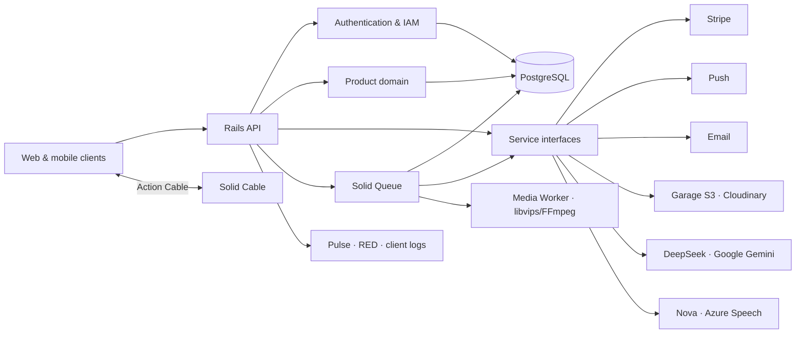

<a id="readme-top"></a>

<div align="center">

# RexOne Core

### Start from One. Not from Zero. A battle-hardened Rails foundation, forged so the product can wage the interesting war.

A sovereign, production-grade API core for modern web and mobile products. Authentication, hierarchical IAM, Stripe billing, access control, media pipelines, notifications, durable AI queues, real-time Action Cable WebSockets, background job topologies, operational administration, and glass-box observability stand ready—not as scattered trophies, but as one disciplined system.

Built under an immutable creed: **Start from One. Not from Zero. Clear in thought, exact in structure, simple in use, and strong enough to endure what comes after launch.**

[](https://www.ruby-lang.org/)
[](https://rubyonrails.org/)
[](https://www.postgresql.org/)
[](https://www.docker.com/)
[](https://github.com/sponsors/rex-9)
[](https://rexone.rex9.me)
[](https://github.com/rex-9/rexone-core/actions/workflows/test.yml)

**API-first · Modular · Observable · Queue-aware · Built to grow**

[Live Demo ↗](https://rexone.rex9.me) · [Quick Start](docs/QUICK_START.md) · [Explore the foundation](#feature-map) · [Foundation Guide](docs/FOUNDATION.md) · [Ecosystem Architecture](ECOSYSTEM.md) · [Visual Walkthrough](./docs/VISUAL_WALKTHROUGH.md) · [Who it is for](#who-rexone-is-for) · [Development Law](LAW.md) · [Agent Governance](AGENTS.md) · [Production Deployment](docs/DEPLOYMENT.md)

</div>

---

### 🏛️ Unified Ecosystem & Constitutional Directives

| Resource | Purpose & Canonical Specification |
| :--- | :--- |
| **🏛️ Unified Ecosystem** | Complete cross-platform architecture, feature parity matrix, and communication protocols across Core, Web, and Mobile: **[ECOSYSTEM.md](ECOSYSTEM.md)** |
| **🗺️ Visual Walkthrough** | Screenshot-driven, feature-by-feature tour of RexOne across all surfaces and operations: **[VISUAL_WALKTHROUGH.md](./docs/VISUAL_WALKTHROUGH.md)** |
| **📜 Constitutional Law** | Non-negotiable architecture, pure parameter contracts, zero legacy shims, and plain English laws: **[LAW.md](LAW.md)** *(Zero exceptions)* |
| **🤖 Operational Agent Governance** | Immutable operational rules for AI coding assistants (secret isolation, git safety, synchronous doc sync): **[AGENTS.md](AGENTS.md)** |
| **🛡️ Production Security** | Origin isolation, Cloudflare edge defense, and rate-limiting protocols: **[Production DDoS & API Abuse Protection](docs/DDOS.md)** |
| **🌐 AI Discovery & GEO** | Generative Engine Optimization, crawler allowlists, and LLM context files: **[AI Discovery & GEO Guide](https://github.com/rex-9/rexone-web/blob/dev/docs/SEO_GEO.md)** |

---

## Why RexOne Core?

Every product eventually meets the same old enemies: accounts, permissions, billing, uploads, jobs, notifications, dashboards, audit trails, failures, and the darkness between _“it works”_ and _“we know why it works.”_ Especially, the ultimate killer of momentum: _“it works on my machine.”_

RexOne Core exists because this ground should never have to be conquered again for every product.

### The Purpose: Start from One. Not from Zero.

Software has never been easier to generate, but more code does not automatically mean better systems. Human developers and AI coding agents can move fast, but speed without disciplined architecture burns money, AI compute, and human energy—wasting thousands of expensive tokens rewriting weak abstractions, fixing hallucinatory debt, or having to rebuild the exact same foundation again and again for every product.

RexOne turns that repeated, expensive grind into a battle-tested, sovereign baseline.

### Discipline-Driven Development (DDD): The Unvarnished Truth

RexOne pioneers **Discipline-Driven Development (DDD)**. While legacy paradigms spent decades debating Domain-Driven Design or Test-Driven Development, the AI era created a fundamentally different reality: **typing code is free**. Generating 10,000 lines of code takes 30 seconds. 

90% of modern software projects never survive to master the business domain because their architecture collapses first under an avalanche of hallucinatory abstractions, conflicting shims, and zombie code. Tests cannot save a rotten architecture.

Discipline-Driven Development establishes that **architectural discipline, sovereign foundation, and constitutional law are the primary drivers of sustainable engineering**.

> *You bring the idea. AI writes the code. RexOne keeps both of you from destroying the foundation.*

#### The Brutal Realities Others Hesitate to Reveal:
1. **The Vibe-Coding Delusion**: Prompting an AI to generate code without an immutable constitution isn't velocity; it's compounding debt at 100x speed. Speed without discipline is just accelerating toward a brick wall.
2. **The BaaS Trap**: Serverless "5-minute backends" lure developers in with toys, then slap them with a $5,000/mo cloud hostage bill when they need relational integrity, background queues, or compliance audits. Real software runs sovereign PostgreSQL, native queues (Solid Queue), and self-hosted S3 (Garage).
3. **The Full-Stack Monolith Lie**: Stuffing API controllers, database queries, background tasks, and client hydration into a single node runtime creates fragile, unmaintainable monoliths. True engineering enforces client-server separation.
4. **Deprecation Cowardice & Zombie Code**: Retaining dead code, backwards-compatibility shims, and duplicate parameter aliases is cowardice. Under Constitutional Law U14, if code is replaced, the old code is wiped out completely. No shims. No legacy bloat.
5. **100% Free Sovereignty**: Unlike commercial boilerplates charging $300–$800 for basic auth or gating features behind "pro licenses", RexOne is 100% free, MIT/open, and sovereign. You own your code, your data, and your infrastructure.

### 📊 Architectural Comparison: Why RexOne Wins

| Dimension / Capability | 🛡️ **RexOne Sovereign Trinity** | 📦 **Next.js Full-Stack Boilerplates** | 🔥 **Firebase / Cloud Serverless** | 🪤 **Supabase / BaaS Starter Kits** | 🚂 **Rails & Laravel Monoliths** |
| :--- | :--- | :--- | :--- | :--- | :--- |
| **Architectural Model** | ✅ **Sovereign Tri-Platform**: Rails 8 API + React 19 SPA + pure Flutter 3 native client | ❌ **Node Monolith**: API, DB, jobs & DOM crammed into 1 fragile runtime | ❌ **Serverless Spaghetti**: Disconnected Cloud Functions + NoSQL Firestore | ⚠️ **Client-Heavy BaaS**: Direct client DB queries + scattered edge functions | ⚠️ **HTML Monolith**: Server-rendered HTML with Turbo/Livewire |
| **Native Mobile App** | ✅ **Native 60fps Flutter**: Shared contracts, biometrics, hardware media & push | ❌ **None or Webview Shell**: Sluggish Capacitor/Cordova wrapper | ⚠️ **Fragmented SDKs**: Direct NoSQL queries from mobile with zero encapsulation | ⚠️ **Raw Client SDK**: Mobile apps directly expose database tables via client key | ⚠️ **Turbo / Webview**: Web pages wrapped in a native navigation shell |
| **Offline-First Durability** | ✅ **Drift SQLite (`rexone_offline`)**: Schema mirroring, offline subtitles & AES-256 saves | ❌ **None**: Application breaks entirely on network disconnect | ⚠️ **Flaky Document Cache**: Primitive document cache prone to sync desync | ⚠️ **No Relational Offline**: Unreliable offline sync across foreign keys | ❌ **None**: Server-rendered pages require constant connectivity |
| **Database Integrity** | ✅ **Strict Relational PostgreSQL**: Foreign keys, ACID, UUIDs, soft-deletes | ⚠️ **ORM Inconsistencies**: Serverless connection pool limits on Prisma/Drizzle | ❌ **NoSQL Hell**: No joins, no cascading deletes, data duplication nightmare | ✅ **PostgreSQL**: Relational integrity via managed Postgres instance | ✅ **PostgreSQL / MySQL**: Mature relational ORM (ActiveRecord / Eloquent) |
| **Background Processing** | ✅ **Solid Queue (Fibers + Threads)**: Workload pooling, recurring cron, zero Redis costs | ❌ **Serverless Timeouts**: Forced into third-party Inngest, QStash, or Celery ($$$) | ❌ **Execution Timeouts**: Severe execution limits, cold starts & high invocation bills | ⚠️ **Edge Functions**: Strict 10s CPU limits, no persistent background workers | ⚠️ **Redis Dependency**: Requires external Redis broker & extra hosting RAM |
| **Real-Time Delivery** | ✅ **Native Action Cable**: Persistent WebSockets, auto-reconnect & binary STT/TTS | ❌ **Broken on Serverless**: Forced into expensive Pusher / Ably tiers ($$$) | ⚠️ **Firestore Listeners**: Pay-per-document-read billing nightmare under active polling | ⚠️ **Supabase Realtime**: Row-level broadcast, high connection pricing tiers | ⚠️ **External Broker**: Requires Redis/Reverb/Soketi daemon configuration |
| **Object Storage** | ✅ **Self-Hosted Garage S3**: High-performance local S3, zero egress bills | ❌ **Vendor Cloud**: AWS S3 / Cloudflare R2 egress fees | ❌ **Google Cloud Storage**: Proprietary bucket pricing & steep download egress fees | ⚠️ **Proprietary Storage**: Vendor-locked BaaS pricing ladders | ⚠️ **ActiveStorage / Flysystem**: Tied to third-party cloud S3 bucket bills |
| **AI Workflows & Speech** | ✅ **Durable Queued AI**: Chunked streaming, 16kHz live STT, binary MP3 TTS | ⚠️ **Edge Timeouts**: LLM streams crash on cold starts or Vercel limits | ❌ **Synchronous Timeouts**: Long-running LLM inferences hit function deadlines | ❌ **Client Leaks**: Client-side API keys or basic Edge Function calls | ⚠️ **Basic Wrappers**: Simple synchronous chat endpoints |
| **Anti-Vibe Governance** | ✅ **Constitutional Law (`LAW.md`)**: Laws U14/U15 stop AI tech debt and zombie code | ❌ **Unguided Vibe-Coding**: Fragile abstractions, dead shims & runaway debt | ❌ **Scattered Cloud Logic**: Code fragmented across dozens of uncoordinated functions | ❌ **RLS Spaghetti**: 100+ line SQL security policies prone to data leaks | ⚠️ **Conventions Only**: No explicit constitutional AI agent rules |
| **Cost & Sovereignty** | ✅ **100% Free & Open (MIT)**: Zero paywalls, zero "Pro" upsells, sovereign VPS deploy | ❌ **$199–$499 Paid License**: Features gated behind tier paywalls | ❌ **Google Vendor Trap**: Massive cloud bills as user volume scales ($5k–$20k/mo) | ❌ **Monthly Cloud Lock-in**: Free tier lulls you into $5,000/mo hostage bill | ❌ **$299–$799 Paid License**: Commercial starter kit paywalls (Jumpstart, Spark) |

### The Reality: The Exponential AI Tech Debt Cycle

Without immutable architectural boundaries:
```text
Agent 1 invents Pattern A
   ↓
Agent 2 arrives on the next prompt, treats Pattern A as "legacy",
and adds a backward-compatibility shim with Pattern B
   ↓
Agent 3 arrives, bypasses both, and hardcodes an inline workaround
   ↓
Deadlines loom; human developers layer more glue code
   ↓
Context windows fill with duplicate abstractions & zombie code
   ↓
Exponential technical debt & token burn before the product even launches
```

RexOne breaks this cycle decisively:
* **Constitutional Law (`LAW.md`)**: Law U14 enforces *zero loose code, zero backward-compatibility shims, complete wipeout and replacement*. If code deviates from the law, the code is wrong—fix the code. Law U15 enforces human-readable plain English with zero esoteric syntax.
* **Operational Agent Governance (`AGENTS.md`)**: Strict guidelines for AI coding tools—never read `.env` secrets, never run destructive git operations, and synchronize documentation in the exact same turn as code changes.
* **AI Turns from an Architect into a Worker**: The architecture has already been decided. AI works cleanly inside it.

### Born from Battle-Tested Production Reality

RexOne was not born from framework fandom or an abstract weekend thought experiment. It is the hard-won distillation of years of shipping real-world production systems across:
* **Firebase & Google Ecosystem**: Battle-tested as a founding engineer at **js.eco** (a 3-person team: CEO, CTO, and Htet Naing, scaling rapidly in the US EV charging market). While one of the most systematic, high-growth Google-centric architectures, it proved that proprietary ecosystem lock-in and scattered functions still create immense friction.
* **Multi-Cloud & Polyglot Background**: Extensive real-world production engineering across AWS SAM, Microsoft Azure, FastAPI (Python), Laravel & TALL/Filament (PHP), NestJS & Next.js (Node/TypeScript), Go, Prisma, MongoDB, MySQL, and PostgreSQL.

**The Golden Architectural Rule**:
Server frameworks on the frontend create clumsy UX; client languages on the backend create loose, messy architectures. RexOne combines the strongest technologies that survived this crucible—**Rails 8 API Core + React 19 Web + Flutter 3 Mobile**—with crystal-clear boundaries, workload-separated queues, self-hosted S3 storage (Garage), full-stack observability, and constitutional laws.

The foundation is designed to **bend around the product**, never to make the product kneel before the framework.

Instead of hardcoding a rigid SaaS "Teams" hierarchy into domains where it doesn't belong (which is painful to dismantle if the product is an educational platform, clinic, or marketplace), RexOne provides rock-solid IAM primitives (roles, permissions, and 23 canonical resources), leaving domain hierarchy entirely to the business.

RexOne Core brings startup speed with battle-tested discipline—and zero final-hour whispers of _“we should probably build that before launch.”_

It is a particularly good fit when you want to:

- **Stop writing boilerplate infrastructure** and start shipping domain features on day one.
- **Keep AI generation on rails**: prevent autonomous LLM coders from inventing haphazard abstractions, sprawling directories, or unmaintainable architectural debt.
- **Have complete confidence in reviews**: clean boundaries mean reviewing code is effortless with zero garbage to wade through.
- **Rely on automated tests**: end-to-end verification across both the backend server and client applications.
- **Operate a unified ecosystem**:
  - Authentication and explicit role-based access control.
  - Stripe payments connected to durable entitlements.
  - Provider-neutral media storage and background optimization.
  - In-app, push, email, and real-time notification delivery.
  - Queued AI and speech workflows that survive client disconnection.
  - Operational dashboards, client telemetry, audit trails, and health checks.
  - Reference React and Flutter clients consuming the exact same contracts.

RexOne is not a no-code application generator or a promise that every product domain is already modeled. It supplies the disciplined platform foundation; the product remains responsible for its own domain, workflows, interface, and operating decisions.

## What you get

- **One coherent system:** identity, authorization, commerce, media, async work, notifications, and observability are designed to cooperate.
- **Real client contracts:** [RexOne Web](https://github.com/rex-9/rexone-web) and [RexOne Mobile](https://github.com/rex-9/rexone_mobile) exercise the same versioned API and real-time events.
- **Replaceable providers:** external services remain behind focused client and base contracts.
- **Inspectable operations:** queues, cache, sockets, performance, backend errors, and frontend telemetry have explicit operational surfaces.
- **A documented engineering standard:** architectural constraints, API conventions, lifecycle rules, and cross-client responsibilities are written down and tested.

The public [open-source growth roadmap](docs/OPEN_SOURCE_GROWTH_ROADMAP.md) tracks how RexOne will improve evaluation, evidence, contribution readiness, and responsible distribution.

## The philosophy

RexOne Core follows a simple doctrine:

> **Clarity before cleverness. Precision before haste. Simplicity without weakness. Strength without spectacle.**

Years of building software teach the same lesson as any long campaign: the first victory is easy to celebrate; surviving everything that follows is the true test.

The difficult part is rarely another controller or CRUD endpoint. It is preserving a system that remains understandable when the product grows, integrations multiply, failures arrive from unfamiliar directions, and the original developer is no longer the only one carrying the blade.

So the ambition was never to build the largest foundation possible.

It was to build a **clear one**—strong enough to carry ambitious products, flexible enough to surrender its shape to them, and disciplined enough that the next developer can enter the codebase without a map drawn in blood.

No prophecy. No magic. No shortcuts disguised as momentum.

Just deliberate engineering, tested boundaries, and a foundation built to remain standing.

## Feature map

| Foundation     | What is ready                                                                                                                   | Details                                                                               |
| -------------- | ------------------------------------------------------------------------------------------------------------------------------- | ------------------------------------------------------------------------------------- |
| Identity       | Devise, JWT, confirmation, recovery, Google sign-in, platform sessions                                                          | [Authentication & security](docs/FOUNDATION.md#authentication-and-security)           |
| Authorization  | Roles, permissions, user-role and role-permission assignments                                                                   | [IAM & access control](docs/FOUNDATION.md#iam-and-access-control)                     |
| Commerce       | Stripe Checkout, products, transactions, subscriptions, coupons & randomized referrals (with cooldown ladder), access grants, Stripe minimum currency limits | [Payments & entitlements](docs/FOUNDATION.md#payments-and-entitlements)               |
| Async work     | Solid Queue, dedicated queues, retries, concurrency controls, recurring cleanup                                                 | [Background processing](#background-processing)                                       |
| Notifications  | Socket, push, and email coordination through Action Cable, OneSignal, and Brevo (Master Shell & client URL normalization)       | [Notifications & real time](docs/FOUNDATION.md#notifications-and-real-time-delivery)  |
| Media          | Provider-neutral storage (Garage S3), silent background optimization (FFmpeg + libvips), SVG conversion, posters, SRT subtitle tracks, and progressive playback | [Media playback](docs/MEDIA_PLAYBACK.md)                                              |
| Speech         | Synchronous and async TTS, batch STT, and live audio WebSocket streaming through Azure/Nova                                     | [AI & speech](docs/FOUNDATION.md#ai-and-speech)                                       |
| AI             | Durable queued chat, Telegram-style multi-message chunking, persisted history, completion alerts, and language tools            | [AI & speech](docs/FOUNDATION.md#ai-and-speech)                                       |
| Localization   | Request-scoped English and Myanmar responses with modular domain translations                                                   | [Data & API design](docs/FOUNDATION.md#data-and-api-design)                           |
| Data lifecycle | PostgreSQL, global soft deletion, actor-aware auditing, JSON:API serialization                                                  | [Data & API design](docs/FOUNDATION.md#data-and-api-design)                           |
| Operations     | Performance, errors, client logs, queues, cache, cable, health checks                                                           | [Observability & administration](docs/FOUNDATION.md#observability-and-administration) |
| Administration | Administrate for Server plus Client Admin API for users (with quick confirmation), IAM, products (with access inspection), chat, assets, notifications, app versions | [Observability & administration](docs/FOUNDATION.md#observability-and-administration) |
| Security       | Boot Guard, Zero-Trust CORS, Rate Limiting (Rack::Attack), Pre-Commit Secret Scanner                                            | [Security Architecture](docs/SECURITY.md)                                             |
| Governance     | Constitutional Law (LAW.md: pure deterministic contracts, zero legacy shims) & Agent Operations (AGENTS.md)                     | [LAW.md](LAW.md) · [AGENTS.md](AGENTS.md)                                              |
| Delivery       | Docker images, 5-container topology (API/waka/media/db/garage), graceful shutdown                                               | [Deployment](#deployment)                                                             |
| Quality        | RSpec, factories, security scanning, dependency auditing, linting                                                               | [Quality toolchain](docs/FOUNDATION.md#quality-toolchain)                             |

## Architecture

RexOne Core keeps framework concerns conventional and integrations replaceable.

Controllers own HTTP contracts, models own data rules, services own business and provider boundaries, jobs own deferred work, and serializers own response representation.



External vendor and provider integrations live behind focused gateway clients (e.g., payment, storage, AI, speech, and notification clients). Swapping or extending an upstream vendor never leaks into controllers or domain logic.

For example, queued AI chat orchestrates message chunking, multi-provider execution (DeepSeek, Google Gemini), and live WebSocket streaming through clean service boundaries with server-owned profiles and run telemetry. For deep implementation details, see the [AI Manual](docs/AI_MANUAL.md) and [Foundation Guide](docs/FOUNDATION.md).

The same principle applies to product-specific functionality: the foundation provides the structure, while the product remains free to define its own domain, workflows, and experience.

### Background processing & Concurrency Architecture

Solid Queue is part of the application architecture, not an afterthought. RexOne leverages a **hybrid Fiber + Thread concurrency model** powered by Ruby Fibers (`async`), Rails 8 fiber isolation (`config.active_support.isolation_level = :fiber`), and Solid Queue 1.7.0:

| Work | Queue | Concurrency Engine | Why |
| ---- | ----- | ------------------ | --- |
| Stripe webhook processing & batch coupon sync | `payments` | **Fibers** (50 concurrent) | Durable ingestion, idempotency, non-blocking HTTP verification, async Stripe coupon generation (`Payment::SyncBatchCouponsJob`) |
| AI completions & TTS synthesis | `ai` | **Fibers** (50 concurrent) | I/O-bound LLM socket streaming; 50 in-flight requests without thread exhaustion |
| Socket, push, and email delivery | `notifications` | **Fibers** (50 concurrent) | Provider latency (OneSignal, Brevo, ActionCable) must not block OS threads |
| Default application tasks | `default` | **Fibers** (50 concurrent) | Dynamic shared capacity with instant failover |
| System maintenance & recurring cron | `solid_queue_recurring` | **Threads** (2 isolated OS threads) | Sequential, transactional DB table maintenance ([`config/recurring.yml`](config/recurring.yml)) |
| Media transcoding & image processing | `media` | **Threads** (2 isolated OS threads) | Isolated in dedicated `media` worker/container; prevents CPU-heavy libvips/FFmpeg from starving I/O |

#### Dynamic Workload Elasticity Under All Conditions

1. **Uneven Workload Spikes** (e.g. zero AI traffic, surge in notifications):
   All I/O queues (`[ payments, ai, notifications, default ]`) are pooled under the fiber worker with deterministic priority order. When notifications surge, **all 50 fibers instantly pivot to deliver notifications**. When AI requests spike, free fibers immediately prioritize AI completions. Zero idle worker capacity is wasted.
2. **Low Workload / Idle State**:
   Fibers run on a single cooperative event reactor. When queues are empty, context switching drops to zero, CPU usage is near-zero, and Active Record releases idle database connections back to PostgreSQL.
3. **Full System Saturation**:
   Up to 50 concurrent I/O operations execute simultaneously within a single worker process without OS thread thrashing, using only 5–10 active database connections. CPU-bound media operations remain isolated in the `media` container so image/video compression never starves payment webhooks or live chat completions.
4. **Exact Development & Production Parity**:
   [`config/queue.yml`](config/queue.yml) maintains the exact same fiber + thread configuration in both `development` and `production`, allowing engineers to observe and benchmark real-world concurrent execution locally.

The API, worker (`waka`), and media processor run as separate services in Docker, keeping request handling, async I/O, and CPU-intensive operations independently scalable.


## ⚡ Quick Start

With Docker installed, you do **not** need multiple terminals. All Core services (PostgreSQL 18, Rails 8 API, Solid Queue workers, self-hosted Garage S3 storage, and media processor) run together in a single command:

```bash
git clone https://github.com/rex-9/rexone-core.git
cd rexone-core && git switch dev
cp .env.example .env
./scripts/install_pre_commit.sh
./scripts/dev.sh
```

Seed the initial IAM roles, accounts, and client version (`1.0.0`):

```bash
docker compose -f docker-compose.dev.yaml exec api bin/rails db:seed
```

Start the companion **[RexOne Web](https://github.com/rex-9/rexone-web)** client:

```bash
cd ../rexone-web && ./scripts/dev.sh
```

> [!TIP]
> Testing Stripe payments locally? Forward webhooks in an optional second terminal: `./scripts/listen_webhook.sh`.  
> For granular debugging commands and manual process supervision, see the **[Ecosystem Quick Start](docs/QUICK_START.md)**.

---

## 🎛️ Operations & Glass-Box Observability

Built-in operational consoles are mounted directly into the engine, secured by administrative RBAC:

- **Resource Administration**: `/admin` (Administrate engine for core models, users, and credentials)
- **AI Profiles & Diagnostics**: `/admin/ai/profiles` (prompt models) & `/admin/ai/runs` (telemetry audit)
- **Application Performance Monitoring (APM)**: `/admin/pulse` (request, SQL query, and job latency metrics)
- **Error Tracking**: `/admin/red` (Rails Error Dashboard with stack traces and request parameters)
- **Queue & Real-Time Inspection**: `/admin/queue` (Solid Queue), `/admin/cache`, and `/admin/cable`
- **Interactive API Documentation**: `/api-docs` (Swagger / OpenAPI 3.0 specification)
- **System Health**: `/up` (automated zero-downtime container health probes)

Client runtime errors are accepted at `POST /v1/client/logs` and correlated with backend traces.

---

## 📚 Technical Documentation & Subsystem Architecture

To maintain high architectural discipline without cluttering the primary showcase, exhaustive technical specifications, API routes, and operational playbooks are organized in **[`docs/`](docs/)**:

| Resource | Scope & Canonical Specification |
| :--- | :--- |
| **📖 Master Documentation Hub** | Comprehensive engineering reference and scripts catalog: **[`docs/README.md`](docs/README.md)** |
| **🚀 Ecosystem Quick Start** | Local Docker setup, database seeding, and startup debugging: **[`docs/QUICK_START.md`](docs/QUICK_START.md)** |
| **🏛️ Foundation Architecture** | Deep dive into IAM, Devise JWT, Soft Deletion, and JSON:API: **[`docs/FOUNDATION.md`](docs/FOUNDATION.md)** |
| **🗄️ Database Schema & Models** | Complete database schema, tables, UUID indexes, and associations: **[`docs/SCHEMA.md`](docs/SCHEMA.md)** |
| **📦 Object Storage (Garage S3)** | Self-hosted S3 Garage setup (port 3100), buckets, and Cyberduck: **[`docs/GARAGE.md`](docs/GARAGE.md)** |
| **🎬 Media Streaming & Playback** | Progressive video/audio, FFmpeg background compression, and SRT subtitles: **[`docs/MEDIA_PLAYBACK.md`](docs/MEDIA_PLAYBACK.md)** |
| **🤖 AI Assistant & Speech** | Queued chat, multi-message chunking, DeepSeek/Gemini, and TTS/STT: **[`docs/AI_MANUAL.md`](docs/AI_MANUAL.md)** |
| **🛡️ Security & Boot Guard** | Zero-trust CORS, startup secret validation, pre-commit scanners: **[`docs/SECURITY.md`](docs/SECURITY.md)** |
| **🛑 DDoS & Rate Limiting** | Rack::Attack rate-limiting ladders, IP throttling, and abuse defense: **[`docs/DDOS.md`](docs/DDOS.md)** |
| **🚀 Production Deployment** | Multi-stage Docker, Coolify VPS maintenance, log rotation, and SSL: **[`docs/DEPLOYMENT.md`](docs/DEPLOYMENT.md)** |

---

## 🚀 Production Deployment & Security

The production image is multi-stage, runs as an unprivileged non-root user, precompiles Bootsnap, and includes health-check probes.

- **Zero-Trust Boot Guard**: Refuses to boot if production keys (`RAILS_SECRET_KEY_BASE`, `PG_PASSWORD`, `S3_ADMIN_TOKEN`) match placeholders.
- **Edge Throttling**: Pre-configured `Rack::Attack` defends account peek, sign-in, and code dispatch against brute-force attacks.
- **Automated VPS Maintenance**: Includes [`./scripts/vps_cleanup.sh`](docs/DEPLOYMENT.md) for recurring Coolify image pruning and Docker log rotation.

For the complete production deployment playbook, see **[`docs/DEPLOYMENT.md`](docs/DEPLOYMENT.md)**.

## 🎨 Rebranding

RexOne Core serves as the master rebranding engine for the entire ecosystem:

```bash
# 1. Rebrand all 3 repositories from rexone-core:
./scripts/rebrand.sh brand.config.json

# 2. Local environment variables in .env:
APP_NAME="My New App Name"
DEFAULT_MAIL_SENDER="no-reply@mynewapp.com"
```

---

## 🏛️ Ecosystem Lineage & Attribution

This API core is built on top of the **RexOne Ecosystem** (`rex-9`). When creating derivative products or white-label backends:

- Developers and creators are warmly encouraged to preserve ecosystem credit in documentation to support the project.
- All development must strictly adhere to the constitutional engineering standards in **[LAW.md](LAW.md)** and **[ECOSYSTEM.md](ECOSYSTEM.md)**.

---

## 💖 Sponsor & Support RexOne

RexOne is built and maintained by Rex ([@rex-9](https://github.com/rex-9)). If RexOne saves you engineering weeks, AI tokens, or cloud compute costs, consider supporting the foundation!

[](https://github.com/sponsors/rex-9)
[](https://github.com/rex-9/rexone-core)

👉 **[Sponsor Rex on GitHub](https://github.com/sponsors/rex-9)**

## Author

Architected with Discipline-Driven Development (DDD), by **Htet Naing (Rex9)**.

A full-stack architect, product craftsman, and long-time practitioner of meditation.

I build systems the same way I approach the path itself: **with a clear mind, deliberate steps, and zero unnecessary weight.**

- **Creator**: Htet Naing ([@rex-9](https://github.com/rex-9))
- **Portfolio**: [rex9.me](https://rex9.me)
- **LinkedIn**: [Htet Naing (rex9)](https://www.linkedin.com/in/rex9/)
- **X / Twitter**: [@htetnaing0814](https://x.com/htetnaing0814)

_Built with ❤️ by Htet Naing (Rex9) on the RexOne Ecosystem_

<p align="right"><a href="#readme-top">Back to top ↑</a></p>
