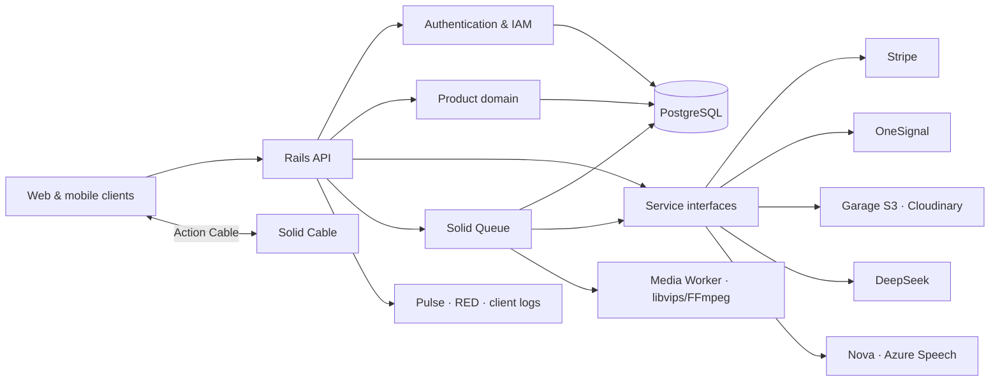

<a id="readme-top"></a>

<div align="center">

# Rexone Core

### A battle-hardened Rails foundation, forged so the product can wage the interesting war.

A production-minded API core for web and mobile products. Authentication, IAM, payments, access control, media, notifications, AI, real-time delivery, background work, administration, and observability stand ready—not as scattered trophies, but as one disciplined system.

Built under a simple creed: **clear in thought, exact in structure, simple in use, and strong enough to endure what comes after launch.**

[](https://www.ruby-lang.org/)
[](https://rubyonrails.org/)
[](https://www.postgresql.org/)
[](https://www.docker.com/)
[](https://github.com/rex-9/rexone-core/actions/workflows/test.yml)

**API-first · Modular · Observable · Queue-aware · Built to grow**

[Quick Start](docs/QUICK_START.md) · [Explore the foundation](#feature-map) · [Foundation Guide](docs/FOUNDATION.md) · [Ecosystem Architecture](ECOSYSTEM.md) · [Visual Walkthrough](./docs/VISUAL_WALKTHRUOGH.md) · [Who it is for](#who-rexone-is-for) · [Development Law](LAW.md) · [Production Deployment](docs/DEPLOYMENT.md)

</div>

---

> [!IMPORTANT]

> **🏛️ Unified Ecosystem**: For the complete cross-platform architecture, feature parity matrix, and communication protocols between Core, Web, and Mobile, see **[ECOSYSTEM.md](ECOSYSTEM.md)**.

>

> **🗺️ Visual Walkthrough**: For the screenshot-driven, feature-by-feature tour of Rexone across Core, Web, Mobile, administration, and operations, see **[VISUAL_WALKTHRUOGH.md](./docs/VISUAL_WALKTHRUOGH.md**)\*\*\*\*.

>

> **📜 Constitutional Law**: All development must strictly adhere to the architecture, service boundary, and API envelope laws in **[LAW.md](LAW.md)**. Zero exceptions.

>

> **🛡️ Production Security**: Deployments must follow the origin-isolation, edge protection, rate limiting, and verification steps in **[Production DDoS and API Abuse Protection](docs/DDOS.md)**.

## Why Rexone Core?

Every product eventually meets the same old enemies: accounts, permissions, billing, uploads, jobs, notifications, dashboards, audit trails, failures, and the darkness between _“it works”_ and _“we know why it works.”_. Especially, the real challenge is _“it works on my machine.”_

Rexone Core exists because this ground should not have to be conquered again for every product.

This is not a chest of disconnected examples wearing the armor of an architecture. It is a cohesive foundation whose parts answer to one another. Stripe payments grant access. Webhooks are durably recorded before background processing begins. Notifications divide into isolated delivery jobs. Asset cleanup retries without making the client wait. Administrators can inspect the realm, while performance, backend errors, frontend failures, queues, cache, and sockets each leave a trail.

The foundation is designed to **bend around the product**, never to make the product kneel before the framework.

Its boundaries are deliberate and provider-aware. Capabilities can be extended, replaced, or reforged as the product evolves without scattering vendor logic across the codebase.

And no—this was not vibe-coded into existence.

The boundaries were reasoned about. Failure paths were traced. Immediate work was separated from deferred work. Retries, idempotency, observability, security, and data lifecycle were treated as engineering concerns, not decorations added after the demo survived.

Rexone Core brings startup speed with battle-tested discipline—and fewer final-hour whispers of _“we should probably build that before launch.”_

## Who Rexone is for

Rexone is built for Rails teams, founder-engineers, and agencies creating API-first web or mobile products that need production infrastructure without rebuilding the same foundation for every launch.

It is a particularly good fit when a product needs several of these capabilities to work together:

- Authentication and explicit role-based access control.
- Stripe payments connected to durable entitlements.
- Provider-neutral media storage and background optimization.
- In-app, push, email, and real-time notification delivery.
- Queued AI and speech workflows that survive client disconnection.
- Operational dashboards, client telemetry, audit trails, and health checks.
- Reference React and Flutter clients consuming the same contracts.

Rexone is not a no-code application generator or a promise that every product domain is already modeled. It supplies the disciplined platform foundation; the product remains responsible for its own domain, workflows, interface, and operating decisions.

## What you get

- **One coherent system:** identity, authorization, commerce, media, async work, notifications, and observability are designed to cooperate.
- **Real client contracts:** [Rexone Web](https://github.com/rex-9/rexone-web) and [Rexone Mobile](https://github.com/rex-9/rexone_mobile) exercise the same versioned API and real-time events.
- **Replaceable providers:** external services remain behind focused client and base contracts.
- **Inspectable operations:** queues, cache, sockets, performance, backend errors, and frontend telemetry have explicit operational surfaces.
- **A documented engineering standard:** architectural constraints, API conventions, lifecycle rules, and cross-client responsibilities are written down and tested.

The public [open-source growth roadmap](docs/OPEN_SOURCE_GROWTH_ROADMAP.md) tracks how Rexone will improve evaluation, evidence, contribution readiness, and responsible distribution.

## The philosophy

Rexone Core follows a simple doctrine:

> **Clarity before cleverness. Precision before haste. Simplicity without weakness. Strength without spectacle.**

Years of building software teach the same lesson as any long campaign: the first victory is easy to celebrate; surviving everything that follows is the true test.

The difficult part is rarely another controller or CRUD endpoint. It is preserving a system that remains understandable when the product grows, integrations multiply, failures arrive from unfamiliar directions, and the original developer is no longer the only one carrying the blade.

So the ambition was never to build the largest foundation possible.

It was to build a **clear one**—strong enough to carry ambitious products, flexible enough to surrender its shape to them, and disciplined enough that the next developer can enter the codebase without a map drawn in blood.

No prophecy. No magic. No shortcuts disguised as momentum.

Just deliberate engineering, tested boundaries, and a foundation built to remain standing.

## Feature map

| Foundation     | What is ready                                                                                                                   | Details                                                                               |
| -------------- | ------------------------------------------------------------------------------------------------------------------------------- | ------------------------------------------------------------------------------------- |
| Identity       | Devise, JWT, confirmation, recovery, Google sign-in, platform sessions                                                          | [Authentication & security](docs/FOUNDATION.md#authentication-and-security)           |
| Authorization  | Roles, permissions, user-role and role-permission assignments                                                                   | [IAM & access control](docs/FOUNDATION.md#iam-and-access-control)                     |
| Commerce       | Stripe Checkout, products, transactions, subscriptions, access grants                                                           | [Payments & entitlements](docs/FOUNDATION.md#payments-and-entitlements)               |
| Async work     | Solid Queue, dedicated queues, retries, concurrency controls, recurring cleanup                                                 | [Background processing](#background-processing)                                       |
| Notifications  | Socket, push, and email coordination through OneSignal and Action Cable                                                         | [Notifications & real time](docs/FOUNDATION.md#notifications-and-real-time-delivery)  |
| Media          | Provider-neutral storage, media optimization, SVG conversion, thumbnails, SRT subtitles, and progressive playback              | [Media playback](docs/MEDIA_PLAYBACK.md)                                              |
| Speech         | Synchronous and async TTS, batch STT, and live audio WebSocket streaming through Azure/Nova                                     | [AI & speech](docs/FOUNDATION.md#ai-and-speech)                                       |
| AI             | Durable queued chat, persisted history, completion alerts, and language tools                                                   | [AI & speech](docs/FOUNDATION.md#ai-and-speech)                                       |
| Localization   | Request-scoped English and Myanmar responses with modular domain translations                                                   | [Data & API design](docs/FOUNDATION.md#data-and-api-design)                           |
| Data lifecycle | PostgreSQL, global soft deletion, actor-aware auditing, JSON:API serialization                                                  | [Data & API design](docs/FOUNDATION.md#data-and-api-design)                           |
| Operations     | Performance, errors, client logs, queues, cache, cable, health checks                                                           | [Observability & administration](docs/FOUNDATION.md#observability-and-administration) |
| Administration | Administrate for Server plus Client Admin API for users, IAM, products, chat, assets, notifications, app versions               | [Observability & administration](docs/FOUNDATION.md#observability-and-administration) |
| Delivery       | Docker images, 5-container topology (API/waka/media/db/garage), graceful shutdown                                               | [Deployment](#deployment)                                                             |
| Quality        | RSpec, factories, security scanning, dependency auditing, linting                                                               | [Quality toolchain](docs/FOUNDATION.md#quality-toolchain)                             |

## Architecture

Rexone Core keeps framework concerns conventional and integrations replaceable.

Controllers own HTTP contracts, models own data rules, services own business and provider boundaries, jobs own deferred work, and serializers own response representation.



Provider-facing code lives behind focused clients such as `PaymentService::Client`, `StorageService::Client`, `AiService::Client`, `SpeechService::Client`, and the notification delivery services.

Swapping or extending a provider does not require spreading vendor logic across controllers.

The same principle applies to product-specific functionality: the foundation provides the structure, while the product remains free to define its own domain, workflows, and experience.

### Background processing

Solid Queue is part of the application architecture, not an afterthought.

The foundation currently queues work where it benefits from durability, isolation, retries, or provider independence:

| Work                             | Queue           | Why                                                                          |
| -------------------------------- | --------------- | ---------------------------------------------------------------------------- |
| Stripe webhook processing        | `payments`      | Durable ingestion, idempotency, retries, and concurrency safety              |
| Socket, push, and email delivery | `notifications` | Provider latency must not delay the originating request                      |
| Media processing                 | `media`         | Isolated compression, conversion, thumbnail, and remote-image ingestion work |

Production workers are separated by workload in [`config/queue.yml`](config/queue.yml), and recurring maintenance lives in [`config/recurring.yml`](config/recurring.yml).

The queue architecture is intentionally extensible. As a product grows, new workloads can be introduced as dedicated queues with their own concurrency, retry, and execution policies rather than turning the background layer into one undifferentiated worker.

The exact queue structure can also be customized around the requirements of the product being built.

The API and worker run as separate services in Docker, keeping request handling and background execution independently scalable.

## Foundation capabilities

Rexone Core integrates identity, IAM, payments and entitlements, notifications, media, AI, speech, version management, administration, and observability behind explicit service and provider boundaries.

Read the [Foundation Guide](docs/FOUNDATION.md) for the detailed capability map, lifecycle behavior, provider boundaries, and operational responsibilities. The [Ecosystem Architecture](ECOSYSTEM.md) defines how Core, Web, and Mobile divide ownership and communicate.

## Operations center

Operational dashboards are mounted in the application and protected by admin authentication. API documentation and the health endpoint are listed alongside them for convenience.

| Path                          | Purpose                             |
| ----------------------------- | ----------------------------------- |
| `/admin`                      | Administrate resource management    |
| `/admin/client/versions`      | App versions (super-admin only)     |
| `/admin/client/user_versions` | User version snapshots (index/show) |
| `/admin/pulse`                | Request, query, and job performance |
| `/admin/red`                  | Backend errors and diagnostics      |
| `/admin/queue`                | Solid Queue inspection and control  |
| `/admin/cache`                | Solid Cache inspection              |
| `/admin/cable`                | Solid Cable inspection              |
| `/api-docs`                   | Swagger/OpenAPI documentation       |
| `/up`                         | Application health check            |

Client-side errors are accepted at `POST /v1/client/logs` and managed from the admin area.

## Quick start

Core development runs each responsibility in its own terminal. After cloning and configuring `.env`, start the required database, API, and general worker:

```bash
git clone https://github.com/rex-9/rexone-core.git
cd rexone-core
git switch dev
cp .env.example .env
./scripts/dev_db.sh
```

Then run `./scripts/dev_api.sh` and `./scripts/dev_waka.sh` in two additional terminals. Garage storage, media processing, and Stripe webhook forwarding each have an optional dedicated terminal when those providers are enabled.

After the API starts, seed the development IAM roles and accounts:

```bash
docker compose -f docker-compose.dev.yaml exec api bin/rails db:seed
```

The complete [Ecosystem Quick Start](docs/QUICK_START.md) lists all six terminals, explains which services are optional, covers Core/Web/Mobile compatibility, and provides client startup and troubleshooting guidance.

## Configuration

Configuration is part of the [Ecosystem Quick Start](docs/QUICK_START.md#configure-core). The checked-in [`.env.example`](.env.example) remains the authoritative catalog of available settings; keep real credentials in the deployment environment or an encrypted secret store.

## API surface

The API is broader than a starter CRUD demo. Its main route families are:

| Area             | Representative routes                                                                                                                                               |
| ---------------- | ------------------------------------------------------------------------------------------------------------------------------------------------------------------- |
| Authentication   | `/signup`, `/signin`, `/signin/google`, `/confirmation/*`, `/password/*`                                                                                            |
| Users            | `/v1/users/*`                                                                                                                                                       |
| IAM              | `/v1/iam/*`                                                                                                                                                         |
| Admin API        | `/v1/admin/*`                                                                                                                                                       |
| Payments         | `/v1/payment/*`, `/webhooks/stripe`                                                                                                                                 |
| Entitlements     | `/v1/access/*`                                                                                                                                                      |
| Media            | `/v1/assets/upload`, `/v1/assets`, `/v1/assets/:id/playback`                                                                                                        |
| Notifications    | `/v1/admin/notifications`                                                                                                                                           |
| AI               | `/v1/ai/*`                                                                                                                                                          |
| Speech           | `/v1/speech/*`, `SpeechLiveChannel` (WS)                                                                                                                            |
| Client telemetry | `/v1/client/logs`                                                                                                                                                   |
| App versions     | `/v1/client/versions/current`, `/v1/client/versions/user-version`, `/v1/admin/client/versions`, `/v1/admin/client/versions/user_versions`, `/admin/client/versions` |

Use `/api-docs` for the interactive OpenAPI view and [`config/routes.rb`](config/routes.rb) for the authoritative route map.

## Deployment

The production image is multi-stage, runs as a non-root user, precompiles Bootsnap, includes health-check dependencies, and prepares the database when the API container starts.

[`docker-compose.yaml`](docker-compose.yaml) separates the API, Solid Queue worker, and PostgreSQL services with health checks and restart policies.

The same image can also be deployed through Kamal or another container platform.

Before production:

1. Supply real secrets through the deployment environment.
2. Use strong, unique admin credentials and remove development seed accounts.
3. Configure Stripe webhook signing and provider callback URLs.
4. Run the API and `bin/jobs` worker as separate processes.
5. Confirm database pool sizing against API threads and queue concurrency.
6. Put TLS and a trusted reverse proxy in front of the application.
7. Review retention, throttling, alerting, and backup policies for your product.

## Clients in Rexone Ecosystem

- [Rexone Web](https://github.com/rex-9/rexone-web) — web client
- [Rexone Mobile](https://github.com/rex-9/rexone_mobile) — mobile client

## 🎨 Rebranding

Rexone Core serves as the master rebranding engine for the entire ecosystem:

```bash
# 1. Rebrand all 3 repositories from rexone-core:
./scripts/rebrand.sh brand.config.json

# 2. Local environment variables in .env:
APP_NAME="My New App Name"
DEFAULT_MAIL_SENDER="no-reply@mynewapp.com"
```

---

## 🏛️ Ecosystem Lineage & Attribution

This API core is built on top of the **Rexone Ecosystem** (`rex-9`). When creating derivative products or white-label backends:

- Developers and creators are warmly encouraged to preserve ecosystem credit in documentation to support the project.
- All development must strictly adhere to the constitutional engineering standards in **[LAW.md](LAW.md)** and **[ECOSYSTEM.md](ECOSYSTEM.md)**.

---

## Support the project

If Rexone Core saves you a few weeks—or saves you from one memorable production incident—consider giving it a star. 🌟

[](https://github.com/rex-9/rexone-core)

## Author

Built with Clarity & Simplicity Driven Development, by **Rex (Rex9)**.

A software engineer, full-stack architect, and long-time practitioner of meditation.

I build systems the same way I approach the path itself: **with a clear mind, deliberate steps, and no unnecessary weight.**

- GitHub: [@rex-9](https://github.com/rex-9)
- Portfolio: [rex9.me](https://rex9.me)
- LinkedIn: [rex9](https://www.linkedin.com/in/rex9/)

_Built with ❤️ by Rex9 on Rexone Ecosystem_

<p align="right"><a href="#readme-top">Back to top ↑</a></p>
