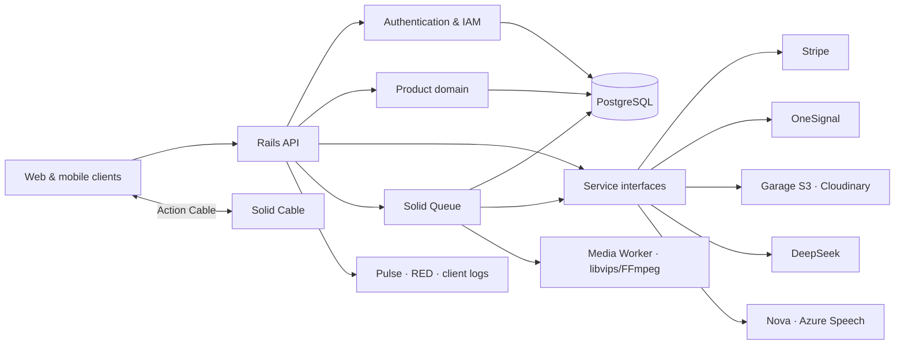

<a id="readme-top"></a>

<div align="center">

# Rexone Core

### A battle-hardened Rails foundation, forged so the product can wage the interesting war.

A production-minded API core for web and mobile products. Authentication, IAM, payments, access control, media, notifications, AI, real-time delivery, background work, administration, and observability stand ready—not as scattered trophies, but as one disciplined system.

Built under a simple creed: **clear in thought, exact in structure, simple in use, and strong enough to endure what comes after launch.**

[](https://www.ruby-lang.org/)
[](https://rubyonrails.org/)
[](https://www.postgresql.org/)
[](https://www.docker.com/)
[](https://github.com/rex-9/rexone-core/actions/workflows/test.yml)

**API-first · Modular · Observable · Queue-aware · Built to grow**

[Quick Start](docs/QUICK_START.md) · [Explore the foundation](#feature-map) · [Foundation Guide](docs/FOUNDATION.md) · [Ecosystem Architecture](ECOSYSTEM.md) · [Who it is for](#who-rexone-is-for) · [Development Law](LAW.md) · [Production Deployment](docs/DEPLOYMENT.md)

</div>

---

> [!IMPORTANT]
> **🏛️ Unified Ecosystem**: For the complete cross-platform architecture, feature parity matrix, and communication protocols between Core, Web, and Mobile, see **[ECOSYSTEM.md](ECOSYSTEM.md)**.
>
> **📜 Constitutional Law**: All development must strictly adhere to the architecture, service boundary, and API envelope laws in **[LAW.md](LAW.md)**. Zero exceptions.
>
> **🛡️ Production Security**: Deployments must follow the origin-isolation, edge protection, rate limiting, and verification steps in **[Production DDoS and API Abuse Protection](docs/DDOS.md)**.

## Why Rexone Core?

Every product eventually meets the same old enemies: accounts, permissions, billing, uploads, jobs, notifications, dashboards, audit trails, failures, and the darkness between _“it works”_ and _“we know why it works.”_. Especially, the real challenge is _“it works on my machine.”_

Rexone Core exists because this ground should not have to be conquered again for every product.

This is not a chest of disconnected examples wearing the armor of an architecture. It is a cohesive foundation whose parts answer to one another. Stripe payments grant access. Webhooks are durably recorded before background processing begins. Notifications divide into isolated delivery jobs. Asset cleanup retries without making the client wait. Administrators can inspect the realm, while performance, backend errors, frontend failures, queues, cache, and sockets each leave a trail.

The foundation is designed to **bend around the product**, never to make the product kneel before the framework.

Its boundaries are deliberate and provider-aware. Capabilities can be extended, replaced, or reforged as the product evolves without scattering vendor logic across the codebase.

And no—this was not vibe-coded into existence.

The boundaries were reasoned about. Failure paths were traced. Immediate work was separated from deferred work. Retries, idempotency, observability, security, and data lifecycle were treated as engineering concerns, not decorations added after the demo survived.

Rexone Core brings startup speed with battle-tested discipline—and fewer final-hour whispers of _“we should probably build that before launch.”_

## Who Rexone is for

Rexone is built for Rails teams, founder-engineers, and agencies creating API-first web or mobile products that need production infrastructure without rebuilding the same foundation for every launch.

It is a particularly good fit when a product needs several of these capabilities to work together:

- Authentication and explicit role-based access control.
- Stripe payments connected to durable entitlements.
- Provider-neutral media storage and background optimization.
- In-app, push, email, and real-time notification delivery.
- Queued AI and speech workflows that survive client disconnection.
- Operational dashboards, client telemetry, audit trails, and health checks.
- Reference React and Flutter clients consuming the same contracts.

Rexone is not a no-code application generator or a promise that every product domain is already modeled. It supplies the disciplined platform foundation; the product remains responsible for its own domain, workflows, interface, and operating decisions.

## What you get

- **One coherent system:** identity, authorization, commerce, media, async work, notifications, and observability are designed to cooperate.
- **Real client contracts:** [Rexone Web](https://github.com/rex-9/rexone-web) and [Rexone Mobile](https://github.com/rex-9/rexone_mobile) exercise the same versioned API and real-time events.
- **Replaceable providers:** external services remain behind focused client and base contracts.
- **Inspectable operations:** queues, cache, sockets, performance, backend errors, and frontend telemetry have explicit operational surfaces.
- **A documented engineering standard:** architectural constraints, API conventions, lifecycle rules, and cross-client responsibilities are written down and tested.

The public [open-source growth roadmap](docs/OPEN_SOURCE_GROWTH_ROADMAP.md) tracks how Rexone will improve evaluation, evidence, contribution readiness, and responsible distribution.

## The philosophy

Rexone Core follows a simple doctrine:

> **Clarity before cleverness. Precision before haste. Simplicity without weakness. Strength without spectacle.**

Years of building software teach the same lesson as any long campaign: the first victory is easy to celebrate; surviving everything that follows is the true test.

The difficult part is rarely another controller or CRUD endpoint. It is preserving a system that remains understandable when the product grows, integrations multiply, failures arrive from unfamiliar directions, and the original developer is no longer the only one carrying the blade.

So the ambition was never to build the largest foundation possible.

It was to build a **clear one**—strong enough to carry ambitious products, flexible enough to surrender its shape to them, and disciplined enough that the next developer can enter the codebase without a map drawn in blood.

No prophecy. No magic. No shortcuts disguised as momentum.

Just deliberate engineering, tested boundaries, and a foundation built to remain standing.

## Feature map

| Foundation     | What is ready                                                                                                     | Details                                                |
| -------------- | ----------------------------------------------------------------------------------------------------------------- | ------------------------------------------------------ |
| Identity       | Devise, JWT, confirmation, recovery, Google sign-in, platform sessions                                            | [Authentication & security](#authentication--security) |
| Authorization  | Roles, permissions, user-role and role-permission assignments                                                     | [IAM & access control](#iam--access-control)           |
| Commerce       | Stripe Checkout, products, transactions, subscriptions, access grants                                             | [Payments & entitlements](#payments--entitlements)     |
| Async work     | Solid Queue, dedicated queues, retries, concurrency controls, recurring cleanup                                   | [Background processing](#background-processing)        |
| Notifications  | Socket, push, and email coordination through OneSignal and Action Cable                                           | [Notifications & real time](#notifications--real-time) |
| Media          | Garage S3/Cloudinary/local storage, underground silent compression (libvips/FFmpeg), optimal-first flow           | [Storage & assets](#storage--assets)                   |
| Speech         | Synchronous & async TTS (MP3 binary stream), batch STT, live audio WebSocket streaming (Azure/Nova)               | [Speech capabilities](#speech-capabilities)            |
| AI             | Durable queued chat, persisted history, completion alerts, and language tools                                     | [AI capabilities](#ai-capabilities)                    |
| Localization   | Request-scoped English and Myanmar responses with modular domain translations                                     | [Localization](#localization)                          |
| Data lifecycle | PostgreSQL, global soft deletion, actor-aware auditing, JSON:API serialization                                    | [Data & API design](#data--api-design)                 |
| Operations     | Performance, errors, client logs, queues, cache, cable, health checks                                             | [Observability](#observability)                        |
| Administration | Administrate for Server plus Client Admin API for users, IAM, products, chat, assets, notifications, app versions | [Administration](#administration)                      |
| Delivery       | Docker images, 5-container topology (API/waka/media/db/garage), graceful shutdown                                 | [Deployment](#deployment)                              |
| Quality        | RSpec, factories, security scanning, dependency auditing, linting                                                 | [Quality toolchain](#quality-toolchain)                |

## Architecture

Rexone Core keeps framework concerns conventional and integrations replaceable.

Controllers own HTTP contracts, models own data rules, services own business and provider boundaries, jobs own deferred work, and serializers own response representation.



Provider-facing code lives behind focused clients such as `PaymentService::Client`, `StorageService::Client`, `AiService::Client`, `SpeechService::Client`, and the notification delivery services.

Swapping or extending a provider does not require spreading vendor logic across controllers.

The same principle applies to product-specific functionality: the foundation provides the structure, while the product remains free to define its own domain, workflows, and experience.

### Background processing

Solid Queue is part of the application architecture, not an afterthought.

The foundation currently queues work where it benefits from durability, isolation, retries, or provider independence:

| Work                             | Queue           | Why                                                             |
| -------------------------------- | --------------- | --------------------------------------------------------------- |
| Stripe webhook processing        | `payments`      | Durable ingestion, idempotency, retries, and concurrency safety |
| Socket, push, and email delivery | `notifications` | Provider latency must not delay the originating request         |
| Image, video & audio compression | `media`         | Dedicated worker (libvips/FFmpeg) isolating heavy media compute |

Production workers are separated by workload in [`config/queue.yml`](config/queue.yml), and recurring maintenance lives in [`config/recurring.yml`](config/recurring.yml).

The queue architecture is intentionally extensible. As a product grows, new workloads can be introduced as dedicated queues with their own concurrency, retry, and execution policies rather than turning the background layer into one undifferentiated worker.

The exact queue structure can also be customized around the requirements of the product being built.

The API and worker run as separate services in Docker, keeping request handling and background execution independently scalable.

<<<<<<< HEAD
## The foundation in detail

### Authentication & security

- Devise authentication with JWT issuance and revocation.
- Email/password registration, confirmation codes, password recovery, locking, tracking, and timeout support.
- Google sign-in with a challenge flow for completing account creation.
- Profile management and identity inspection supporting atomic name and username updates with validation.
- Platform-aware active sessions backed by the application cache.
- Rack Attack throttling for abusive or excessive requests.
- Configurable CORS and Rails security defaults.
- Consistent authentication failures and localized client-facing messages.

Authentication is ready for multiple clients without forcing browser-session assumptions onto an API product.

### IAM & access control

Authorization is modeled explicitly instead of being buried in controller conditionals:

- Users receive roles through `Iam::UserRole`.
- Roles receive resource/action permissions through `Iam::RolePermission`.
- Permissions cover operations such as `create`, `read`, `update`, and `delete`.
- **Three-Tier Administrative Hierarchy & Permission Scoping**:
  - `super_admin`: Full, unrestricted authority across all resources, endpoints, and IAM governance.
  - `admin`: Full operational authority across domain resources (`feedbacks`, `payments`, `ai`, `assets`, `logs`), strictly restricted from managing `users`, `iam`, `versions`, and `user_versions`.
  - Partial admins (`*_admin` naming convention): Roles named with the `_admin` suffix (e.g. `feedback_admin`, `payment_admin`) granted to users with the base `user` role.
  - **Permission Provenance & Endpoint Scoping**:
    - **`/v1/admin/*` Endpoints**: Require an admin role (a role whose name contains `admin`) that explicitly grants the required CRUD permission. Permissions inside non-admin roles (such as the base `user` role) cannot grant access to `/v1/admin/*`.
    - **`/v1/*` Endpoints**: Permissions in an admin role (e.g. `read_users` in `user_admin`) grant access to both `/v1/users` and `/v1/admin/users`, whereas permissions in standard user roles only grant access to `/v1/users`.
- New users receive the default user role automatically. That role includes `read_versions` (splash check when signed in) and `create_user_versions` (record the device). Public unsigned splash still skips login. Client::Version create/update/delete stay off the default user role.

This gives small products a sensible starting policy and growing products a clean path to granular authorization.

### Payments & entitlements

Stripe integration covers the full commercial loop:

- Product and price synchronization.
- Checkout Sessions for one-time purchases and subscriptions.
- Customer creation and reuse.
- PaymentIntent transaction snapshots, payment-method metadata, and Stripe-version-aligned subscription item snapshots.
- Cancellation-at-period-end and subscription resumption.
- Access grants and revocation driven by payment state.
- Persisted webhook events with duplicate protection, processing state, attempts, errors, retention, and admin visibility.
- Background webhook processing with targeted retries and per-event concurrency control.

The important distinction is deliberate: customer-facing payment flows remain responsive, while webhook fulfillment is durable and asynchronous for the business.

### Notifications & real time

`NotificationService` coordinates three independent delivery paths:

- Action Cable broadcasts for live in-product updates and persistent inbox storage.
- Push notifications (e.g. OneSignal).
- Transactional and marketing email delivery.

Each enabled channel receives its own Solid Queue job. A failed email therefore does not repeat a successful push, and a notification provider outage does not roll back a completed payment or authentication action.

Client-visible queued work follows the shared `queued -> processing -> completed | failed` contract with a stable operation ID and resource link. See [Asynchronous operation contract](docs/ASYNC_OPERATIONS.md).

- **Persistent In-App Notifications (`user_notifications`)**:
  - In-app socket broadcasts are persisted to `user_notifications` as immutable historical receipts (`title`, `message`, `link`, `data`, `read_at`).
  - Subsequent admin template alterations never rewrite historical inbox receipts received by users.
  - Endpoints:
    - `GET /v1/notifications` — Paginated inbox list (Pagy 20 items, supports `filter=all|unread|read`).
    - `GET /v1/notifications/unread_count` — Total unread count for real-time badge counters without fetching full lists.
    - `PUT /v1/notifications/:id/read` — Marks an individual notification as read.
    - `PUT /v1/notifications/read_all` — Marks all unread notifications as read.
    - `DELETE /v1/notifications/:id` — Soft-deletes an individual notification from the user inbox.

- **Multi-Channel Notifications (`notifications`)**:
  - Database-backed multi-channel notifications supporting dynamic variable interpolation (`{{user_name}}`, `{{user_email}}`, custom variables).
  - Provider-agnostic identifiers (`push_template_id`, `email_template_id`) decouple notifications from external delivery vendors.
  - Admin management endpoints:
    - `GET /v1/admin/notifications` — List and filter notifications with pagination and search.
    - `GET /v1/admin/notifications/:id` — Read single notification details.
    - `POST /v1/admin/notifications` — Create custom marketing and broadcast notifications.
    - `PUT /v1/admin/notifications/:id` — Update notification content across In-App, Push, and Email channels.
    - `DELETE /v1/admin/notifications/:id` — Soft-delete notification.
    - `POST /v1/admin/notifications/:id/undiscard` — Restore soft-deleted notification.
    - `POST /v1/admin/notifications/dispatch` — Broadcast dispatch to confirmed users holding selected roles, specific user IDs, or the full confirmed audience.

- **Automated Retention Cleanup (`Notification::CleanupJob`)**:
  - Daily maintenance job scheduled at 2:30am via `config/recurring.yml`:
    - Purges read notifications older than 30 days (`AppConfig::NOTIFICATION_READ_RETENTION_DAYS = 30`).
    - Purges unread notifications older than 90 days (`AppConfig::NOTIFICATION_UNREAD_RETENTION_DAYS = 90`).
    - Purges discarded notifications older than 7 days (`AppConfig::NOTIFICATION_DISCARDED_RETENTION_DAYS = 7`).

- **Cumulative Lifetime Notification Metrics**:
  - `UserNotification` maintains `sent_count` and `read_count` counters on `Notification` atomically in real-time via transactional lifecycle callbacks on notification creation, individual reading, and bulk read-all operations.
  - Because `Notification::CleanupJob` routinely purges older inbox receipts, notification metrics are strictly cumulative lifetime telemetry and are intentionally decoupled from recount queries to prevent retention-induced data loss.

- **Data Synchronization Pipeline (`DataSyncService` & `DataSyncJob`)**:
  - Provides an extensible background reconciliation framework (`DataSyncJob` $\rightarrow$ `DataSyncService.sync_all!`) scheduled via `config/recurring.yml` using `DATA_SYNC_SCHEDULE` (defaults to weekly: `"at 3:00am every Sunday"`, configurable via environment) for periodic synchronization of non-lossy resources and caches.

The admin- and permission-protected `POST /v1/admin/notifications/dispatch` contract is ready for the dashboard to send custom content to confirmed users holding selected roles—or to the full confirmed audience—through any combination of socket, push, and email. Users with several selected roles are included only once. Audience fanout runs in the `notifications` queue, while each resulting channel delivery keeps its own retry boundary. Sensitive confirmation or password-reset workflows are never exposed as admin-selectable presets.

### Storage & assets

The storage abstraction defaults to **Garage** (self-hosted S3-compatible distributed object storage on port 3100) with full fallback support for **Cloudinary** and local filesystem storage. Read the complete [Garage Guide](docs/GARAGE.md) for architecture, configuration, and UI tooling.

- **Hierarchical S3 Key Structure**:
  - Admin uploads: `admin/{type}_{name}_{timestamp}.{ext}`
  - User uploads: `user/{user_id}/{type}_{name}_{timestamp}.{ext}`
  - Google avatar imports: `user/{user_id}/avatar_google_{timestamp}.{ext}`
  - **Environment Storage Partitions (`S3_FOLDER_PREFIX`)**: Garage automatically partitions new storage keys by Rails environment—`dev/` for development, `uat/` for UAT/staging, and `prod/` for production—with `S3_FOLDER_PREFIX` available as an explicit override. Partition handling belongs exclusively to Garage; asset records and admin database queries remain environment-agnostic and cover the complete assets table.
- **Zero-Footprint Storage In-Place Rename**: When an administrator updates an asset's `type` via the Admin Portal, the backend dynamically moves the storage object (`StorageService::Client.move(old_key, new_key)`) without creating duplicate or orphaned files in Garage.
- **Storage & VPS Capacity Monitoring**: The super-admin-only `GET /v1/admin/assets/storage_stats` endpoint polls the Garage Admin API (`S3_ADMIN_ENDPOINT=http://garage:3101`, `S3_ADMIN_TOKEN=...`) and reports bucket/VPS capacity, actual and database-tracked object/byte usage for each `dev/`, `uat/`, and `prod/` Garage partition, plus complete database asset totals. It triggers proactive low-disk alerts when free disk space falls below 15%.
- **Automated Backup Scripts**:
  - `scripts/backup_db.sh`: Automated PostgreSQL database dumps with 7-day rolling retention.
  - `scripts/backup_garage.sh`: Automated Garage metadata & block backups with 7-day rolling retention.
  - `scripts/backup_all.sh`: Unified single-command backup runner configured for cron automation.
- **Empty Recycle Bin (`DELETE /v1/admin/assets/bin`)**: Hard-purges all discarded assets (`Asset.purge_and_destroy_all!`) and immediately removes backing objects from Garage S3 / Cloudinary storage without orphaned files.
- **Batch Operations**:
  - `POST /v1/admin/assets/batch_discard`: Multi-select soft-deletion (discards multiple active assets to recycle bin via `discard_batch`).
  - `POST /v1/admin/assets/batch_undiscard`: Multi-select restoration (restores multiple discarded assets via `undiscard_batch`).
  - `POST /v1/admin/assets/batch_destroy`: Multi-select permanent purging (hard-deletes selected assets and immediately purges backing objects from Garage S3 via `destroy_batch`).
  - All lifecycle actions map cleanly: `destroy_bin`, `destroy_batch`, `discard_batch`, and `undiscard_batch` resolve uniformly under `:delete` permission in authorization.
- **Unified Asset Lifecycle**: Uploads return the URL and metadata the client needs immediately while retaining provider identifiers, category, media type, extension, size, source, and ownership. `GET /v1/assets` lists stored assets and accepts `type` (`avatar`, `thumbnail`, `subtitle`, `audio`, `video`, `attachment`, `general`) plus pagination (`page`, `limit`).
- **Default Self-Hosted Storage**: `STORAGE_PROVIDER=garage` uses the official `aws-sdk-s3` client connected to the local or production Garage daemon (`http://garage:3100` / `http://localhost:3100`).
- **Instant Clean Purge**: Storage deletion executes directly (`StorageService::Client.delete`) upon record destruction commit, ensuring storage objects are permanently cleaned without orphan drift.
- **Provider Switching**: Easily switch between `garage` (S3), `cloudinary`, or `local` via `STORAGE_PROVIDER` without code changes.

#### Silent Underground Media Compression Pipeline

When the media container is enabled (`MEDIA_CONTAINER_ENABLED=true`), uploaded assets run through an isolated, background media optimization pipeline:

- **Isolated Worker (`media` container)**: CPU- and memory-intensive media processing runs on a dedicated Solid Queue worker (`config/queue.media.yml`), completely isolating image/video/audio compression and canonical FFmpeg video-thumbnail generation from API requests and transactional jobs.
- **SVG to PNG on save**: Uploaded SVG is converted to PNG in the API process (`MediaService::SvgToPng` → `MediaService::ImageConversion` via `rsvg-convert`, fitted inside `IMAGE_MAX_WIDTH` × `IMAGE_MAX_HEIGHT`). The stored asset is `extension: png` and `optimal`; it does **not** enqueue `Media::CompressImageJob`. Thumbnail SVG covers use a `.png` key and are also `optimal`. Stored SVG rows are not converted until re-uploaded. Docker images need `librsvg2-bin` (rebuild `api` after pulling this change).
- **Image Compression (`Media::CompressImageJob`)**: Powered by `libvips` with smart palette quantization (`palette: true`, dynamic Q factor), dimension constraints (`IMAGE_MAX_WIDTH`, `IMAGE_MAX_HEIGHT`), and format-specific optimizations across JPEG, PNG, and WebP.
- **Video Compression (`Media::CompressVideoJob`)**: Powered by `ffmpeg` (`libx264`, `aac`) with adaptive CRF tuning, dimension constraints, bitrate caps (`VIDEO_MAX_BITRATE`), and audio stream optimization.
- **Audio Compression (`Media::CompressAudioJob`)**: Powered by `ffmpeg` (`aac` / `libmp3lame`, `AUDIO_BITRATE`) with `-vn`, stereo 44.1 kHz. WAV, FLAC, and OGG remux to M4A because those containers cannot host AAC; MP3, M4A, and AAC keep their original extension.
- **Optimal-First Flow**:
  - If initial compression yields no improvement or reduction is negligible (`< 3%`), the pipeline immediately marks the asset as `optimal` without incrementing cache counters or scheduling redundant passes.
  - If meaningful reduction is achieved, the pass counter increments with a fallback safety cap of 2 passes (`MAX_COMPRESSION_PASSES = 2`).
- **Real-Time Cable Broadcasts**: Status changes (`pending` $\rightarrow$ `processing` $\rightarrow$ `ready` or `optimal`), updated file sizes, and compression ratios broadcast in real-time over ActionCable (`NotificationChannel`) to connected clients.
- **Canonical Video Thumbnails**: Every uploaded compressible video queues independent FFmpeg thumbnail generation. The resulting WebP is stored beside the original, represented by its own `Asset` linked through `parent_asset_id`, serialized on the source asset, and broadcast as `asset_thumbnail_generated` so Web and Mobile can update without waiting. Admin clients can regenerate a video thumbnail or upload an image replacement for a compressible video or audio parent; replacement commits the new asset before the superseded Garage object is cleaned up.
- **SRT Subtitles**: Admin clients attach one `.srt` file to a compressible video or audio parent (`POST /v1/admin/assets/:id/subtitle/upload`). The child is `type`/`format` `subtitle`, Garage `raw`, `status: ready`, and is **not** sent to the media queue. Serialized parents expose nested `subtitle` (`id`, `url`, `status`, `size_bytes`). Replacement destroys the previous subtitle record and Garage object first.
- **Upload Boundaries (`MAX_NON_VIDEO_SIZE_MB` & `MAX_VIDEO_SIZE_MB`)**:
  - Dynamically conditioned on `MEDIA_CONTAINER_ENABLED` and configurable via `MEDIA_MAX_NON_VIDEO_SIZE_MB` and `MEDIA_MAX_VIDEO_SIZE_MB`.
  - **With Media Container** (`MEDIA_CONTAINER_ENABLED=true`): Defaults to **10 MB** for images/non-videos and **100 MB** for videos.
  - **Without Media Container** (`MEDIA_CONTAINER_ENABLED=false`): Defaults to **1 MB** for images/non-videos and **10 MB** for videos.
  - Server-side validation cleanly returns a localized 422 error if files exceed configured limits.

### AI capabilities

The DeepSeek-backed AI layer provides:

- Durable conversational work through Solid Queue's dedicated `ai` queue.
- Persisted rooms, user messages, processing state, and assistant responses—the browser never owns the lifetime of the work.
- Immediate acknowledgement while the AI continues in the background, with one in-flight request allowed per room.
- Safe retries, per-message concurrency control, idempotent completion, and visible failure state.
- Real-time completion and failure alerts through the existing notification socket channel.
- Optional push and email delivery through the same notification path by enabling the existing channel flags.
- Summarization.
- Translation.
- Sentiment, entity, keyword, and general analysis prompts.
- A provider-neutral client boundary for future AI backends.
- Safe client errors with detailed provider failures retained in server logs.

The user can leave the chat, browse elsewhere, close the browser, or shut down the device without interrupting generation. The completed assistant message is committed to conversation history before notification delivery begins, so it is already waiting when the user returns—even if no live socket was present to receive the alert.

The AI layer remains isolated behind its provider boundary so product-specific workflows can evolve without coupling the rest of the application to a single model provider.

### Speech capabilities

The unified speech infrastructure provides both synchronous utilities and real-time streaming audio capabilities:

- **Text-to-Speech (TTS)**:
  - Synchronous binary audio streaming (`POST /v1/speech/tts`) returning raw MP3 data without base64 wrapper overhead.
  - Asynchronous background TTS synthesis for chat messages (`POST /v1/speech/tts` with `message_id`).
  - Durable background processing via `Speech::ProcessTtsJob` on the dedicated `:ai` queue with retry logic and per-message concurrency limits.
  - Automated Cloudinary audio storage and polymorphic `Asset` attachment to chat messages.
  - Real-time `tts_ready` and `tts_failed` completion alerts broadcast over ActionCable (`NotificationChannel`).
- **Speech-to-Text (STT)**:
  - Synchronous transcription (`POST /v1/speech/stt`) accepting either multipart audio file uploads or remote `audio_url` references.
  - Real-time live audio transcription over WebSocket via `SpeechLiveChannel`, streaming PCM audio chunks directly to Azure Speech live recognition sessions.
- **Provider Architecture**:
  - `SpeechService::Client` exposes the generic domain interface while isolating provider specifics behind `NovaSpeech` (batch REST STT/TTS) and `AzureSpeech` (SSML REST TTS & live WebSocket STT).

### Data & API design

- PostgreSQL with UUID primary keys for application records.
- Global soft deletion through Discard, with kept records as the default scope.
- Actor-aware creation, update, discard, and restore auditing through `Current.auditor`.
- JSON:API serializers for stable resource representation.
- A consistent response envelope (`status`, `message`, `data`, `error`, `meta.pagination`) across all standard endpoints.
- Pagy-backed offset pagination unified across all collection and list endpoints.
- Intentionally namespaced constants organized by domain in `app/constants/` (`AiConstants`, `PaymentConstants`, `AccessConstants`, `AssetConstants`, `AuthConstants`, `NotificationConstants`).
- Versioned client routes under `/v1` and a separate admin API namespace.
- Modular I18n-backed client messages, organized by product domain.
- OpenAPI documentation served through Rswag.

### Localization

Client-facing messages are organized by domain through `MessageService` and Rails I18n instead of being collected in one global constants file. English (`en`) and Myanmar (`my`) are included, with English as the safe fallback.

The API selects a locale for each request in this order:

1. Query parameter: `?locale=my`
2. Explicit header: `X-Locale: my`
3. Standard header: `Accept-Language: my-MM`
4. Default: `en`

Locale switching is request-scoped through `I18n.with_locale`, preventing one request's language from leaking into another under concurrent execution. Adding another language means mirroring the modular files in `config/locales` and registering its locale code.

### App version check

Clients call `GET /v1/client/versions/current?version=1.2.0` on splash. `update_required` is true when the client marketing semver is strictly less than the live version (optional update dialog). `must_update` is true when that live version is a force update and greater than the client (blocking dialog). `skip_premium` is true when that client semver is strictly greater than the live version number (TestFlight/beta ahead of store). Store links come from `IOS_STORE_URL` / `ANDROID_STORE_URL` (`store_url` follows `X-Platform`). Client::Version build numbers are not returned. Missing or invalid JWT still returns the latest **live** version plus computed `update_required` / `must_update` / `skip_premium`. A valid JWT requires `read_versions`. This check never writes `Client::UserVersion`. Signed-in clients record the device with `POST /v1/client/versions/user-version` (`create_user_versions`, `version` required, `version_code` optional). Draft, yanked, and future `released_at` rows are excluded from the public check. Publishing a version yanks every other kept published row (only one published at a time). Client::Version CRUD lives in Administrate at `/admin/client/versions` and in the JSON admin API at `/v1/admin/client/versions`.

### Observability

Backend, frontend, synchronous, and asynchronous failures leave different clues. Rexone Core gives each one a proper home.

Behavioral marketing analytics stays in Firebase/GA4 rather than the primary database. Core constantizes the shared Web/Mobile `action_noun` event vocabulary while remaining the authoritative source for users, access, payments, subscriptions, and operational business aggregates.
=======
## Foundation capabilities
>>>>>>> e81c94415f7404d6baaeb677640e926058305491

Rexone Core integrates identity, IAM, payments and entitlements, notifications, media, AI, speech, version management, administration, and observability behind explicit service and provider boundaries.

Read the [Foundation Guide](docs/FOUNDATION.md) for the detailed capability map, lifecycle behavior, provider boundaries, and operational responsibilities. The [Ecosystem Architecture](ECOSYSTEM.md) defines how Core, Web, and Mobile divide ownership and communicate.

## Operations center

Operational dashboards are mounted in the application and protected by admin authentication. API documentation and the health endpoint are listed alongside them for convenience.

| Path                          | Purpose                             |
| ----------------------------- | ----------------------------------- |
| `/admin`                      | Administrate resource management    |
| `/admin/client/versions`      | App versions (super-admin only)     |
| `/admin/client/user_versions` | User version snapshots (index/show) |
| `/admin/pulse`                | Request, query, and job performance |
| `/admin/red`                  | Backend errors and diagnostics      |
| `/admin/queue`                | Solid Queue inspection and control  |
| `/admin/cache`                | Solid Cache inspection              |
| `/admin/cable`                | Solid Cable inspection              |
| `/api-docs`                   | Swagger/OpenAPI documentation       |
| `/up`                         | Application health check            |

Client-side errors are accepted at `POST /v1/client/logs` and managed from the admin area.

## Quick start

<<<<<<< HEAD
For a native installation, use Ruby `4.0.4`, PostgreSQL, libvips, `librsvg2-bin` (`rsvg-convert` for SVG to PNG), and Bundler `4.0.16`.

### 1. Clone and configure
=======
Core development runs each responsibility in its own terminal. After cloning and configuring `.env`, start the required database, API, and general worker:
>>>>>>> e81c94415f7404d6baaeb677640e926058305491

```bash
git clone https://github.com/rex-9/rexone-core.git
cd rexone-core
git switch dev
cp .env.example .env
./scripts/dev_db.sh
```

Then run `./scripts/dev_api.sh` and `./scripts/dev_waka.sh` in two additional terminals. Garage storage, media processing, and Stripe webhook forwarding each have an optional dedicated terminal when those providers are enabled.

After the API starts, seed the development IAM roles and accounts:

```bash
docker compose -f docker-compose.dev.yaml exec api bin/rails db:seed
```

The complete [Ecosystem Quick Start](docs/QUICK_START.md) lists all six terminals, explains which services are optional, covers Core/Web/Mobile compatibility, and provides client startup and troubleshooting guidance.

## Configuration

<<<<<<< HEAD
The checked-in [`.env.example`](.env.example) documents the available settings.

The important groups are:

- **Centralized Application Configuration**: All environment variables are validated, given safe defaults, and mapped to constants in [`config/app_config.rb`](config/app_config.rb) (`AppConfig::*`), preventing string typos and runtime drift across environments.
- Rails environment, URLs, logging, threads, ports, and secrets (`PORT`, `RAILS_SECRET_KEY_BASE`, `RAILS_MASTER_KEY`).
- PostgreSQL connection, connection pools (`DB_POOL`, `API_DB_POOL`, `WAKA_DB_POOL`, `MEDIA_DB_POOL`), and Docker service names.
- JWT/session, confirmation, and password-reset lifetimes.
- Stripe credentials, webhook secret, and redirect URLs.
- OneSignal application, API key, sender, and sound configuration.
- DeepSeek AI API URL, key, and model.
- Speech services: Azure Speech (key, region) and Nova Speech (key, endpoint) for TTS/STT.
- Storage & S3: `STORAGE_PROVIDER` (`garage`, `cloudinary`, `local`), S3 endpoints, credentials, and bucket.
- Media compression: `MEDIA_CONTAINER_ENABLED`, upload size limits (`MEDIA_MAX_VIDEO_SIZE_MB`, `MEDIA_MAX_NON_VIDEO_SIZE_MB`), video profile (CRF, preset, bitrate, resolution), audio profile (`MEDIA_AUDIO_CODEC`, `MEDIA_AUDIO_BITRATE`), and image profile (JPEG/PNG/WebP quality, compression).
- Solid Queue process, supervisors (`SOLID_QUEUE_IN_PUMA`), and shutdown settings (`SOLID_QUEUE_SHUTDOWN_TIMEOUT`).
- Observability & Error Dashboard: `DASHBOARD_BASE_URL`, `APP_VERSION`, `GIT_SHA`.
- App store listings for force-update: `IOS_STORE_URL`, `ANDROID_STORE_URL` (returned as `store_url` on `GET /v1/client/versions/current`, chosen from `X-Platform`).

Keep real credentials in your deployment platform or encrypted secret store—not in Git.
=======
Configuration is part of the [Ecosystem Quick Start](docs/QUICK_START.md#configure-core). The checked-in [`.env.example`](.env.example) remains the authoritative catalog of available settings; keep real credentials in the deployment environment or an encrypted secret store.
>>>>>>> e81c94415f7404d6baaeb677640e926058305491

## API surface

The API is broader than a starter CRUD demo. Its main route families are:

| Area             | Representative routes                                                                                                                                               |
| ---------------- | ------------------------------------------------------------------------------------------------------------------------------------------------------------------- |
| Authentication   | `/signup`, `/signin`, `/signin/google`, `/confirmation/*`, `/password/*`                                                                                            |
| Users            | `/v1/users/*`                                                                                                                                                       |
| IAM              | `/v1/iam/*`                                                                                                                                                         |
| Admin API        | `/v1/admin/*`                                                                                                                                                       |
| Payments         | `/v1/payment/*`, `/webhooks/stripe`                                                                                                                                 |
| Entitlements     | `/v1/access/*`                                                                                                                                                      |
| Media            | `/v1/media/upload`, `/v1/assets`                                                                                                                                    |
| Notifications    | `/v1/admin/notifications`                                                                                                                                           |
| AI               | `/v1/ai/*`                                                                                                                                                          |
| Speech           | `/v1/speech/*`, `SpeechLiveChannel` (WS)                                                                                                                            |
| Client telemetry | `/v1/client/logs`                                                                                                                                                   |
| App versions     | `/v1/client/versions/current`, `/v1/client/versions/user-version`, `/v1/admin/client/versions`, `/v1/admin/client/versions/user_versions`, `/admin/client/versions` |

Use `/api-docs` for the interactive OpenAPI view and [`config/routes.rb`](config/routes.rb) for the authoritative route map.

## Deployment

The production image is multi-stage, runs as a non-root user, precompiles Bootsnap, includes health-check dependencies, and prepares the database when the API container starts.

[`docker-compose.yaml`](docker-compose.yaml) separates the API, Solid Queue worker, and PostgreSQL services with health checks and restart policies.

The same image can also be deployed through Kamal or another container platform.

Before production:

1. Supply real secrets through the deployment environment.
2. Use strong, unique admin credentials and remove development seed accounts.
3. Configure Stripe webhook signing and provider callback URLs.
4. Run the API and `bin/jobs` worker as separate processes.
5. Confirm database pool sizing against API threads and queue concurrency.
6. Put TLS and a trusted reverse proxy in front of the application.
7. Review retention, throttling, alerting, and backup policies for your product.

## Clients in Rexone Ecosystem

- [Rexone Web](https://github.com/rex-9/rexone-web) — web client
- [Rexone Mobile](https://github.com/rex-9/rexone_mobile) — mobile client

## 🎨 Rebranding

Rexone Core serves as the master rebranding engine for the entire ecosystem:

```bash
# 1. Rebrand all 3 repositories from rexone-core:
./scripts/rebrand.sh brand.config.json

# 2. Local environment variables in .env:
APP_NAME="My New App Name"
DEFAULT_MAIL_SENDER="no-reply@mynewapp.com"
```

---

## 🏛️ Ecosystem Lineage & Attribution

This API core is built on top of the **Rexone Ecosystem** (`rex-9`). When creating derivative products or white-label backends:

- Developers and creators are warmly encouraged to preserve ecosystem credit in documentation to support the project.
- All development must strictly adhere to the constitutional engineering standards in **[LAW.md](LAW.md)** and **[ECOSYSTEM.md](ECOSYSTEM.md)**.

---

## Support the project

If Rexone Core saves you a few weeks—or saves you from one memorable production incident—consider giving it a star. 🌟

[](https://github.com/rex-9/rexone-core)

## Author

Built with Clarity & Simplicity Driven Development, by **Rex (Rex9)**.

A software engineer, full-stack architect, and long-time practitioner of meditation.

I build systems the same way I approach the path itself: **with a clear mind, deliberate steps, and no unnecessary weight.**

- GitHub: [@rex-9](https://github.com/rex-9)
- Portfolio: [rex9.me](https://rex9.me)
- LinkedIn: [rex9](https://www.linkedin.com/in/rex9/)

_Built with ❤️ by Rex9 on Rexone Ecosystem_

<p align="right"><a href="#readme-top">Back to top ↑</a></p>
