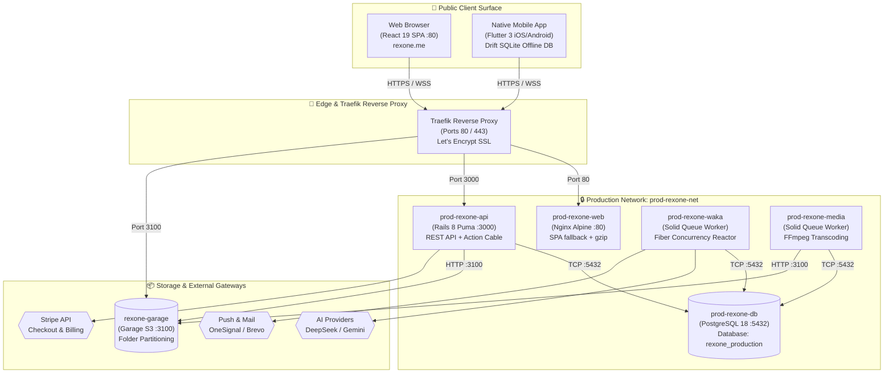

# RexOne Universal Architecture Manual

> **Creed:** *Start from One. Not from Zero.* A sovereign, production-grade foundation across backend, web, and mobile.
> **Scope:** Full-System Architecture (`rexone-core`, `rexone-web`, `rexone_mobile`)

---

## 🏛️ 1. The Sovereign Tri-Platform Creed

RexOne pioneers **Discipline-Driven Development (DDD)**. In modern engineering, code generation is trivial—the true battle is preventing architectural collapse, zombie code, and state fragmentation across platforms. 

RexOne organizes software as an immutable, synchronized trinity:

```text
┌────────────────────────────────────────────────────────────────────────────────────────┐
│                                 REXONE SOVEREIGN TRINITY                               │
├────────────────────────────┬─────────────────────────────┬─────────────────────────────┤
│      rexone-core           │         rexone-web          │        rexone_mobile        │
│  (Ruby on Rails 8 API)     │    (React 19 / Vite SPA)    │    (Flutter 3 / GetX iOS+Android)│
├────────────────────────────┼─────────────────────────────┼─────────────────────────────┤
│ • Sovereign API Engine     │ • Ambient Scarlet Frontend  │ • Native 60fps Mobile App   │
│ • PostgreSQL 18 (UUIDs)    │ • DaisyUI 5 / Tailwind v4   │ • Drift SQLite Offline DB   │
│ • Solid Queue Concurrency  │ • Vidstack Subtitle Player  │ • Biometrics & Push Notis   │
│ • Self-hosted Garage S3    │ • AudioWorklet Speech Stream│ • Dual Native Media Players │
│ • Action Cable WebSockets  │ • URL Modal State Machine   │ • Strict Clean Architecture │
└────────────────────────────┴─────────────────────────────┴─────────────────────────────┘
```

All three repositories are governed by:
- **Constitutional Law (`LAW.md`)**: Non-negotiable architectural boundaries, zero backward-compatibility shims, pure parameter contracts (Law U14), and plain English syntax (Law U15).
- **Autonomous Agent Governance (`AGENTS.md`)**: Strict Git safety protocols, `.env` isolation, and mandatory same-turn documentation synchronization (`SCHEMA.md`, `README.md`, `ECOSYSTEM.md`).

---

## 🗺️ 2. System Topology & Cross-Platform Flow

### 2.1 Unified Tri-Platform Infrastructure Topology



---

### 2.2 Core Subsystem Architecture & Dataflow

```mermaid
flowchart TD
    subgraph group_api["Rails API & Admin Surface"]
        node_routes["Routes & Boot\n[config/routes.rb]"]
        node_api_controller["API Base Controller\n[application_controller.rb]"]
        node_authorization["Authorization Concern\n[concerns/authorization.rb]"]
        node_admin["Admin Controllers\n[/v1/admin/*]"]
    end

    subgraph group_domain["Domain Workflows"]
        node_identity_iam["Identity & IAM\n[User, Role, Permission]"]
        node_commerce["Commerce & In-App Purchases\n[Product, Purchase, Subscription]"]
        node_access_service["Access & Entitlements\n[AccessService.grant]"]
        node_media_pipeline["Media Pipeline\n[Asset, CompressMediaJob]"]
        node_chat_ai["AI Control Plane\n[AiProfile, AiRun, MessageService]"]
        node_notification_center["Notification Center\n[UserNotification, Center]"]
    end

    subgraph group_async["Async & Real-time Runtime"]
        node_postgres[("PostgreSQL 18\n[db/schema.rb]")]
        node_solid_queue["Solid Queue Engine\n[config/queue.yml]"]
        node_payment_job["Payment Webhook Worker\n[ProcessWebhookJob]"]
        node_chat_job["AI Chat Execution Worker\n[ProcessMessageJob]"]
        node_delivery_job["Notification Delivery Worker\n[DeliverJob]"]
        node_action_cable["Action Cable Engine\n[NotificationChannel]"]
    end

    subgraph group_external["External Providers & Storage"]
        node_payment_provider{{"Payment Gateways\n[Stripe / Play / StoreKit]"}}
        node_ai_providers{{"AI Providers\n[DeepSeek / Gemini]"}}
        node_delivery_providers{{"Delivery Providers\n[OneSignal / Brevo]"}}
        node_storage_providers{{"Object Storage\n[Garage S3 / Cloudinary]"}}
    end

    node_routes -->|API Requests| node_api_controller
    node_routes -->|Admin Requests| node_admin
    node_api_controller -->|Enforces Access| node_authorization
    node_authorization -->|Checks Permissions| node_identity_iam
    node_api_controller -->|Commerce Endpoints| node_commerce
    node_api_controller -->|Media Endpoints| node_media_pipeline
    node_api_controller -->|Chat Endpoints| node_chat_ai

    node_identity_iam -->|Persists State| node_postgres
    node_commerce -->|Persists Transactions| node_postgres
    node_commerce -->|Enqueues Webhooks| node_solid_queue

    node_solid_queue -->|Dispatches Work| node_payment_job
    node_payment_job -->|Reconciles State| node_payment_provider
    node_payment_job -->|Updates Entitlements| node_access_service
    node_access_service -->|Creates Grants| node_identity_iam

    node_media_pipeline -->|Enqueues Transcoding| node_solid_queue
    node_media_pipeline -->|Stores Assets| node_storage_providers

    node_chat_ai -->|Enqueues Generations| node_solid_queue
    node_solid_queue -->|Executes Prompts| node_chat_job
    node_chat_job -->|Invokes Models| node_ai_providers

    node_notification_center -->|Enqueues Alerts| node_solid_queue
    node_solid_queue -->|Dispatches Multi-Channel| node_delivery_job
    node_delivery_job -->|Sends Push/Email| node_delivery_providers
    node_notification_center -->|Broadcasts In-App| node_action_cable

    classDef toneBlue fill:#dbeafe,stroke:#2563eb,stroke-width:1.5px,color:#172554;
    classDef toneAmber fill:#fef3c7,stroke:#d97706,stroke-width:1.5px,color:#78350f;
    classDef toneMint fill:#dcfce7,stroke:#16a34a,stroke-width:1.5px,color:#14532d;
    classDef toneRose fill:#ffe4e6,stroke:#e11d48,stroke-width:1.5px,color:#881337;

    class node_routes,node_api_controller,node_authorization,node_admin toneBlue;
    class node_identity_iam,node_commerce,node_access_service,node_media_pipeline,node_chat_ai,node_notification_center toneAmber;
    class node_postgres,node_solid_queue,node_payment_job,node_chat_job,node_delivery_job,node_action_cable toneMint;
    class node_payment_provider,node_ai_providers,node_delivery_providers,node_storage_providers toneRose;
```



---

## 🏛️ 3. Core Subsystems Breakdown (`rexone-core`)

### 3.1 Authentication & Security Engine
- **Devise JWT**: Stateless JWT token authentication with atomic JTI revocation lists (`user.jti`).
- **Device-Scoped Sessions**: Concurrent session tracking isolating active tokens by platform:
  `active_session:user:{id}:{platform}` (platforms: `web`, `android`, `ios`, `default`).
- **Single-Use Confirmation Codes**: 6-digit confirmation codes that auto-nullify upon verification, preventing code replay attacks.
- **Password Reset & Session Invalidation**: Resetting a password automatically rotates `jti`, purges cached platform sessions, and broadcasts a `session_invalidated` Action Cable event.
- **Account Deactivation Invariant**: Overridden `User#active_for_authentication?` rejects soft-deleted/inactive users with `:inactive` error message.
- **Boot Guard Circuit Breaker**: Refuses to start in production if placeholder secrets (`RAILS_SECRET_KEY_BASE`, `RAILS_JWT_SECRET_KEY`, `PG_PASSWORD`) are detected.
- **Rack::Attack Throttling**: IP and user-based sliding rate-limiting ladders defending against brute force.

### 3.2 Hierarchical IAM & Permissions Matrix
- **Three-Tier Administrative Hierarchy**:
  - `super_admin`: Sovereign system control (cannot be deleted or demoted).
  - `admin`: Operational governance (cannot mutate IAM, users, or system version records).
  - Scoped Roles (`*_admin`): Granular resource/action permissions explicitly granted.
- **Resource/Action Grid**: Matrix resolving actions to standard CRUD: `create`, `read`, `update`, `delete`.
- **Real-Time IAM Mutation Broadcasts**: Altering a role, adding permissions, or discarding roles immediately notifies all affected logged-in users via WebSocket.

### 3.3 Universal Commerce & Omnichannel Subscriptions
- **Unified Catalog Tier Model**: A single `Payment::Product` maps seamlessly to:
  - Stripe Products & Prices (Web).
  - Google Play Developer API (Android In-App Purchases).
  - Apple App Store Server API / StoreKit 2 JWS (iOS In-App Purchases).
  - Free Products (`unit_amount: 0`, `provider: nil`, bypasses external API calls).
- **Progressive Coupon Ladder**: Multi-tier discount validation with cooldown timers against redemption spam.
- **Idempotent Webhooks**: All inbound webhooks are persisted to `payment_webhook_events` before asynchronous processing to guarantee at-least-once execution with zero duplicates.

### 3.4 Access Control & Entitlements
- **Decoupled Access Grants (`Access`)**: Users receive product access through decoupled grant records rather than hardcoded role flags.
- **Lifecycle Management**: Supports lifetime grants, fixed-duration trials, and end-of-period subscription grants.
- **Automatic Revocation**: Subscription cancellations, chargebacks, and manual admin revocations cleanly revoke access and synchronize state across devices.

### 3.5 Storage & Media Processing Pipeline
- **Universal Storage Key**: Strict adherence to `storage_key` contract across all tables; provider-specific IDs (e.g. `public_id`) are prohibited.
- **Self-Hosted Garage S3**: High-performance S3 storage with environment folder partitioning (`dev/`, `uat/`, `prod/`).
- **Silent Background Transcoding**: Dedicated `media` worker isolates CPU-intensive libvips image optimizations and FFmpeg video transcoding (CRF 23, 1080p capping, AAC audio).
- **Subtitle & Caption Engine**: Replaceable raw SRT and WebVTT subtitle streaming with millisecond timecode accuracy.

### 3.6 AI Control Plane & Real-Time Speech
- **Durable Queued Chat**: Prompts are persisted before background generation begins, eliminating lost chats on disconnect.
- **Telegram-Style Multi-Chunk Streaming**: Responses stream in natural conversational chunks with live "thinking" state.
- **Swappable Providers**: Provider-neutral client dynamically executing DeepSeek (`deepseek-v4-flash`), Google Gemini (`gemini-2.5-flash`), or OpenAI-compatible models.
- **Speech Pipelines**: Synchronous/asynchronous MP3 text-to-speech (TTS), speech-to-text (STT), and live 16kHz mono PCM streaming over Action Cable (`SpeechLiveChannel`).

### 3.7 Notification Center & Alert Operations
- **Tri-Channel Delivery Engine**: Coordinated delivery across Action Cable WebSockets (in-app toasts), OneSignal (push notifications), and Brevo/OneSignal (transactional emails).
- **Alert Center Master Shell**: Dynamic, code-free cyber-glass email rendering with unified receipt grids and highlight boxes.
- **Asynchronous Operation Contract**: All background operations follow the stable lifecycle:
  `queued -> processing -> completed | failed`.

### 3.8 Solid Queue Hybrid Concurrency Topology
- **High-Concurrency Fiber Reactor**: Non-blocking cooperative concurrency for I/O workloads (AI completions, push notifications, Stripe webhooks, Action Cable dispatch). Scales up to 50 fibers on minimal RAM.
- **Preemptive OS Thread Workers**: Dedicated threads for recurring scheduler tasks and data maintenance.
- **Isolated Media Worker**: Dedicated container (`prod-rexone-media`) capped with CPU/memory limits to prevent FFmpeg from starving database connections.

### 3.9 Glass-Box Observability & Administration
- **Rails Pulse APM**: Real-time performance telemetry tracking HTTP request durations, P95/P99 latencies, SQL query performance, and job queues.
- **Rails Error Dashboard**: Centralized backend exception tracking with automated error cascading and diagnostic dumps.
- **Structured Client Log Ingestion**: Endpoint `/v1/client/logs` captures uncaught frontend and mobile crashes directly into PostgreSQL.

### 3.10 Data Management & Audit Invariants
- **PostgreSQL 18**: Pure relational integrity, UUID v4 primary keys on all business tables.
- **Global Soft Deletion**: Discard-based soft deletion with dedicated Recycle Bins.
- **Actor Auditing Invariant**: Every record tracks `created_by_id`, `updated_by_id`, `discarded_by_id`, and `undiscarded_by_id`.
- **UTC Enforcement**: All timestamps persisted and transmitted strictly in UTC; clients handle local timezone display.

---

## 💻 4. Web Client Architecture (`rexone-web`)

### 4.1 Technology Stack & Design Tokens
- **Framework**: React 19, TypeScript, Vite 8, Tailwind CSS v4, DaisyUI 5.
- **Cyber-Glass Aesthetics**: **Neon Scarlet Red** (`#FF2238`), ambient brick warmth (`#160B11`), custom `Clip` typography, and glassmorphic translucent surfaces.
- **Zero-Friction State Machines**: URL-addressable dialog controllers (`?auth=login`, `?auth=register`, `?auth=reset-password`).

### 4.2 Architecture & Directory Topology
```text
src/
├── assets/          # Icons, brand logos, audio cues
├── design/          # UI primitives, DaisyUI 5 custom theme tokens, layout shells
├── contexts/        # React contexts (AuthContext, ThemeContext, ToastContext)
├── hooks/           # Stateful hooks (usePermissions, useSort, useTranslate)
├── locales/         # Type-safe translations (English, Burmese, Spanish)
├── modules/         # Cohesive, self-contained domain modules:
│   ├── admin/       # Operational admin consoles (Users, IAM, Products, Assets, Logs)
│   ├── auth/        # Auth state machines & OAuth challenge dialogs
│   ├── payment/     # Stripe Checkout, coupon forms, subscription cards
│   ├── media/       # Asset management, upload queue, Vidstack player integration
│   ├── ai/          # Queued chat, multi-chunk rendering, room management
│   └── landing/     # Public landing page with interactive neon sign
└── services/        # Gateway transport (Fetch API interceptors, Action Cable)
```

### 4.3 Advanced Multimedia & AudioWorklet
- **Vidstack Player Engine**: Dynamic dialogue gap bridging ($\le 800\text{ms}$) to eliminate subtitle flicker during playback and scrubbing, paired with 60-second forward/backward RAM buffers.
- **Live Speech AudioWorklet**: Custom worklet (`pcm-processor.js`) streaming 16kHz mono linear PCM directly to Rails Action Cable with real-time RMS voice energy indicators.

---

## 📱 5. Mobile Client Architecture (`rexone_mobile`)

### 5.1 Technology Stack & Clean Architecture
- **Framework**: Flutter 3 (Dart 3) with reactive GetX state management and dependency injection.
- **Clean Architecture Separation**: Presentation (Widgets/Pages), Business Logic (Controllers), and Data (Drift DAOs/Models).

### 5.2 Offline-First Drift SQLite Database
- **Mirroring Schema**: Local SQLite database (`rexone_offline`) mirroring user profiles, cached products, offline media assets, notifications, and room messages.
- **Seamless Reconnection**: Local DAOs serve cached state instantly on cold boot; background sync reconciles dirty records upon network recovery.

### 5.3 Native Hardware Capabilities
- **Biometric Authentication**: Local fingerprint / Face ID biometric gate for fast session resumption.
- **Camera & Hardware Media**: Direct hardware capture, avatar image cropping, background upload queues, and dual video/audio players.
- **Background Push Delivery**: OneSignal native notification listener handling foreground toasts and background wakeups.
- **SemVer Version Gating**: Automatic check against `/v1/client/versions/current` with blocking force-upgrade screens or dismissible update dialogs.

---

## 🌐 6. Cross-Platform Communication Protocols

### 6.1 Universal JSON:API Response Envelope
All HTTP endpoints across Core, Web, and Mobile adhere to a deterministic contract:

```json
{
  "status_code": 200,
  "message": "Operation completed successfully.",
  "data": { ... },
  "meta": {
    "page": 1,
    "per_page": 20,
    "total_count": 150
  },
  "errors": null
}
```

### 6.2 Standardized Parameter Contracts (Law U14)
- **Zero Loose Code**: No optional parameter ambiguities, duplicate synonym keys (`user_name` vs `name`), or backwards-compatibility shims.
- **Domain Entity Passing**: Methods and service gateways pass cohesive domain records directly rather than unpacking primitive fields.

### 6.3 Real-Time Action Cable Event Catalog
- `NotificationChannel`: User-scoped stream delivering notification envelopes, task progress, and live alerts.
- `SpeechLiveChannel`: Bi-directional PCM audio chunk transmission and transcript broadcasts.
- `Session Invalidation`: Automatic broadcast when credentials rotate, terminating stale sessions across all active tabs and devices.

### 6.4 Shared Analytics Ontology
All platforms record user actions using the standardized `action_noun` vocabulary (e.g. `sign_in_user`, `purchase_product`, `stream_video`, `complete_chat`) routed to Firebase / Google Analytics 4.

---

## 🔒 7. Zero-Trust Security & DDoS Defense

- **Isolated Internal Ports**: Internal services (`PostgreSQL :5432`, `Rails Puma :3000`, `Garage Admin :3101`) are bound exclusively to private Docker networks (`prod-rexone-net`).
- **Cloudflare Edge Defense**: Strict origin isolation rejecting any HTTP request that does not originate from validated Cloudflare edge proxy IPs.
- **DNS Rebinding Immunity**: `config.hosts` validates all inbound `Host` headers in production while explicitly preserving healthcheck endpoints (`/up`).
- **Pre-Commit Security Scanner**: Automated git hooks (`scripts/check_secrets.sh`) preventing raw API secrets, high-entropy tokens, or unignored `.env` files from ever entering source control.

---

## ♾️ 8. Infrastructure & Long-Term VPS Maintenance

- **Target Orchestrator**: Contabo VPS + Coolify Self-Hosted PaaS.
- **Zero-Downtime Rolling Deploys**: Coolify boots new containers, validates Puma health via `GET /up`, and Traefik shifts traffic without dropping in-flight transactions (`stop_grace_period: 30s`).
- **BuildKit Auto-Garbage Collection**: Host daemon (`/etc/docker/daemon.json`) enforces `defaultKeepStorage: "20GB"` preventing build cache disk bloat over months/years.
- **Container Log Rotation**: Host daemon enforces `max-size: 10m` and `max-file: 3` (30MB maximum per container).
- **Automated Host Cleanup**: Weekly cron (`scripts/vps_cleanup.sh -y`) pruning dead containers, unreferenced images older than 7 days, and intermediate tagged build cache, with 100% volume safety guarantees.
