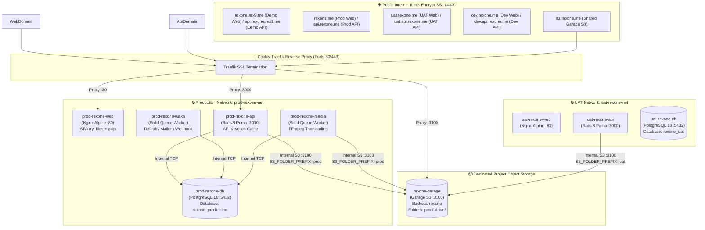

# Production Deployment Guide: Contabo VPS + Coolify

### ⚠️ Prerequisite Security Requirement
**Complete the edge, proxy, origin-firewall, and rate-limit steps in [Production DDoS and API Abuse Protection](DDOS.md) before exposing a production API.**

| Parameter | Production Value |
| :--- | :--- |
| **Target Platform** | Contabo Cloud VPS (Ubuntu 22.04 / 24.04 LTS) |
| **Deployment Orchestrator** | Coolify (Self-hosted PaaS) |
| **Project Scope** | `rexone` (isolated namespaces for UAT and Production) |
| **Core Architecture** | Modular Architecture (Standalone PostgreSQL per Environment + Single Dedicated Project Garage S3 with Folder Partitioning + Core App Stack + Static Nginx Web) |

---

## 1. Architecture Overview & Comparison

### 1.1 The Modular Architecture (Recommended)

In production on Coolify, running **standalone persistent services** decoupled from the application runtime is the industry standard:



---

### 1.2 Monolithic 5-in-1 Compose vs. Modular Standalone Approach

| Feature                        | Monolithic 5-in-1 Compose                                                                            | Modular Standalone (Our Setup)                                                                                   |
| :----------------------------- | :--------------------------------------------------------------------------------------------------- | :--------------------------------------------------------------------------------------------------------------- |
| **PostgreSQL Backups**         | ❌ None. Coolify treats Postgres as an unmanaged container.                                          | ✅ **Native Automated Backups.** Daily scheduled `pg_dump` to remote S3 storage with 1-click restore in Coolify. |
| **Zero-Downtime Code Deploys** | ⚠️ Risky. Code deploys recreate the compose stack, risking DB restarts and terminated transactions.  | ✅ **True Zero-Downtime.** Rebuilding or redeploying Rails/Web never restarts PostgreSQL or Garage.              |
| **Contabo I/O Contention**     | ⚠️ High blast radius. FFmpeg 4K video transcoding can throttle shared disk IOPS and starve Postgres. | ✅ **Resource-capped.** CPU/memory limits prevent media workers from choking the database.                       |
| **Volume Persistence Safety**  | ⚠️ Accidental `docker compose down -v` can destroy production databases.                             | ✅ Database and Garage volumes are decoupled and persistent.                                                     |

---

## 2. Multi-Environment & Multi-Project Strategy

### 2.1 Database vs. Storage Strategy

#### Database (PostgreSQL): **2 Separate Databases are Mandatory (`prod-rexone-db` & `uat-rexone-db`).**

1. **Accidental Corruption Risk:** UAT is used for staging tests, seed data, and destructive testing (e.g. testing account purging, Stripe webhooks, user role elevation). Sharing a database with Production introduces catastrophic risk of human or automated errors wiping production rows.
2. **Schema Migrations:** New feature branches on UAT run `rails db:migrate` before code is merged into `main`. If UAT and Prod shared a database, unreleased migrations would alter production tables prematurely.
3. **Coolify Implementation:** Deploy two separate PostgreSQL services in Coolify:
   - `prod-rexone-db` (Database: `rexone_production`, Volume: `prod-rexone-postgres-data`)
   - `uat-rexone-db` (Database: `rexone_uat`, Volume: `uat-rexone-postgres-data`)

#### Object Storage (Garage): **1 Dedicated Garage Container Per Project (`rexone-garage`).**

- Instead of running 2 separate storage daemons, run **one dedicated Garage container per project**:
  - Container: `rexone-garage`
  - Volumes: `rexone-garage-meta` and `rexone-garage-data`
  - Network: Connected to both `prod-rexone-net` and `uat-rexone-net`
- **Environment Isolation via Folder Partitioning (`S3_FOLDER_PREFIX`):**
  - **Production:** `S3_FOLDER_PREFIX=prod` → user uploads are saved under `prod/user/...`
  - **UAT:** `S3_FOLDER_PREFIX=uat` → user uploads are saved under `uat/user/...`
  - `StorageService::Garage` handles prefix application and transparent listing/deletions automatically without code changes in controllers or jobs.

---

### 2.2 Environment-First Naming Standard (`<env>-<project>-<component>`)

To safely run multiple projects (e.g. `rexone`, `client-b`, `internal-tools`) on the same Contabo server without name collisions:

| Component                   | Production Identifier             | UAT Identifier                  | Dedicated Project Storage                    |
| :-------------------------- | :-------------------------------- | :------------------------------ | :------------------------------------------- |
| **Coolify Project Tag**     | `prod-rexone`                     | `uat-rexone`                    | `rexone-storage`                             |
| **Docker Network**          | `prod-rexone-net`                 | `uat-rexone-net`                | Joined to both networks                      |
| **Database Container**      | `prod-rexone-db`                  | `uat-rexone-db`                 | —                                            |
| **Database Name**           | `rexone_production`               | `rexone_uat`                    | —                                            |
| **Database Volume**         | `prod-rexone-postgres-data`       | `uat-rexone-postgres-data`      | —                                            |
| **Garage Container**        | —                                 | —                               | `rexone-garage`                              |
| **Garage Volumes**          | —                                 | —                               | `rexone-garage-meta`<br>`rexone-garage-data` |
| **Garage Folder Partition** | `prod/` (`S3_FOLDER_PREFIX=prod`) | `uat/` (`S3_FOLDER_PREFIX=uat`) | —                                            |
| **API Container**           | `prod-rexone-api`                 | `uat-rexone-api`                | —                                            |
| **Solid Queue Worker**      | `prod-rexone-waka`                | `uat-rexone-waka`               | —                                            |
| **Media Worker**            | `prod-rexone-media`               | `uat-rexone-media`              | —                                            |
| **Web Container**           | `prod-rexone-web`                 | `uat-rexone-web`                | —                                            |

---

## 3. Contabo VPS Hardening & Prerequisites

Execute these on your Contabo Ubuntu VPS prior to deployment:

### 3.1 Configure Swapfile (Critical for Memory Spikes)

Contabo VPS instances can suffer from sudden OOM kills if `ffmpeg` transcoding or Puma memory spikes concurrently. A 4GB swapfile is mandatory:

```bash
sudo fallocate -l 4G /swapfile
sudo chmod 600 /swapfile
sudo mkswap /swapfile
sudo swapon /swapfile
echo '/swapfile none swap sw 0 0' | sudo tee -a /etc/fstab
```

### 3.2 UFW Firewall Hardening

Only expose SSH and web ports. Never expose internal ports (`5432`, `3000`, `3100`, `3101`) to `0.0.0.0`:

```bash
sudo ufw default deny incoming
sudo ufw default allow outgoing
sudo ufw allow 22/tcp
sudo ufw allow 80/tcp
sudo ufw allow 443/tcp
sudo ufw enable
```

### 3.3 Create Docker Networks

Create the project-scoped Docker networks so standalone services and application containers can resolve each other by container name:

```bash
docker network create prod-rexone-net || true
docker network create uat-rexone-net || true
```

---

## 4. Step-by-Step Deployment Instructions

### Step 1: Deploy Standalone PostgreSQL on Coolify

1. In Coolify Dashboard, click **New Resource** → **Databases** → **PostgreSQL**.
2. Set configuration for **Production**:
   - **Name:** `prod-rexone-db`
   - **Database Name:** `rexone_production`
   - **User:** `postgres`
   - **Password:** Generate a strong password.
   - **Network:** Select `prod-rexone-net`.
3. In **Backups** tab:
   - Enable scheduled automated daily backups (e.g. at 03:00 UTC) to external S3 / Cloudflare R2 / local storage.
4. Repeat for **UAT** with name `uat-rexone-db`, database `rexone_uat`, and network `uat-rexone-net`.

---

### Step 2: Deploy Standalone Garage S3 on Coolify

1. In Coolify Dashboard, click **New Resource** → **Docker Compose** (or Service).
2. Use the standalone Garage configuration:

```yaml
services:
  garage:
    image: dxflrs/garage:v1.0.1
    container_name: rexone-garage
    restart: unless-stopped
    volumes:
      - /data/rexone/garage.toml:/etc/garage.toml:ro
      - rexone-garage-meta:/var/lib/garage/meta
      - rexone-garage-data:/var/lib/garage/data
    networks:
      - prod-rexone-net
      - uat-rexone-net
    labels:
      - traefik.enable=true
      - traefik.http.services.rexone-garage.loadbalancer.server.port=3100
      - traefik.http.routers.rexone-garage.rule=Host(`s3.rexone.me`)
      - traefik.http.routers.rexone-garage.entrypoints=https
      - traefik.http.routers.rexone-garage.tls=true
      - traefik.http.routers.rexone-garage.tls.certresolver=letsencrypt

networks:
  prod-rexone-net:
    external: true
  uat-rexone-net:
    external: true

volumes:
  rexone-garage-meta:
    name: rexone-garage-meta
  rexone-garage-data:
    name: rexone-garage-data
```

3. **Bootstrap the Garage Cluster (One-Time Execution):**
   Once the container is healthy, run the initialization script on the VPS:

```bash
./scripts/prod_garage_init.sh rexone-garage rexone rexone-key
```

_(This automatically assigns the cluster layout, creates bucket `rexone`, and configures the S3 credentials)._

---

### Step 3: Deploy Core Application Stack (`rexone-core`)

1. In Coolify, add a new **Docker Compose Application** pointing to your `rexone-core` Git repository (branch `main` for prod, `dev` for uat).
2. Set the compose file path: `docker-compose.yaml`.
3. Fill in the **Environment Variables** in Coolify:

| Variable                | Production Value                                                 | UAT Value                                                |
| :---------------------- | :--------------------------------------------------------------- | :------------------------------------------------------- |
| `RAILS_ENV`             | `production`                                                     | `production`                                             |
| `RAILS_CONTAINER_NAME`  | `prod-rexone-api`                                                | `uat-rexone-api`                                         |
| `WAKA_CONTAINER_NAME`   | `prod-rexone-waka`                                               | `uat-rexone-waka`                                        |
| `MEDIA_CONTAINER_NAME`  | `prod-rexone-media`                                              | `uat-rexone-media`                                       |
| `DOCKER_NETWORK`        | `prod-rexone-net`                                                | `uat-rexone-net`                                         |
| `EXTERNAL_NETWORK`      | `true`                                                           | `true`                                                   |
| `RAILS_DATABASE_URL`    | `postgres://postgres:<PW>@prod-rexone-db:5432/rexone_production` | `postgres://postgres:<PW>@uat-rexone-db:5432/rexone_uat` |
| `RAILS_MASTER_KEY`      | `<VALUE_FROM_CONFIG_MASTER_KEY>`                                 | `<VALUE_FROM_CONFIG_MASTER_KEY>`                         |
| `RAILS_SECRET_KEY_BASE` | `<GENERATE_VIA_RAILS_SECRET>`                                    | `<GENERATE_VIA_RAILS_SECRET>`                            |
| `RAILS_JWT_SECRET_KEY`  | `<STRONG_RANDOM_SECRET>`                                         | `<STRONG_RANDOM_SECRET>`                                 |
| `PRODUCT_DOMAIN`        | `rexone.me` (or custom product domain)                           | `rexone.me`                                              |
| `RAILS_CLIENT_BASE_URL` | `https://rexone.me`                                              | `https://uat.rexone.me`                                  |
| `RAILS_SERVER_BASE_URL` | `https://api.rexone.me`                                          | `https://uat.api.rexone.me`                              |
| `STORAGE_PROVIDER`      | `garage`                                                         | `garage`                                                 |
| `S3_ENDPOINT`           | `http://rexone-garage:3100`                                      | `http://rexone-garage:3100`                              |
| `S3_PUBLIC_ENDPOINT`    | `https://s3.rexone.me`                                           | `https://s3.rexone.me`                                   |
| `S3_BUCKET`             | `rexone`                                                         | `rexone`                                                 |
| `S3_REGION`             | `garage`                                                         | `garage`                                                 |
| `S3_FOLDER_PREFIX`      | `prod`                                                           | `uat`                                                    |
| `S3_ACCESS_KEY`         | `<FROM_GARAGE_INIT>`                                             | `<FROM_GARAGE_INIT>`                                     |
| `S3_SECRET_KEY`         | `<FROM_GARAGE_INIT>`                                             | `<FROM_GARAGE_INIT>`                                     |

4. In the **Traefik Configuration** for `api`:
   - Production: `https://api.rexone.me`
   - UAT: `https://uat.api.rexone.me`
   - Dev: `https://dev.api.rexone.me`
   - Demo: `https://api.rexone.rex9.me`
   - Traefik maps port `3000` with automatic Let's Encrypt SSL.

---

### Step 4: Deploy Web Frontend (`rexone-web`)

1. In Coolify, add a new **Docker Compose Application** pointing to your `rexone-web` Git repository.
2. Set compose file path: `docker-compose.yaml`.
3. Set **Environment Variables / Build Arguments**:

| Variable                            | Production Value (e.g. RexOne) | UAT Value                   | Demo Value                   |
| :---------------------------------- | :----------------------------- | :-------------------------- | :--------------------------- |
| `WEB_CONTAINER_NAME`                | `prod-rexone-web`              | `uat-rexone-web`            | `demo-rexone-web`            |
| `DOCKER_NETWORK`                    | `prod-rexone-net`              | `uat-rexone-net`            | `demo-rexone-net`            |
| `VITE_REACT_APP_NAME`               | `rexone.me`                    | `uat.rexone.me`             | `rexone.rex9.me`             |
| `VITE_REACT_APP_SERVER_BASE_URL`    | `https://api.rexone.me`        | `https://uat.api.rexone.me` | `https://api.rexone.rex9.me` |
| `VITE_REACT_APP_CLIENT_BASE_URL`    | `https://rexone.me`            | `https://uat.rexone.me`     | `https://rexone.rex9.me`     |
| `VITE_REACT_APP_SERVER_WS_BASE_URL` | `wss://api.rexone.me`          | `wss://uat.api.rexone.me`   | `wss://api.rexone.rex9.me`   |
| `VITE_REACT_APP_GOOGLE_CLIENT_ID`   | `<Google_Client_ID>`           | `<Google_Client_ID>`        | `<Google_Client_ID>`         |

4. Set Traefik Domain:
   - Production: `https://rexone.me`
   - UAT: `https://uat.rexone.me`
   - Dev: `https://dev.rexone.me`
   - Demo: `https://rexone.rex9.me`

---

## 5. Deployment Verification Checklist

After deploying all services, verify each component:

- [ ] **Database Health:** `docker exec -it prod-rexone-db pg_isready -U postgres` returns `accepting connections`.
- [ ] **Database Migrations:** Checked API deployment logs to confirm `bundle exec rake db:prepare` ran successfully.
- [ ] **API Health:** `curl -fsS https://api.rexone.me/up` (or `https://api.rexone.rex9.me/up`) returns `HTTP 200 OK`.
- [ ] **Action Cable WebSockets:** Browser connects to `wss://api.rexone.me/cable` with `201/101 Switching Protocols` without origin rejection.
- [ ] **Garage S3 Public Read:** Visit `https://s3.rexone.me/rexone` (should return valid XML from Garage, not Traefik 404/502).
- [ ] **Folder Partitioning:** Upload an asset on Prod → check Garage to verify the key starts with `prod/` (e.g. `prod/user/...`); upload on UAT → starts with `uat/`.
- [ ] **Media Worker Compression:** Upload a video via web/mobile; check `docker logs prod-rexone-media` for `[CompressMediaJob] Compressed ... bytes`.
- [ ] **Solid Queue Background Jobs:** `docker logs prod-rexone-waka` shows active Solid Queue polling without errors.
- [ ] **Web SPA Routing:** Visiting deep links (e.g. `https://rexone.me/profile`, `https://rexone.me/ai`) returns HTTP 200 and loads React correctly (not Nginx 404).
- [ ] **Automated Maintenance & Retention:** Docker log rotation is active (`DOCKER_LOG_MAX_SIZE=10m`, `DOCKER_LOG_MAX_FILE=3`), and recurring cleanup tasks are operational. See **[MAINTENANCE.md](MAINTENANCE.md)**.
