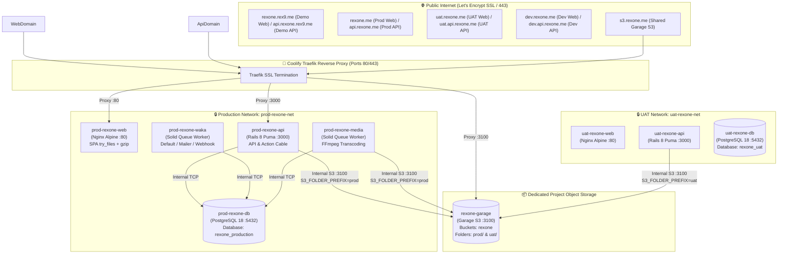

# Production Deployment Guide: Contabo VPS + Coolify

### ⚠️ Prerequisite Security Requirement
**Complete the edge, proxy, origin-firewall, and rate-limit steps in [Production DDoS and API Abuse Protection](DDOS.md) before exposing a production API.**

| Parameter | Production Value |
| :--- | :--- |
| **Target Platform** | Contabo Cloud VPS (Ubuntu 22.04 / 24.04 LTS) |
| **Deployment Orchestrator** | Coolify (Self-hosted PaaS) |
| **Project Scope** | `rexone` (isolated namespaces for UAT and Production) |
| **Core Architecture** | Modular Architecture (Standalone PostgreSQL per Environment + Single Dedicated Project Garage S3 with Folder Partitioning + Core App Stack + Static Nginx Web) |

---

## 1. Architecture Overview & Comparison

### 1.1 The Modular Architecture (Recommended)

In production on Coolify, running **standalone persistent services** decoupled from the application runtime is the industry standard:


```mermaid
flowchart TD
    subgraph Internet ["🌐 Public Internet (Let's Encrypt SSL / 443)"]
        DemoDomain["rexone.rex9.me (Demo Web) / api.rexone.rex9.me (Demo API)"]
        ProdDomain["rexone.me (Prod Web) / api.rexone.me (Prod API)"]
        UatDomain["uat.rexone.me (UAT Web) / uat.api.rexone.me (UAT API)"]
        DevDomain["dev.rexone.me (Dev Web) / dev.api.rexone.me (Dev API)"]
        S3Domain["s3.rexone.me (Shared Garage S3)"]
    end

    subgraph CoolifyTraefik ["🔀 Coolify Traefik Reverse Proxy (Ports 80/443)"]
        Traefik["Traefik SSL Termination"]
    end

    subgraph ProdNet ["🔒 Production Network: prod-rexone-net"]
        WebProd["prod-rexone-web\n(Nginx Alpine :80)\nSPA try_files + gzip"]
        ApiProd["prod-rexone-api\n(Rails 8 Puma :3000)\nAPI & Action Cable"]
        WakaProd["prod-rexone-waka\n(Solid Queue Worker)\nDefault / Mailer / Webhook"]
        MediaProd["prod-rexone-media\n(Solid Queue Worker)\nFFmpeg Transcoding"]
        DbProd[("prod-rexone-db\n(PostgreSQL 18 :5432)\nDatabase: rexone_production")]
    end

    subgraph UatNet ["🔒 UAT Network: uat-rexone-net"]
        WebUat["uat-rexone-web\n(Nginx Alpine :80)"]
        ApiUat["uat-rexone-api\n(Rails 8 Puma :3000)"]
        DbUat[("uat-rexone-db\n(PostgreSQL 18 :5432)\nDatabase: rexone_uat")]
    end

    subgraph ProjectStorage ["📦 Dedicated Project Object Storage"]
        Garage[("rexone-garage\n(Garage S3 :3100)\nBuckets: rexone\nFolders: prod/ & uat/")]
    end

    WebDomain --> Traefik
    ApiDomain --> Traefik
    S3Domain --> Traefik

    Traefik -->|Proxy :80| WebProd
    Traefik -->|Proxy :3000| ApiProd
    Traefik -->|Proxy :3100| Garage

    ApiProd -->|Internal TCP| DbProd
    WakaProd -->|Internal TCP| DbProd
    MediaProd -->|Internal TCP| DbProd

    ApiProd -->|Internal S3 :3100\nS3_FOLDER_PREFIX=prod| Garage
    MediaProd -->|Internal S3 :3100\nS3_FOLDER_PREFIX=prod| Garage
    ApiUat -->|Internal S3 :3100\nS3_FOLDER_PREFIX=uat| Garage
```

---

### 1.2 Monolithic 5-in-1 Compose vs. Modular Standalone Approach

| Feature                        | Monolithic 5-in-1 Compose                                                                            | Modular Standalone (Our Setup)                                                                                   |
| :----------------------------- | :--------------------------------------------------------------------------------------------------- | :--------------------------------------------------------------------------------------------------------------- |
| **PostgreSQL Backups**         | ❌ None. Coolify treats Postgres as an unmanaged container.                                          | ✅ **Native Automated Backups.** Daily scheduled `pg_dump` to remote S3 storage with 1-click restore in Coolify. |
| **Zero-Downtime Code Deploys** | ⚠️ Risky. Code deploys recreate the compose stack, risking DB restarts and terminated transactions.  | ✅ **True Zero-Downtime.** Rebuilding or redeploying Rails/Web never restarts PostgreSQL or Garage.              |
| **Contabo I/O Contention**     | ⚠️ High blast radius. FFmpeg 4K video transcoding can throttle shared disk IOPS and starve Postgres. | ✅ **Resource-capped.** CPU/memory limits prevent media workers from choking the database.                       |
| **Volume Persistence Safety**  | ⚠️ Accidental `docker compose down -v` can destroy production databases.                             | ✅ Database and Garage volumes are decoupled and persistent.                                                     |

---

## 2. Multi-Environment & Multi-Project Strategy

### 2.1 Database vs. Storage Strategy

#### Database (PostgreSQL): **2 Separate Databases are Mandatory (`prod-rexone-db` & `uat-rexone-db`).**

1. **Accidental Corruption Risk:** UAT is used for staging tests, seed data, and destructive testing (e.g. testing account purging, Stripe webhooks, user role elevation). Sharing a database with Production introduces catastrophic risk of human or automated errors wiping production rows.
2. **Schema Migrations:** New feature branches on UAT run `rails db:migrate` before code is merged into `main`. If UAT and Prod shared a database, unreleased migrations would alter production tables prematurely.
3. **Coolify Implementation:** Deploy two separate PostgreSQL services in Coolify:
   - `prod-rexone-db` (Database: `rexone_production`, Volume: `prod-rexone-postgres-data`)
   - `uat-rexone-db` (Database: `rexone_uat`, Volume: `uat-rexone-postgres-data`)

#### Object Storage (Garage): **1 Dedicated Garage Container Per Project (`rexone-garage`).**

- Instead of running 2 separate storage daemons, run **one dedicated Garage container per project**:
  - Container: `rexone-garage`
  - Volumes: `rexone-garage-meta` and `rexone-garage-data`
  - Network: Connected to both `prod-rexone-net` and `uat-rexone-net`
- **Environment Isolation via Folder Partitioning (`S3_FOLDER_PREFIX`):**
  - **Production:** `S3_FOLDER_PREFIX=prod` → user uploads are saved under `prod/user/...`
  - **UAT:** `S3_FOLDER_PREFIX=uat` → user uploads are saved under `uat/user/...`
  - `StorageService::Garage` handles prefix application and transparent listing/deletions automatically without code changes in controllers or jobs.

---

### 2.2 Environment-First Naming Standard (`<env>-<project>-<component>`)

To safely run multiple projects (e.g. `rexone`, `client-b`, `internal-tools`) on the same Contabo server without name collisions:

| Component                   | Production Identifier             | UAT Identifier                  | Dedicated Project Storage                    |
| :-------------------------- | :-------------------------------- | :------------------------------ | :------------------------------------------- |
| **Coolify Project Tag**     | `prod-rexone`                     | `uat-rexone`                    | `rexone-storage`                             |
| **Docker Network**          | `prod-rexone-net`                 | `uat-rexone-net`                | Joined to both networks                      |
| **Database Container**      | `prod-rexone-db`                  | `uat-rexone-db`                 | —                                            |
| **Database Name**           | `rexone_production`               | `rexone_uat`                    | —                                            |
| **Database Volume**         | `prod-rexone-postgres-data`       | `uat-rexone-postgres-data`      | —                                            |
| **Garage Container**        | —                                 | —                               | `rexone-garage`                              |
| **Garage Volumes**          | —                                 | —                               | `rexone-garage-meta`<br>`rexone-garage-data` |
| **Garage Folder Partition** | `prod/` (`S3_FOLDER_PREFIX=prod`) | `uat/` (`S3_FOLDER_PREFIX=uat`) | —                                            |
| **API Container**           | `prod-rexone-api`                 | `uat-rexone-api`                | —                                            |
| **Solid Queue Worker**      | `prod-rexone-waka`                | `uat-rexone-waka`               | —                                            |
| **Media Worker**            | `prod-rexone-media`               | `uat-rexone-media`              | —                                            |
| **Web Container**           | `prod-rexone-web`                 | `uat-rexone-web`                | —                                            |

---

## 3. Contabo VPS Hardening & Prerequisites

Execute these on your Contabo Ubuntu VPS prior to deployment:

### 3.1 Configure Swapfile (Critical for Memory Spikes)

Contabo VPS instances can suffer from sudden OOM kills if `ffmpeg` transcoding or Puma memory spikes concurrently. A 4GB swapfile is mandatory:

```bash
sudo fallocate -l 4G /swapfile
sudo chmod 600 /swapfile
sudo mkswap /swapfile
sudo swapon /swapfile
echo '/swapfile none swap sw 0 0' | sudo tee -a /etc/fstab
```

### 3.2 UFW Firewall Hardening

Only expose SSH and web ports. Never expose internal ports (`5432`, `3000`, `3100`, `3101`) to `0.0.0.0`:

```bash
sudo ufw default deny incoming
sudo ufw default allow outgoing
sudo ufw allow 22/tcp
sudo ufw allow 80/tcp
sudo ufw allow 443/tcp
sudo ufw enable
```

### 3.3 Create Docker Networks

Create the project-scoped Docker networks so standalone services and application containers can resolve each other by container name:

```bash
docker network create prod-rexone-net || true
docker network create uat-rexone-net || true
```

### 3.4 Configure Docker Daemon for "Zero to Infinity" Disk Protection (One-Time Setup)

To guarantee your VPS never runs out of disk space regardless of how many builds or deployments occur over years of operation, configure the Docker daemon to enforce automatic BuildKit cache garbage collection and universal container log rotation.

Edit `/etc/docker/daemon.json` on the VPS host (create it if it does not exist):

```bash
sudo mkdir -p /etc/docker
sudo tee /etc/docker/daemon.json > /dev/null <<'EOF'
{
  "log-driver": "json-file",
  "log-opts": {
    "max-size": "10m",
    "max-file": "3"
  },
  "builder": {
    "gc": {
      "enabled": true,
      "defaultKeepStorage": "20GB"
    }
  }
}
EOF
```

* **`defaultKeepStorage: "20GB"`**: Instructs Docker BuildKit to automatically garbage-collect build cache when it exceeds 20GB.
* **`max-size: 10m` & `max-file: 3`**: Strictly caps every container's log file on the VPS to 30MB maximum (10MB $\times$ 3 files).

Restart Docker to apply the daemon settings:
```bash
sudo systemctl restart docker
```

### 3.5 Coolify Dashboard Server Cleanup Settings

In the Coolify UI dashboard:
1. Navigate to **Server** (top navigation) → select your server → **Docker Cleanup**.
2. **Enable Docker Cleanup**: Toggle **ON** (runs on schedule).
3. Ensure **Clean Images** and **Clean Builder Cache** checkboxes are enabled.
4. Set execution frequency to **Daily** or **Weekly**.

---

## 4. Step-by-Step Deployment Instructions

### Step 1: Deploy Standalone PostgreSQL on Coolify

1. In Coolify Dashboard, click **New Resource** → **Databases** → **PostgreSQL**.
2. Set configuration for **Production**:
   - **Name:** `prod-rexone-db`
   - **Database Name:** `rexone_production`
   - **User:** `postgres`
   - **Password:** Generate a strong password.
   - **Network:** Select `prod-rexone-net`.
3. In **Backups** tab:
   - Enable scheduled automated daily backups (e.g. at 03:00 UTC) to external S3 / Cloudflare R2 / local storage.
4. Repeat for **UAT** with name `uat-rexone-db`, database `rexone_uat`, and network `uat-rexone-net`.

---

### Step 2: Deploy Standalone Garage S3 on Coolify

1. **Generate High-Entropy Production Secrets:**
   Run `./scripts/generate_secrets.sh` (or generate random 32-byte hex tokens) to get your:
   - `GARAGE_RPC_SECRET` (`openssl rand -hex 32`)
   - `S3_ADMIN_TOKEN` (`openssl rand -hex 32`)

2. In Coolify Dashboard, click **New Resource** → **Docker Compose** (or Service).

3. Paste the standalone Garage configuration using Coolify's native `content:` volume block (Coolify automatically writes the file on the server without triggering Docker's "missing file creates directory" trap):

```yaml
services:
  garage:
    image: dxflrs/garage:v1.0.1
    container_name: rexone-garage
    restart: unless-stopped
    volumes:
      - rexone-garage-meta:/var/lib/garage/meta
      - rexone-garage-data:/var/lib/garage/data
      - type: bind
        source: /data/rexone/garage.toml
        target: /etc/garage.toml
        content: |
          metadata_dir = "/var/lib/garage/meta"
          data_dir = "/var/lib/garage/data"
          db_engine = "sqlite"
          replication_factor = 1

          rpc_bind_addr = "[::]:3901"
          rpc_secret = "<PASTE_GENERATED_RPC_SECRET_HERE>"

          [s3_api]
          s3_region = "garage"
          api_bind_addr = "[::]:3100"
          root_domain = ".s3.garage.localhost"

          [admin]
          api_bind_addr = "[::]:3101"
          admin_token = "<PASTE_GENERATED_S3_ADMIN_TOKEN_HERE>"
          metrics_token = "<PASTE_GENERATED_S3_ADMIN_TOKEN_HERE>"
    networks:
      - prod-rexone-net
      - uat-rexone-net
    labels:
      - traefik.enable=true
      - traefik.http.services.rexone-garage.loadbalancer.server.port=3100
      - traefik.http.routers.rexone-garage.rule=Host(`s3.rexone.me`)
      - traefik.http.routers.rexone-garage.entrypoints=https
      - traefik.http.routers.rexone-garage.tls=true
      - traefik.http.routers.rexone-garage.tls.certresolver=letsencrypt

networks:
  prod-rexone-net:
    external: true
  uat-rexone-net:
    external: true

volumes:
  rexone-garage-meta:
    name: rexone-garage-meta
  rexone-garage-data:
    name: rexone-garage-data
```

> **Note (Admin Port 3101 Security)**: Garage's admin API (`:3101`) is intentionally **not** mapped to public ports or exposed via Traefik. It communicates exclusively across the private Docker network (`prod-rexone-net`), shielding it from public access.
>
> **Alternative UI Method**: Instead of embedding `content:` in YAML, you can omit the bind mount in the Compose YAML and add it via Coolify's UI: navigate to **Persistent Storage** → **Add File Mount** → set Destination to `/etc/garage.toml` and paste the TOML configuration.

3. **Bootstrap the Garage Cluster (One-Time Execution):**
   Once the container is healthy, run the initialization script on the VPS:

```bash
./scripts/prod_garage_init.sh rexone-garage rexone rexone-key
```

_(This automatically assigns the cluster layout, creates bucket `rexone`, and configures the S3 credentials)._

---

### Step 3: Deploy Core Application Stack (`rexone-core`)

1. In Coolify, add a new **Docker Compose Application** pointing to your `rexone-core` Git repository (branch `main` for prod, `dev` for uat).
2. Set the compose file path: `docker-compose.yaml`.
3. Fill in the **Environment Variables** in Coolify:

| Variable                | Production Value                                                 | UAT Value                                                |
| :---------------------- | :--------------------------------------------------------------- | :------------------------------------------------------- |
| `RAILS_ENV`             | `production`                                                     | `production`                                             |
| `RAILS_CONTAINER_NAME`  | `prod-rexone-api`                                                | `uat-rexone-api`                                         |
| `WAKA_CONTAINER_NAME`   | `prod-rexone-waka`                                               | `uat-rexone-waka`                                        |
| `MEDIA_CONTAINER_NAME`  | `prod-rexone-media`                                              | `uat-rexone-media`                                       |
| `DOCKER_NETWORK`        | `prod-rexone-net`                                                | `uat-rexone-net`                                         |
| `EXTERNAL_NETWORK`      | `true`                                                           | `true`                                                   |
| `PG_PASSWORD`           | `<GENERATE_VIA_SECRET_GENERATOR>`                                | `<GENERATE_VIA_SECRET_GENERATOR>`                        |
| `RAILS_DATABASE_URL`    | `postgres://postgres:<PG_PASSWORD>@prod-rexone-db:5432/rexone_production` | `postgres://postgres:<PG_PASSWORD>@uat-rexone-db:5432/rexone_uat` |
| `RAILS_MASTER_KEY`      | `<VALUE_FROM_CONFIG_MASTER_KEY>`                                 | `<VALUE_FROM_CONFIG_MASTER_KEY>`                         |
| `RAILS_SECRET_KEY_BASE` | `<GENERATE_VIA_RAILS_SECRET>`                                    | `<GENERATE_VIA_RAILS_SECRET>`                            |
| `RAILS_JWT_SECRET_KEY`  | `<STRONG_RANDOM_SECRET>`                                         | `<STRONG_RANDOM_SECRET>`                                 |
| `PRODUCT_DOMAIN`        | `rexone.me` (or custom product domain)                           | `rexone.me`                                              |
| `RAILS_CLIENT_BASE_URL` | `https://rexone.me`                                              | `https://uat.rexone.me`                                  |
| `RAILS_SERVER_BASE_URL` | `https://api.rexone.me`                                          | `https://uat.api.rexone.me`                              |
| `STORAGE_PROVIDER`      | `garage`                                                         | `garage`                                                 |
| `S3_ENDPOINT`           | `http://rexone-garage:3100`                                      | `http://rexone-garage:3100`                              |
| `S3_PUBLIC_ENDPOINT`    | `https://s3.rexone.me`                                           | `https://s3.rexone.me`                                   |
| `S3_BUCKET`             | `rexone`                                                         | `rexone`                                                 |
| `S3_REGION`             | `garage`                                                         | `garage`                                                 |
| `S3_FOLDER_PREFIX`      | `prod`                                                           | `uat`                                                    |
| `S3_ACCESS_KEY`         | `<FROM_GARAGE_INIT>`                                             | `<FROM_GARAGE_INIT>`                                     |
| `S3_SECRET_KEY`         | `<FROM_GARAGE_INIT>`                                             | `<FROM_GARAGE_INIT>`                                     |
| `S3_ADMIN_ENDPOINT`     | `http://rexone-garage:3101`                                      | `http://rexone-garage:3101`                               |
| `S3_ADMIN_TOKEN`        | `<PASTE_SAME_TOKEN_AS_IN_STEP_2>`                                | `<PASTE_SAME_TOKEN_AS_IN_STEP_2>`                         |

4. In the **Traefik Configuration** for `api`:
   - Production: `https://api.rexone.me`
   - UAT: `https://uat.api.rexone.me`
   - Dev: `https://dev.api.rexone.me`
   - Demo: `https://api.rexone.rex9.me`
   - Traefik maps port `3000` with automatic Let's Encrypt SSL.
   - **Healthcheck Path:** Set to `/up` (interval: 10s, timeout: 5s, retries: 5). Rails 8 automatically excludes `/up` from host authorization and SSL redirect.
   - **Pre-deployment Migration (Optional):** If using Coolify's pre-deployment command, set `bundle exec rake db:migrate` and pass `SKIP_DB_PREPARE=true` to runtime containers to avoid redundant migrations on horizontal replicas.
   - **Database Connection Flexibility:** Both `RAILS_DATABASE_URL` and standard Coolify `DATABASE_URL` are recognized automatically.

---

### Step 4: Deploy Web Frontend (`rexone-web`)

1. In Coolify, add a new **Docker Compose Application** pointing to your `rexone-web` Git repository.
2. Set compose file path: `docker-compose.yaml`.
3. Set **Environment Variables / Build Arguments**:

| Variable                            | Production Value (e.g. RexOne) | UAT Value                   | Demo Value                   |
| :---------------------------------- | :----------------------------- | :-------------------------- | :--------------------------- |
| `WEB_CONTAINER_NAME`                | `prod-rexone-web`              | `uat-rexone-web`            | `demo-rexone-web`            |
| `DOCKER_NETWORK`                    | `prod-rexone-net`              | `uat-rexone-net`            | `demo-rexone-net`            |
| `VITE_REACT_APP_NAME`               | `rexone.me`                    | `uat.rexone.me`             | `rexone.rex9.me`             |
| `VITE_REACT_APP_SERVER_BASE_URL`    | `https://api.rexone.me`        | `https://uat.api.rexone.me` | `https://api.rexone.rex9.me` |
| `VITE_REACT_APP_CLIENT_BASE_URL`    | `https://rexone.me`            | `https://uat.rexone.me`     | `https://rexone.rex9.me`     |
| `VITE_REACT_APP_SERVER_WS_BASE_URL` | `wss://api.rexone.me`          | `wss://uat.api.rexone.me`   | `wss://api.rexone.rex9.me`   |
| `VITE_REACT_APP_GOOGLE_CLIENT_ID`   | `<Google_Client_ID>`           | `<Google_Client_ID>`        | `<Google_Client_ID>`         |

4. Set Traefik Domain:
   - Production: `https://rexone.me`
   - UAT: `https://uat.rexone.me`
   - Dev: `https://dev.rexone.me`
   - Demo: `https://rexone.rex9.me`

---

### Step 5: Setup Automated Host Maintenance Cron ("Zero to Infinity" Safety Net)

To ensure that the VPS disk remains healthy indefinitely without manual developer intervention, configure the automated maintenance cron on the host VPS:

1. Open root crontab on the VPS host:
   ```bash
   sudo crontab -e
   ```
2. Add the scheduled weekly maintenance job (runs every Sunday at 03:00 UTC):
   ```bash
   0 3 * * 0 /path/to/rexone-core/scripts/vps_cleanup.sh -y >> /var/log/rexone_vps_cleanup.log 2>&1
   ```
   *(Replace `/path/to/rexone-core` with the absolute path to your cloned repository on the host, e.g. `/data/coolify/applications/.../rexone-core`)*

3. **What this automated job cleans every week:**
   - 🧹 **Dead/Exited Containers**: Pruned via `docker container prune -f`.
   - 🧹 **Deployment Images**: Old images older than 7 days (`168h`) are pruned via `docker image prune -a --filter "until=168h" -f`.
   - 🧹 **Docker BuildKit Cache**: Tagged and intermediate build layers older than 7 days (`168h`) are pruned via `docker builder prune -a --filter "until=168h" -f`.
   - 🔒 **Absolute Volume Safety**: Database and Garage S3 volumes (`rexone-postgres-data`, `rexone-garage-data`) are NEVER pruned.
   - 📦 **PostgreSQL Auto-Vacuum**: High-churn Solid Queue and Solid Cache tables are automatically vacuumed and compacted by PostgreSQL autovacuum.

---

## 5. Deployment Verification Checklist

After deploying all services, verify each component:

- [ ] **Database Health:** `docker exec -it prod-rexone-db pg_isready -U postgres` returns `accepting connections`.
- [ ] **Database Migrations:** Checked API deployment logs to confirm `bundle exec rake db:prepare` ran successfully.
- [ ] **API Health:** `curl -fsS https://api.rexone.me/up` (or `https://api.rexone.rex9.me/up`) returns `HTTP 200 OK`.
- [ ] **Action Cable WebSockets:** Browser connects to `wss://api.rexone.me/cable` with `201/101 Switching Protocols` without origin rejection.
- [ ] **Garage S3 Public Read:** Visit `https://s3.rexone.me/rexone` (should return valid XML from Garage, not Traefik 404/502).
- [ ] **Folder Partitioning:** Upload an asset on Prod → check Garage to verify the key starts with `prod/` (e.g. `prod/user/...`); upload on UAT → starts with `uat/`.
- [ ] **Media Worker Compression:** Upload a video via web/mobile; check `docker logs prod-rexone-media` for `[CompressMediaJob] Compressed ... bytes`.
- [ ] **Solid Queue Background Jobs:** `docker logs prod-rexone-waka` shows active Solid Queue polling without errors.
- [ ] **Web SPA Routing:** Visiting deep links (e.g. `https://rexone.me/profile`, `https://rexone.me/ai`) returns HTTP 200 and loads React correctly (not Nginx 404).
- [ ] **Automated Maintenance & Retention:** Docker log rotation is active (`DOCKER_LOG_MAX_SIZE=10m`, `DOCKER_LOG_MAX_FILE=3`), and recurring cleanup tasks are operational. See **[MAINTENANCE.md](MAINTENANCE.md)**.

---

## 6. Ongoing Operations & Maintenance Playbook ("Zero to Infinity")

### 6.1 Zero-Downtime Rolling Redeployments in Coolify
When pushing new code updates to your Git repository:
1. Coolify pulls the latest commit, builds the new Docker image using BuildKit, and boots the new container.
2. The new container runs its native healthcheck (`curl -f http://127.0.0.1:3000/up` with `start_period: 25s`, `interval: 10s`).
3. **Traefik Traffic Switching**: Only after the new container is marked **healthy** does Traefik switch inbound traffic to it.
4. **Graceful Draining**: The old container receives `SIGTERM` and has `stop_grace_period: 30s` to finish processing any active in-flight requests and database transactions before terminating.

### 6.2 Database Migrations During Updates
- **Single Replica (Default)**: `docker-entrypoint` automatically executes `rake db:prepare` during startup.
- **Horizontal Scaling / Pre-Deploy Command**: If running multiple API replicas, specify the Pre-deployment command in Coolify:
  ```bash
  bundle exec rake db:migrate
  ```
  And set `SKIP_DB_PREPARE=true` on runtime containers to prevent concurrent migration attempts.

### 6.3 Host Disk & Resource Inspection (Cheat Sheet)
Run these commands on the VPS host to audit system health:

```bash
# 1. Check VPS filesystem storage
df -h /

# 2. Check Docker disk utilization (Images, Containers, Volumes, Build Cache)
docker system df

# 3. Check container log file sizes on the host
docker ps -q | xargs docker inspect --format='{{.Name}}: {{.LogPath}}' | xargs -n2 sh -c 'ls -lh "$2" 2>/dev/null' _

# 4. Manually trigger instant VPS cleanup (bypasses cron)
sudo /path/to/rexone-core/scripts/vps_cleanup.sh

# 5. Check Rails Pulse / Solid Queue status inside API container
docker exec -it prod-rexone-api bundle exec rails runner "puts SolidQueue::Job.count"
```

### 6.4 Rollback Procedure
If an issue occurs after deploying a new release:
1. In the Coolify Dashboard for `rexone-core` or `rexone-web`, navigate to **Deployments**.
2. Select the previous stable deployment and click **Redeploy**.
3. If database restoration is required, navigate to the PostgreSQL resource → **Backups** tab → select the desired daily snapshot → click **Restore**.
