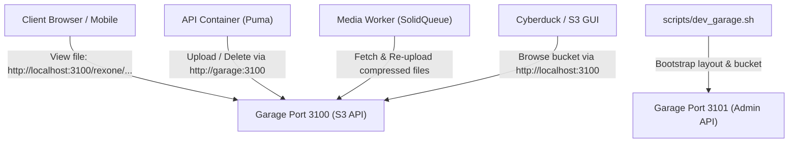

# Garage S3 Object Storage Guide

> **Storage Provider:** Self-Hosted S3-Compatible Object Storage
> **Container Image:** `dxflrs/garage:v1.0.1`
> **S3 API Endpoint:** `http://localhost:3100` (Host) / `http://garage:3100` (Docker Network)
> **Admin REST API:** `http://localhost:3101` (Host)
> **Internal RPC:** `3901` (Container Network)
> **Default Bucket:** `rexone`
> **Default Region:** `garage`

---

## 1. What is Garage & Why Do We Use It?

[Garage](https://garagehq.deuxfleurs.fr/) is a lightweight, open-source distributed object storage service written in Rust by Deuxfleurs. It implements the standard **Amazon S3-compatible API**.

### Why Switch from Cloudinary / AWS S3?

1. **100% Self-Hosted & Free**: No monthly storage fees, billing surprises, credit card requirements, or bandwidth limits.
2. **Zero Vendor Lock-In**: Uses the official `aws-sdk-s3` gem. Switching to AWS S3, MinIO, or Cloudflare R2 only requires updating endpoint environment variables.
3. **Complete Privacy**: Media assets, user avatars, voice recordings, and video files stay inside your local or private deployment volumes (`garage-data` and `garage-meta`).
4. **Local & Offline Dev**: You can develop, upload, stream, and run underground media compression workers completely offline without an internet connection.
5. **No macOS Port Conflicts**: Runs on ports `3100` (S3) and `3101` (Admin), cleanly avoiding macOS ControlCenter / AirPlay Receiver conflicts on port 5000.

---

## 2. Quickstart: Getting Garage Docker Up and Running

### Method A: One-Command Bootstrap (Recommended)

Run the dedicated dev script from the repository root:

```bash
./scripts/dev_garage.sh
```

**What this script does automatically in the background:**

1. Starts the `dev-rexone-core-garage` container on ports `3100` and `3101`.
2. Polls until the Garage daemon is healthy and responsive.
3. **Assigns cluster layout** for single-node development (`/garage layout assign -z dc1 -c 1G <NODE_ID>` and `layout apply --version 1`).
4. **Creates default bucket** `rexone` if it does not already exist.
5. **Generates or imports API key** `rexone-key` with full read, write, and owner permissions on the bucket.
6. Automatically syncs the generated credentials into your local `.env` file if keys are not yet configured.

---

### Method B: Manual Docker Compose Setup

If you prefer to start Garage manually via `docker compose`:

#### Step 1: Start the container

```bash
docker compose -f docker-compose.dev.yaml up garage -d
```

#### Step 2: Check status and get the Node ID

```bash
docker exec -it dev-rexone-core-garage /garage status
```

You will see output showing your node with status `NO ROLE ASSIGNED` (e.g. `e0f76906a44bfbb9`).

#### Step 3: Assign single-node layout

```bash
# Replace <NODE_ID> with the ID from the status command
docker exec -it dev-rexone-core-garage /garage layout assign -z dc1 -c 1G <NODE_ID>
docker exec -it dev-rexone-core-garage /garage layout apply --version 1
```

#### Step 4: Create the default bucket

```bash
docker exec -it dev-rexone-core-garage /garage bucket create rexone
```

#### Step 5: Generate an API key

```bash
docker exec -it dev-rexone-core-garage /garage key create rexone-key
```

Garage will output:

```text
Key ID:     GKxxxxxxxxxxxxxxxxxxxxxxxx
Secret key: xxxxxxxxxxxxxxxxxxxxxxxxxxxxxxxxxxxxxxxxxxxxxxxxxxxxxxxxxxxxxxxx
```

#### Step 6: Grant bucket permissions to the key

```bash
docker exec -it dev-rexone-core-garage /garage bucket allow --read --write --owner rexone --key rexone-key
```

#### Step 7: Update `.env`

Add the generated `Key ID` and `Secret key` to your `.env` file:

```bash
STORAGE_PROVIDER=garage
S3_ENDPOINT=http://garage:3100
S3_PUBLIC_ENDPOINT=http://localhost:3100
S3_BUCKET=rexone
S3_REGION=garage
S3_ACCESS_KEY=GKxxxxxxxxxxxxxxxxxxxxxxxx
S3_SECRET_KEY=xxxxxxxxxxxxxxxxxxxxxxxxxxxxxxxxxxxxxxxxxxxxxxxxxxxxxxxxxxxxxxxx
```

---

## 3. Access Key Specifications & Security

### Key Format & Anatomy

Garage implements Amazon S3 credential structures with standard cryptographic sizing:

- **Access Key ID (`S3_ACCESS_KEY`)**: Prefixed with `GK` followed by **24 hexadecimal characters** (`[0-9a-f]{24}`). Example format: `GKdf638173bb772fdd2a5dbb09`.
- **Secret Access Key (`S3_SECRET_KEY`)**: A **64-character hexadecimal string** (`[0-9a-f]{64}`).
- **Key Storage**: Keys are cryptographically stored and managed within Garage's metadata engine (`garage-meta`).

### Dynamic Key Lifecycle

Garage generates unique, cryptographically random keys on-demand without requiring hardcoded secrets:

1. **Creation**: `docker exec dev-rexone-core-garage /garage key create <key-name>`
2. **Inspection**: `docker exec dev-rexone-core-garage /garage key info --show-secret <key-name>`
3. **Authorization**: `docker exec dev-rexone-core-garage /garage bucket allow --read --write --owner <bucket> --key <key-name>`
4. **Revocation**: `docker exec dev-rexone-core-garage /garage key delete <key-name> --yes`

---

## 4. GUI Browsing

For browsing object storage, viewing thumbnails, and inspecting bucket hierarchies:

#### 1. Rexone Web Admin (`/admin/assets`) — Built-In

- **URL**: [http://localhost:4000/admin/assets](http://localhost:4000/admin/assets) (Web) or [http://localhost:3000/admin/assets](http://localhost:3000/admin/assets) (API).
- **Features**: Visual asset gallery, media player (audio/video), dimension and MIME metadata, underground compression metrics, and soft/hard delete lifecycle.

#### 2. Cyberduck (Recommended macOS / Windows S3 GUI)

Cyberduck is a free, native graphical file browser for S3 on macOS.

##### Method A: One-Click Profile (Instant Setup)
We have included a pre-configured profile at [`docs/Garage_Local.cyberduckprofile`](Garage_Local.cyberduckprofile):
1. Double-click **`docs/Garage_Local.cyberduckprofile`** in Finder.
2. Cyberduck will open with **Server (`localhost`)**, **Port (`3100`)**, and **Path (`/rexone`)** automatically configured over HTTP.
3. Paste your credentials:
   - **Access Key ID**: Your `S3_ACCESS_KEY` (e.g. `GKdf638173bb772fdd2a5dbb09`)
   - **Secret Access Key**: Your `S3_SECRET_KEY`
4. Click **Connect** (or Save Bookmark).

##### Method B: Manual Connection
1. Open Cyberduck and click **Open Connection** (`Cmd + O`).
2. Protocol dropdown: Select **S3 (HTTP)**.  
   *(Note: If only "Amazon S3" appears, it forces port 443/TLS. Use the profile file from Method A or download the official [Cyberduck S3 (HTTP) Profile](https://docs.cyberduck.io/s3/)).*
3. Set **Server**: `localhost` | **Port**: `3100`.
4. Enter **Access Key ID** (`S3_ACCESS_KEY`) and **Secret Access Key** (`S3_SECRET_KEY`).
5. Expand *More Options*, set **Region**: `garage` and **Path**: `/rexone`.
6. Click **Connect**. You can now view all files, download, drag-and-drop upload, and organize buckets visually.

#### 3. WinSCP / FileZilla Pro
- Use the **Amazon S3** protocol pointing to `http://localhost:3100` with path-style requests enabled.

---

## 5. Network Architecture & Port Layout



| Port     | Service     | Scope                                            | Default Host Binding             |
| :------- | :---------- | :----------------------------------------------- | :------------------------------- |
| **3100** | S3 API      | Upload, download, delete, presigned URLs         | `http://localhost:3100`          |
| **3101** | Admin API   | Node clustering, layout, key & bucket management | `http://localhost:3101`          |
| **3901** | Cluster RPC | Internal cluster node synchronization            | Container internal (`[::]:3901`) |

---

## 6. Useful Garage CLI Commands

All commands can be executed via `docker exec`:

| Task                       | Command                                                                                               |
| :------------------------- | :---------------------------------------------------------------------------------------------------- |
| Check node status & health | `docker exec dev-rexone-core-garage /garage status`                                                   |
| List all buckets           | `docker exec dev-rexone-core-garage /garage bucket list`                                              |
| Inspect `rexone` bucket    | `docker exec dev-rexone-core-garage /garage bucket info rexone`                                       |
| List API keys              | `docker exec dev-rexone-core-garage /garage key list`                                                 |
| Inspect API key details    | `docker exec dev-rexone-core-garage /garage key info rexone-key`                                      |
| Create a new bucket        | `docker exec dev-rexone-core-garage /garage bucket create <bucket-name>`                              |
| Grant key bucket access    | `docker exec dev-rexone-core-garage /garage bucket allow --read --write --owner <bucket> --key <key>` |

---

## 7. Troubleshooting, Common Problems & Solutions

Here are the real-world issues you may encounter when setting up and running Garage, along with their root causes and resolutions.

### 🔴 Problem 1: `403 Forbidden` / `AccessDenied: Forbidden: Garage does not support anonymous access yet`
- **Symptom**: Opening a direct asset URL in the browser (e.g. `http://localhost:3100/rexone/my-image.png`) or loading an `` element returns an XML error with `<Code>AccessDenied</Code>` and `<Message>Forbidden: Garage does not support anonymous access yet</Message>`.
- **Root Cause**: Garage's S3 API (`[s3_api]` on port 3100) is private by default. It requires AWS SigV4 authentication on every request and intentionally rejects unauthenticated/anonymous HTTP `GET` requests.
- **Solution**:
  - Never use plain, unauthenticated S3 URLs in the frontend.
  - Rexone Core automatically issues **AWS S3 Presigned URLs** via `Aws::S3::Presigner` on port 3100 with a 7-day expiration (`expires_in: 7.days.to_i`).
  - `AssetSerializer` and `Asset#storage_url` generate fully signed URLs (`?X-Amz-Algorithm=AWS4-HMAC-SHA256&X-Amz-Credential=...&X-Amz-Signature=...`) that web browsers, mobile apps, and video players can access seamlessly.

### 🔴 Problem 2: `Errno::ECONNREFUSED` on `localhost:3100` Inside Background Workers
- **Symptom**: Background jobs (`Media::CompressImageJob` or `Media::CompressVideoJob`) fail with `Failed to open TCP connection to localhost:3100 (Connection refused - connect(2) for "localhost" port 3100)`.
- **Root Cause**: Inside a Docker container (`media` or `waka`), `localhost:3100` resolves to the worker container itself where no Garage daemon is running.
- **Solution**:
  - The backend uses internal Docker network routing (`S3_ENDPOINT=http://garage:3100`), whereas external clients use `S3_PUBLIC_ENDPOINT=http://localhost:3100`.
  - Always use `StorageService::Client.download(asset.storage_key, local_path)` instead of HTTP loopback calls (`URI.open(asset.url)`). `StorageService::Garage#download` streams objects directly from `@client.get_object` across the Docker network without relying on host port forwarding.

### 🔴 Problem 3: `curl -I` Returns 403 Forbidden on a Working Presigned URL
- **Symptom**: When testing a presigned URL using `curl -I "http://localhost:3100/rexone/..."`, Garage returns `403 Forbidden`, but pasting the exact same URL into a web browser tab returns `200 OK` and loads the image.
- **Root Cause**: Presigned URLs are cryptographically bound to the HTTP method they were generated for (`:get_object` signs `GET`). The `curl -I` command sends a `HEAD` request, which produces a signature mismatch in AWS SigV4 validation.
- **Solution**:
  - Test presigned URLs using `GET` with curl:
    ```bash
    curl -s -D - -o /dev/null "<PRESIGNED_URL>"
    ```
  - This outputs the HTTP headers (`HTTP/1.1 200 OK`) and discards the binary body, verifying the `GET` signature accurately.

### 🔴 Problem 4: Garage Container Exits with `IO error: No such file or directory (os error 2)`
- **Symptom**: Running `docker compose up garage` exits immediately with status code 1 and logs `Error: IO error: No such file or directory (os error 2)`.
- **Root Cause**: Garage cannot locate its configuration file at `/etc/garage.toml` or the meta/data volume directories.
- **Solution**:
  - Verify that `config/garage.toml` exists in the repository root.
  - Check that `docker-compose.dev.yaml` includes the volume bind mount:
    ```yaml
    volumes:
      - ./config/garage.toml:/etc/garage.toml:ro
      - garage-meta:/var/lib/garage/meta
      - garage-data:/var/lib/garage/data
    ```
  - Use `./scripts/dev_garage.sh`, which verifies these prerequisites before launching the container.

### 🔴 Problem 5: Port 5000 / 5001 Binding Conflicts on macOS
- **Symptom**: Starting Garage on port 5000 fails because the port is already in use by a macOS system process (`ControlCenter`).
- **Root Cause**: macOS Monterey and newer bind port 5000 to the system **AirPlay Receiver**.
- **Solution**:
  - Rexone Core intentionally configures Garage on ports **`3100`** (S3 API) and **`3101`** (Admin API), avoiding any macOS AirPlay conflicts without requiring changes to macOS system settings.

### 🔴 Problem 6: Cyberduck Error: `Failed to parse XML document with handler class org.jets3t.service.impl.rest.XmlResponsesSaxParser$ListBucketHandler`
- **Symptom**: Connecting to Garage via Cyberduck displays the error dialog:
  `Failed to parse XML document with handler class org.jets3t.service.impl.rest.XmlResponsesSaxParser$ListBucketHandler. Please contact your web hosting service provider for assistance.`
- **Root Cause**:
  1. **Region Mismatch**: Cyberduck defaults to region `us-east-1` for S3 connections. Garage strictly validates the AWS SigV4 scope against `s3_region = "garage"` (configured in `config/garage.toml`). When Cyberduck signs with `us-east-1`, Garage returns `400 Bad Request: unexpected scope: 20260904/us-east-1/s3/aws4_request`. Cyberduck receives this HTTP 400 error body instead of the expected bucket XML, causing its Java XML parser (`ListBucketHandler`) to crash.
  2. **Virtual-Host Addressing**: Cyberduck defaults to virtual-hosted addressing (`http://rexone.localhost:3100`) rather than path-style addressing (`http://localhost:3100/rexone`).
- **Solution**:
  - **Method 1 (Recommended)**: Double-click [`docs/Garage_Local.cyberduckprofile`](Garage_Local.cyberduckprofile). It sets the region to `garage`, disables virtual-host addressing (`s3.bucket.virtualhost.disable=true`), and configures port 3100.
  - **Method 2 (Manual Cyberduck Setting)**: In the **Open Connection** dialog, click **More Options**, change **Region** to **`garage`**, and set **Path** to **`/rexone`**.
  - **Method 3 (macOS Terminal)**: Run `defaults write ch.sudo.cyberduck s3.bucket.virtualhost.disable true` to enforce path-style requests globally across Cyberduck.

---

## 8. Storage Lifecycle & Compression Behavior (In-Place Overwrite)

### Does media compression create duplicate files or orphan objects in Garage?

**No.** The silent media compression pipeline operates strictly **in-place**:

1. **Exact Storage Key Re-Use**:
   When `Media::CompressImageJob` or `Media::CompressVideoJob` processes an asset, it downloads the original file to a temporary worker scratchpad, compresses it, and calls:
   ```ruby
   StorageService::Client.upload(
     compressed_path,
     storage_key: @asset.storage_key,
     overwrite: true
   )
   ```
2. **Atomic S3 Replacement**:
   Because `storage_key` is identical to the existing record, Garage's S3 API (`put_object`) **atomically replaces the existing object** in the `rexone` bucket. No new files, random hashes, or duplicate versions are created.
3. **Zero Waste on Optimal Files**:
   If compression does not yield a smaller file (`compressed_bytes >= original_bytes`), the pipeline aborts the re-upload completely:
   - The original file in Garage remains untouched.
   - The asset is marked `optimal` (`mark_optimal!`) immediately.
   - No unnecessary S3 write operations or network transfers occur.
4. **Temporary File Scrubbing**:
   The worker scratchpad directory (`/tmp/media_compress*`) is cleanly wiped in an `ensure` block via `FileUtils.rm_rf` immediately after the job finishes.

---

## 9. S3 Key & Prefix Organization Best Practices

How should object storage paths (`storage_key`) be structured across the ecosystem?

```
rexone/
├── admin/
│   ├── logo_company_1788533943.png
│   ├── banner_summer_sale_1788534000.webp
│   └── product_tshirt_black_1788534200.jpg
└── users/
    ├── 550e8400-e29b-41d4-a716-446655440000/
    │   ├── avatar_profile_1788533943.png
    │   ├── audio_voice_note_1788534120.mp3
    │   └── document_contract_1788534500.pdf
    └── 7c9e6679-7425-40de-944b-e07fc1f90ae7/
        └── avatar_profile_1788536000.jpg
```

### 1. Short Scope Prefixes: `admin/` vs `users/`
- Avoid redundant suffixes like `_uploads` (e.g. `admin_uploads/`, `user_uploads/`). In object storage, all stored objects are uploaded assets.
- **`admin/`**: Holds platform-wide assets, system logos, marketing hero banners, static email templates, and admin catalog files.
- **`users/`**: Scoped container for all end-user content.

### 2. User Subfolders: `users/{user_id}/` (The Gold Standard)
Partitioning user assets by `users/{user_id}/` provides critical production advantages:
- **GDPR / Account Deletion ("Right to be Forgotten")**: When a user deletes their account, purging all their files is a single atomic S3 prefix deletion (`delete_objects` with prefix `users/{user_id}/`).
- **Quota Tracking & Billing**: Calculating a user's total storage consumption requires only a single S3 query: sum the `size` of all objects with prefix `users/{user_id}/`.
- **Zero Collision Risk**: Multiple users can upload `photo.jpg` simultaneously without name collision.
- **Intuitive GUI Browsing**: In Cyberduck or S3 browsers, you see organized per-user folders rather than tens of thousands of loose files in a single flat directory.

### 3. Put `type` in the Filename, NOT as a Subfolder
**Why avoid `users/{user_id}/{type}/` subfolders?**
- **Types are Mutable**: An asset's `type` often evolves over time (e.g., from `general` to `avatar`, or from `attachment` to `document`).
- **Moving Files in S3 is Costly**: Object storage does not have a native "rename" or "move" operation. Moving a file requires `CopyObject` (copying the entire byte stream) + `DeleteObject` (deleting the old key). This invalidates cached presigned URLs, introduces race conditions, and requires updating database references.
- **Folder Proliferation**: Most users only upload 1–3 files (e.g. 1 avatar). Creating separate subfolders (`/avatar/`, `/audio/`, `/document/`, `/general/`) for every user creates excessive empty folders and navigation friction in S3 GUIs.

**Recommended Filename Pattern:**
`users/{user_id}/{type}_{sanitized_basename}_{timestamp}.{ext}`  
and for admins:  
`admin/{type}_{sanitized_basename}_{timestamp}.{ext}`

- **Database Column (`Asset#type`)**: Remains the single source of truth for queries, filtering, authorization, and UI grouping.
- **S3 Storage Key**: Remains a permanent, immutable pointer that never needs to be moved or copied if the asset type is reclassified in Rails.
- **File Extension (`.png`, `.mp4`)**: Always retain the true file extension in the key so Cyberduck, browsers, and CDNs immediately recognize the MIME type and render native thumbnail previews.

---

## 10. Monitoring Disk Capacity & Automated Backups

### Does Garage take up VPS storage?
**Yes.** All uploaded media, video streams, user avatars, and metadata chunks are physically stored inside Docker named volumes on your VPS disk:
- `rexone-core_garage-data`: Content-addressed immutable data blocks.
- `rexone-core_garage-meta`: SQLite database files, indexes, and write-ahead logs.

---

### How to Check Used & Available Space

#### 1. Garage Node Status & Free VPS Disk (Fastest)
```bash
docker exec dev-rexone-core-garage /garage status
```
Output:
```text
==== HEALTHY NODES ====
ID                Hostname      Address          Tags  Zone  Capacity   DataAvail
87134ce57f61018a  6f32e77d686f  172.19.0.6:3901  []    dc1   1000.0 MB  53.9 GB (85.9%)
```
- **`DataAvail`**: The actual free disk space remaining on your VPS host drive (e.g. `53.9 GB`).
- **`Capacity`**: Logical maximum assigned to this node.

#### 2. Bucket Object Count & Byte Size
```bash
docker exec dev-rexone-core-garage /garage bucket info rexone
```
Output:
```text
Size: 168.9 kiB (173.0 KB)
Objects: 3
```

#### 3. Docker Volume Physical Size
```bash
docker system df -v | grep garage
```

#### 4. Total VPS Host Disk Space
```bash
df -h /
```
When `df -h /` shows $> 80\%$ usage, upgrade or resize your VPS block storage volume in your hosting provider console (e.g. Hetzner, DigitalOcean, AWS, Linode).

---

### Server Downtime & Persistence

> [!IMPORTANT]
> **Rebooting or restarting servers DOES NOT lose any data.**
> Docker named volumes (`postgres`, `garage-meta`, `garage-data`) are permanently decoupled from container lifecycles. Running `docker compose down`, `docker restart`, or rebooting the physical VPS leaves all database rows and Garage files 100% intact.

---

### Automated Periodic Backups

For catastrophic disaster recovery (VPS hardware failure, disk corruption, accidental server deletion), use the built-in backup scripts in `scripts/`:

| Script | Function | Target |
|:-------|:---------|:-------|
| **`./scripts/backup_all.sh`** | Runs full unified backup | Both DB & Garage |
| **`./scripts/backup_db.sh`** | Dumps PostgreSQL (`pg_dump`) | `backups/db/rexone_core_*.sql.gz` |
| **`./scripts/backup_garage.sh`** | Takes live meta snapshot & tarballs volumes | `backups/garage/garage_backup_*.tar.gz` |

- **Automatic Pruning**: Retains backups for 7 days by default (`RETENTION_DAYS=7`).
- **Zero Lock-In**: Backups are written to the local `./backups/` directory (git-ignored).

#### Setting Up a Daily Cron Job on the VPS
Add this single cron line to your VPS (`crontab -e`) to back up everything automatically every night at 3:00 AM:

```bash
0 3 * * * cd /path/to/rexone-core && ./scripts/backup_all.sh >> /var/log/rexone_backup.log 2>&1
```


