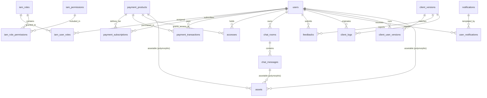

# Database Schema Documentation (`rexone-core`)

> **Database Engine:** PostgreSQL 18
> **Schema Version:** `2026_09_05_100002`
> **Key Conventions:** UUID v4 Primary Keys (`gen_random_uuid()`), Soft Deletion (`discard` gem), Audit Tracking (`Auditable` concern).

> [!IMPORTANT]
>
> ### 🏛️ Mandatory Synchronization Law (LAW.md #12)
>
> This document MUST be updated synchronously **EVERY TIME** the database schema or `ApplicationRecord` models are created, migrated, altered, or updated. Leaving `docs/SCHEMA.md` out-of-sync with migrations or models is strictly prohibited. Keep this document focused exclusively on application records (omitting background and APM tables).

---

## 1. Architectural Overview & Global Patterns

All core business models inherit from [`ApplicationRecord`](file:///Users/rex/Desktop/Dev/rexone/rexone-core/app/models/application_record.rb):

```ruby
class ApplicationRecord < ActiveRecord::Base
  primary_abstract_class
  include Discard::Model
  include Auditable

  default_scope -> { kept }
end
```

### Global Model Standards

1. **Primary Key**: UUID v4 default `gen_random_uuid()`.
2. **Soft Deletion (`Discard::Model`)**:
   - `discarded_at` timestamp: Record is hidden by default via `default_scope -> { kept }`.
   - Methods: `discard`, `undiscard`, `discarded?`, `kept?`.
   - Queries can bypass soft-deletion with `.with_discarded` or inspect soft-deleted records with `.discarded`.
3. **Auditing (`Auditable` Concern)**:
   - Tracks the actor who created, updated, discarded, or undiscarded each record via [`Current.auditor`](file:///Users/rex/Desktop/Dev/rexone/rexone-core/app/models/current.rb).
   - Foreign Keys (pointing to `users.id`):
     - `created_by_id`
     - `updated_by_id`
     - `discarded_by_id`
     - `undiscarded_by_id`
   - Timestamps: `undiscarded_at` (in addition to `discarded_at`).
4. **Scope of this Document**:
   - Covers only **Application Records** representing business entities.
   - **Explicitly Excluded**: Background engine & telemetry tables (Solid Queue, Solid Cable, Solid Cache, Rails Pulse, and Rails Error Dashboard). See [Excluded Infrastructure Tables](#excluded-infrastructure-tables).

---

## 2. Entity-Relationship (ER) Diagram



---

## 3. Identity & Access Management (IAM)

### 3.1. `users`

- **Model**: [`User`](file:///Users/rex/Desktop/Dev/rexone/rexone-core/app/models/user.rb)
- **Description**: Core identity table managing authentication (Devise + JWT revocation with JTI), profile, confirmation, and Stripe customer linking.

| Column                   | Type       | Nullable | Default             | Description / Notes                      |
| :----------------------- | :--------- | :------: | :------------------ | :--------------------------------------- |
| `id`                     | `uuid`     |    ❌    | `gen_random_uuid()` | Primary Key                              |
| `name`                   | `string`   |    ✔️    | `NULL`              | Full display name (max 50 chars)         |
| `username`               | `string`   |    ❌    | —                   | Unique handle (`[a-z0-9_]`, 3..30 chars) |
| `email`                  | `string`   |    ❌    | `""`                | Unique email address                     |
| `encrypted_password`     | `string`   |    ❌    | `""`                | Bcrypt encrypted hash                    |
| `jti`                    | `string`   |    ❌    | —                   | Devise JWT revocation identifier         |
| `stripe_customer_id`     | `string`   |    ✔️    | `NULL`              | Stripe Customer ID (`cus_...`)           |
| `provider`               | `string`   |    ✔️    | `NULL`              | Auth provider (e.g. OAuth)               |
| `confirmation_token`     | `string`   |    ✔️    | `NULL`              | Devise confirmation token                |
| `confirmation_code`      | `string`   |    ✔️    | `NULL`              | 6-digit numeric verification code        |
| `confirmation_sent_at`   | `datetime` |    ✔️    | `NULL`              | When confirmation code was dispatched    |
| `confirmed_at`           | `datetime` |    ✔️    | `NULL`              | When account email was confirmed         |
| `unconfirmed_email`      | `string`   |    ✔️    | `NULL`              | Pending new email address                |
| `reset_password_token`   | `string`   |    ✔️    | `NULL`              | Password recovery token                  |
| `reset_password_sent_at` | `datetime` |    ✔️    | `NULL`              | Password recovery timestamp              |
| `remember_created_at`    | `datetime` |    ✔️    | `NULL`              | Devise remember me timestamp             |
| `sign_in_count`          | `integer`  |    ❌    | `0`                 | Total sign-ins counter                   |
| `current_sign_in_at`     | `datetime` |    ✔️    | `NULL`              | Current session start                    |
| `last_sign_in_at`        | `datetime` |    ✔️    | `NULL`              | Previous session start                   |
| `current_sign_in_ip`     | `string`   |    ✔️    | `NULL`              | Current IP address                       |
| `last_sign_in_ip`        | `string`   |    ✔️    | `NULL`              | Previous IP address                      |
| `failed_attempts`        | `integer`  |    ❌    | `0`                 | Consecutive failed login attempts        |
| `unlock_token`           | `string`   |    ✔️    | `NULL`              | Account lock release token               |
| `locked_at`              | `datetime` |    ✔️    | `NULL`              | Account lock timestamp                   |
| `created_by_id`          | `uuid`     |    ✔️    | `NULL`              | Auditing: Creator                        |
| `updated_by_id`          | `uuid`     |    ✔️    | `NULL`              | Auditing: Modifier                       |
| `discarded_by_id`        | `uuid`     |    ✔️    | `NULL`              | Auditing: Discarder                      |
| `undiscarded_by_id`      | `uuid`     |    ✔️    | `NULL`              | Auditing: Restorer                       |
| `discarded_at`           | `datetime` |    ✔️    | `NULL`              | Soft delete timestamp                    |
| `undiscarded_at`         | `datetime` |    ✔️    | `NULL`              | Soft delete restoration timestamp        |
| `created_at`             | `datetime` |    ❌    | —                   | Timestamp                                |
| `updated_at`             | `datetime` |    ❌    | —                   | Timestamp                                |

**Indexes**:

- `index_users_on_email` (UNIQUE: `email`)
- `index_users_on_username` (UNIQUE: `username`)
- `index_users_on_jti` (UNIQUE: `jti`)
- `index_users_on_confirmation_token` (UNIQUE: `confirmation_token`)
- `index_users_on_reset_password_token` (UNIQUE: `reset_password_token`)
- `index_users_on_unlock_token` (UNIQUE: `unlock_token`)
- `index_users_on_discarded_at` (`discarded_at`)
- `index_users_on_created_by_id`, `updated_by_id`, `discarded_by_id`, `undiscarded_by_id`

**Foreign Keys**:

- Self-referencing FKs for `created_by_id`, `updated_by_id`, `discarded_by_id`, `undiscarded_by_id` -> `users(id)`.

**API representation and lifecycle invariants**:

- `UserSerializer` embeds the current IAM snapshot under `iam`: admin flags plus all/admin/non-admin role and permission collections. The current-user API therefore has no separate IAM aggregate endpoint.
- Super-admin accounts cannot be discarded.

---

### 3.2. `iam_roles`

- **Model**: [`Iam::Role`](file:///Users/rex/Desktop/Dev/rexone/rexone-core/app/models/iam/role.rb)
- **Description**: RBAC roles (e.g. `super_admin`, `admin`, `user`).

| Column              | Type       | Nullable | Default             | Description / Notes                             |
| :------------------ | :--------- | :------: | :------------------ | :---------------------------------------------- |
| `id`                | `uuid`     |    ❌    | `gen_random_uuid()` | Primary Key                                     |
| `name`              | `string`   |    ❌    | —                   | Role name (e.g. `super_admin`, `admin`, `user`) |
| `description`       | `text`     |    ✔️    | `NULL`              | Human-readable role description                 |
| `system`            | `boolean`  |    ✔️    | `false`             | Protected system role flag                      |
| `created_by_id`     | `uuid`     |    ✔️    | `NULL`              | Auditing: Creator                               |
| `updated_by_id`     | `uuid`     |    ✔️    | `NULL`              | Auditing: Modifier                              |
| `discarded_by_id`   | `uuid`     |    ✔️    | `NULL`              | Auditing: Discarder                             |
| `undiscarded_by_id` | `uuid`     |    ✔️    | `NULL`              | Auditing: Restorer                              |
| `discarded_at`      | `datetime` |    ✔️    | `NULL`              | Soft delete timestamp                           |
| `undiscarded_at`    | `datetime` |    ✔️    | `NULL`              | Soft delete restoration timestamp               |
| `created_at`        | `datetime` |    ❌    | —                   | Timestamp                                       |
| `updated_at`        | `datetime` |    ❌    | —                   | Timestamp                                       |

**Indexes**:

- `index_iam_roles_on_name` (UNIQUE: `name`)
- `index_iam_roles_on_discarded_at` (`discarded_at`)
- Auditing indexes on `created_by_id`, `updated_by_id`, `discarded_by_id`, `undiscarded_by_id`.

---

### 3.3. `iam_permissions`

- **Model**: [`Iam::Permission`](file:///Users/rex/Desktop/Dev/rexone/rexone-core/app/models/iam/permission.rb)
- **Description**: Granular permissions composed of an action (`read`, `create`, `update`, `delete`) and a resource.

| Column              | Type       | Nullable | Default             | Description / Notes                                              |
| :------------------ | :--------- | :------: | :------------------ | :--------------------------------------------------------------- |
| `id`                | `uuid`     |    ❌    | `gen_random_uuid()` | Primary Key                                                      |
| `name`              | `string`   |    ❌    | —                   | Unique identifier (e.g. `read_users`, `create_payments`)         |
| `action`            | `string`   |    ❌    | —                   | Enum: `read`, `create`, `update`, `delete`                       |
| `resource`          | `string`   |    ❌    | —                   | Resource key (e.g. `users`, `roles`, `products`, `assets`, etc.) |
| `created_by_id`     | `uuid`     |    ✔️    | `NULL`              | Auditing: Creator                                                |
| `updated_by_id`     | `uuid`     |    ✔️    | `NULL`              | Auditing: Modifier                                               |
| `discarded_by_id`   | `uuid`     |    ✔️    | `NULL`              | Auditing: Discarder                                              |
| `undiscarded_by_id` | `uuid`     |    ✔️    | `NULL`              | Auditing: Restorer                                               |
| `discarded_at`      | `datetime` |    ✔️    | `NULL`              | Soft delete timestamp                                            |
| `undiscarded_at`    | `datetime` |    ✔️    | `NULL`              | Soft delete restoration timestamp                                |
| `created_at`        | `datetime` |    ❌    | —                   | Timestamp                                                        |
| `updated_at`        | `datetime` |    ❌    | —                   | Timestamp                                                        |

**Indexes**:

- `index_iam_permissions_on_name` (UNIQUE: `name`)
- `index_iam_permissions_on_resource_and_action` (UNIQUE: `resource`, `action`)
- Auditing indexes on `created_by_id`, `updated_by_id`, `discarded_by_id`, `undiscarded_by_id`, `discarded_at`.

**Mutation invariants**:

- Permissions must be discarded before permanent deletion and may be restored from the recycle bin.
- A role-permission assignment belonging to `super_admin` cannot be updated or removed.

---

### 3.4. `iam_user_roles`

- **Model**: [`Iam::UserRole`](file:///Users/rex/Desktop/Dev/rexone/rexone-core/app/models/iam/user_role.rb)
- **Description**: Join table linking Users to Roles (Many-to-Many).

| Column              | Type       | Nullable | Default             | Description / Notes               |
| :------------------ | :--------- | :------: | :------------------ | :-------------------------------- |
| `id`                | `uuid`     |    ❌    | `gen_random_uuid()` | Primary Key                       |
| `user_id`           | `uuid`     |    ❌    | —                   | FK to `users.id`                  |
| `role_id`           | `uuid`     |    ❌    | —                   | FK to `iam_roles.id`              |
| `created_by_id`     | `uuid`     |    ✔️    | `NULL`              | Auditing: Creator                 |
| `updated_by_id`     | `uuid`     |    ✔️    | `NULL`              | Auditing: Modifier                |
| `discarded_by_id`   | `uuid`     |    ✔️    | `NULL`              | Auditing: Discarder               |
| `undiscarded_by_id` | `uuid`     |    ✔️    | `NULL`              | Auditing: Restorer                |
| `discarded_at`      | `datetime` |    ✔️    | `NULL`              | Soft delete timestamp             |
| `undiscarded_at`    | `datetime` |    ✔️    | `NULL`              | Soft delete restoration timestamp |
| `created_at`        | `datetime` |    ❌    | —                   | Timestamp                         |
| `updated_at`        | `datetime` |    ❌    | —                   | Timestamp                         |

**Indexes & Foreign Keys**:

- `index_iam_user_roles_on_user_id_and_role_id` (UNIQUE: `user_id`, `role_id`)
- `index_iam_user_roles_on_role_id` (`role_id`)
- `index_iam_user_roles_on_user_id` (`user_id`)
- FKs to `users(id)` and `iam_roles(id)`.

**Mutation invariants**:

- Role membership is changed only through the dedicated IAM user-role resource; admin user create/update does not accept role IDs.
- The final remaining `super_admin` assignment cannot be removed.
- System roles cannot be discarded or permanently deleted.
- The `super_admin` role's permission assignments cannot be updated or removed; newly introduced permissions may still be assigned automatically.

---

### 3.5. `iam_role_permissions`

- **Model**: [`Iam::RolePermission`](file:///Users/rex/Desktop/Dev/rexone/rexone-core/app/models/iam/role_permission.rb)
- **Description**: Join table linking Roles to Permissions (Many-to-Many).

| Column              | Type       | Nullable | Default             | Description / Notes               |
| :------------------ | :--------- | :------: | :------------------ | :-------------------------------- |
| `id`                | `uuid`     |    ❌    | `gen_random_uuid()` | Primary Key                       |
| `role_id`           | `uuid`     |    ❌    | —                   | FK to `iam_roles.id`              |
| `permission_id`     | `uuid`     |    ❌    | —                   | FK to `iam_permissions.id`        |
| `created_by_id`     | `uuid`     |    ✔️    | `NULL`              | Auditing: Creator                 |
| `updated_by_id`     | `uuid`     |    ✔️    | `NULL`              | Auditing: Modifier                |
| `discarded_by_id`   | `uuid`     |    ✔️    | `NULL`              | Auditing: Discarder               |
| `undiscarded_by_id` | `uuid`     |    ✔     | `NULL`              | Auditing: Restorer                |
| `discarded_at`      | `datetime` |    ✔️    | `NULL`              | Soft delete timestamp             |
| `undiscarded_at`    | `datetime` |    ✔️    | `NULL`              | Soft delete restoration timestamp |
| `created_at`        | `datetime` |    ❌    | —                   | Timestamp                         |
| `updated_at`        | `datetime` |    ❌    | —                   | Timestamp                         |

**Indexes & Foreign Keys**:

- `index_iam_role_permissions_on_role_id_and_permission_id` (UNIQUE: `role_id`, `permission_id`)
- `index_iam_role_permissions_on_role_id` (`role_id`)
- `index_iam_role_permissions_on_permission_id` (`permission_id`)
- FKs to `iam_roles(id)` and `iam_permissions(id)`.

---

## 4. Payments, Subscriptions & Products

### 4.1. `payment_products`

- **Model**: [`Payment::Product`](file:///Users/rex/Desktop/Dev/rexone/rexone-core/app/models/payment/product.rb)
- **Description**: Catalog of purchasable tiers and items, synchronized with Stripe Product & Price objects.

| Column              | Type       | Nullable | Default             | Description / Notes                                   |
| :------------------ | :--------- | :------: | :------------------ | :---------------------------------------------------- |
| `id`                | `uuid`     |    ❌    | `gen_random_uuid()` | Primary Key                                           |
| `code`              | `string`   |    ❌    | —                   | Immutable unique product code (10 alphanumeric chars) |
| `name`              | `string`   |    ❌    | —                   | Product display name                                  |
| `description`       | `text`     |    ✔️    | `NULL`              | Marketing / plan description                          |
| `unit_amount`       | `integer`  |    ❌    | —                   | Price in smallest currency unit (cents, 0 = Free)     |
| `currency`          | `string`   |    ❌    | —                   | Currency code (e.g. `usd`)                            |
| `interval`          | `string`   |    ✔️    | `NULL`              | Billing interval: `day`, `week`, `month`, `year`, or `NULL` (one-time) |
| `active`            | `boolean`  |    ❌    | `true`              | Availability status                                   |
| `stripe_product_id` | `string`   |    ❌    | —                   | Stripe Product ID (`prod_...`)                        |
| `stripe_price_id`   | `string`   |    ❌    | —                   | Stripe Price ID (`price_...`)                         |
| `created_by_id`     | `uuid`     |    ✔️    | `NULL`              | Auditing: Creator                                     |
| `updated_by_id`     | `uuid`     |    ✔️    | `NULL`              | Auditing: Modifier                                    |
| `discarded_by_id`   | `uuid`     |    ✔️    | `NULL`              | Auditing: Discarder                                   |
| `undiscarded_by_id` | `uuid`     |    ✔️    | `NULL`              | Auditing: Restorer                                    |
| `discarded_at`      | `datetime` |    ✔️    | `NULL`              | Soft delete timestamp                                 |
| `undiscarded_at`    | `datetime` |    ✔️    | `NULL`              | Soft delete restoration timestamp                     |
| `created_at`        | `datetime` |    ❌    | —                   | Timestamp                                             |
| `updated_at`        | `datetime` |    ❌    | —                   | Timestamp                                             |

**Indexes**:

- `index_payment_products_on_code` (UNIQUE: `code`)
- `index_payment_products_on_stripe_product_id` (UNIQUE: `stripe_product_id`)
- `index_payment_products_on_stripe_price_id` (UNIQUE: `stripe_price_id`)
- `index_payment_products_on_discarded_at` (`discarded_at`)

---

### 4.2. `payment_subscriptions`

- **Model**: [`Payment::Subscription`](file:///Users/rex/Desktop/Dev/rexone/rexone-core/app/models/payment/subscription.rb)
- **Description**: Recurring user subscription instances synchronized with Stripe Subscription objects.

| Column                   | Type       | Nullable | Default             | Description / Notes                                                      |
| :----------------------- | :--------- | :------: | :------------------ | :----------------------------------------------------------------------- |
| `id`                     | `uuid`     |    ❌    | `gen_random_uuid()` | Primary Key                                                              |
| `user_id`                | `uuid`     |    ❌    | —                   | FK to `users.id`                                                         |
| `product_id`             | `uuid`     |    ❌    | —                   | FK to `payment_products.id`                                              |
| `stripe_subscription_id` | `string`   |    ❌    | —                   | Stripe Subscription ID (`sub_...`)                                       |
| `stripe_customer_id`     | `string`   |    ✔️    | `NULL`              | Stripe Customer ID (`cus_...`)                                           |
| `stripe_subscription_item_id` | `string` | ❌ | — | Stripe Subscription Item ID (`si_...`) |
| `stripe_price_id`        | `string`   |    ❌    | —                   | Price snapshot ID (`price_...`)                                          |
| `status`                 | `string`   |    ❌    | `"incomplete"`      | Status: `incomplete`, `active`, `past_due`, `canceled`, `trialing`, etc. |
| `currency`               | `string`   |    ❌    | —                   | Lowercase ISO currency code from Stripe                                  |
| `unit_amount`            | `integer`  |    ❌    | —                   | Price snapshot in minor currency units                                   |
| `quantity`               | `integer`  |    ❌    | `1`                 | Subscription item quantity                                               |
| `interval`               | `string`   |    ❌    | —                   | Stripe recurring interval: `day`, `week`, `month`, or `year`             |
| `interval_count`         | `integer`  |    ❌    | `1`                 | Number of intervals between billings                                     |
| `current_period_start`   | `datetime` |    ❌    | —                   | Subscription Item period start, converted from epoch seconds to UTC      |
| `current_period_end`     | `datetime` |    ❌    | —                   | Subscription Item period end, converted from epoch seconds to UTC        |
| `started_at`             | `datetime` |    ❌    | —                   | Stripe Subscription `start_date` converted from epoch seconds to UTC     |
| `ended_at`               | `datetime` |    ✔️    | `NULL`              | When subscription ceased                                                 |
| `cancel_at`              | `datetime` |    ✔️    | `NULL`              | Scheduled future cancellation time                                       |
| `canceled_at`            | `datetime` |    ✔️    | `NULL`              | Timestamp cancellation was requested                                     |
| `cancel_at_period_end`   | `boolean`  |    ❌    | `false`             | Whether cancel occurs at period boundary                                 |
| `payment_method_id`      | `string`   |    ✔️    | `NULL`              | ID from Stripe Subscription `default_payment_method`                     |
| `payment_method_type`    | `string`   |    ✔️    | `NULL`              | Stripe PaymentMethod `type` (for example `card`, `us_bank_account`)      |
| `payment_method_details` | `jsonb`    |    ✔️    | `{}`                | Brand, last4, exp details                                                |
| `metadata`               | `jsonb`    |    ✔️    | `{}`                | Metadata payload                                                         |
| `created_by_id`          | `uuid`     |    ✔️    | `NULL`              | Auditing: Creator                                                        |
| `updated_by_id`          | `uuid`     |    ✔️    | `NULL`              | Auditing: Modifier                                                       |
| `discarded_by_id`        | `uuid`     |    ✔️    | `NULL`              | Auditing: Discarder                                                      |
| `undiscarded_by_id`      | `uuid`     |    ✔️    | `NULL`              | Auditing: Restorer                                                       |
| `discarded_at`           | `datetime` |    ✔️    | `NULL`              | Soft delete timestamp                                                    |
| `undiscarded_at`         | `datetime` |    ✔️    | `NULL`              | Soft delete restoration timestamp                                        |
| `created_at`             | `datetime` |    ❌    | —                   | Timestamp                                                                |
| `updated_at`             | `datetime` |    ❌    | —                   | Timestamp                                                                |

**Indexes & Foreign Keys**:

- `index_payment_subscriptions_on_stripe_subscription_id` (UNIQUE: `stripe_subscription_id`)
- `index_payment_subscriptions_on_stripe_subscription_item_id` (`stripe_subscription_item_id`)
- `index_payment_subscriptions_on_stripe_price_id` (`stripe_price_id`)
- `index_payment_subscriptions_on_user_id_and_status` (`user_id`, `status`)
- `index_payment_subscriptions_on_user_id` (`user_id`)
- `index_payment_subscriptions_on_product_id` (`product_id`)
- `index_payment_subscriptions_on_status` (`status`)
- `index_payment_subscriptions_on_current_period_end` (`current_period_end`)
- FKs to `users(id)` and `payment_products(id)`.

Subscription synchronization is pinned to Stripe API `2026-08-26.dahlia` (the contract shipped by Stripe Ruby `19.6.1`). Billing periods are read from the single `SubscriptionItem`; integer price fields are stored as a subscription snapshot rather than read later from the mutable product row. Decimal prices are intentionally unsupported.

---

### 4.3. `payment_transactions`

- **Model**: [`Payment::Transaction`](file:///Users/rex/Desktop/Dev/rexone/rexone-core/app/models/payment/transaction.rb)
- **Description**: One-time purchases synchronized from Stripe PaymentIntent objects.

| Column                     | Type       | Nullable | Default                     | Description / Notes                            |
| :------------------------- | :--------- | :------: | :-------------------------- | :--------------------------------------------- |
| `id`                       | `uuid`     |    ❌    | `gen_random_uuid()`         | Primary Key                                    |
| `user_id`                  | `uuid`     |    ❌    | —                           | FK to `users.id`                               |
| `product_id`               | `uuid`     |    ❌    | —                           | FK to `payment_products.id`                    |
| `stripe_payment_intent_id` | `string`   |    ❌    | —                           | Stripe Payment Intent ID (`pi_...`)            |
| `stripe_charge_id`         | `string`   |    ✔️    | `NULL`                      | Stripe Charge ID (`ch_...`)                    |
| `stripe_customer_id`       | `string`   |    ✔️    | `NULL`                      | Stripe Customer ID (`cus_...`)                 |
| `client_secret`            | `string`   |    ✔️    | `NULL`                      | Stripe client secret for FE SDK                |
| `unit_amount`              | `integer`  |    ❌    | —                           | PaymentIntent `amount` in minor currency units |
| `amount_received`          | `integer`  |    ✔️    | `0`                         | Actual captured amount in cents                |
| `amount_capturable`        | `integer`  |    ✔️    | `0`                         | Authorized amount ready for capture            |
| `currency`                 | `string`   |    ❌    | —                           | Currency code (e.g. `usd`)                     |
| `status`                   | `string`   |    ❌    | `"requires_payment_method"` | Stripe status: `succeeded`, `processing`, etc. |
| `payment_method_id`        | `string`   |    ✔️    | `NULL`                      | Stripe PaymentMethod ID                        |
| `payment_method_type`      | `string`   |    ✔️    | `NULL`                      | Payment method category                        |
| `payment_method_details`   | `jsonb`    |    ✔️    | `{}`                        | Detailed card/account summary                  |
| `processing_at`            | `datetime` |    ✔️    | `NULL`                      | When processing began                          |
| `paid_at`                  | `datetime` |    ✔️    | `NULL`                      | When payment succeeded                         |
| `canceled_at`              | `datetime` |    ✔️    | `NULL`                      | When payment was canceled                      |
| `refunded_at`              | `datetime` |    ✔️    | `NULL`                      | When transaction was refunded                  |
| `metadata`                 | `jsonb`    |    ✔️    | `{}`                        | Arbitrary Stripe metadata                      |
| `created_by_id`            | `uuid`     |    ✔️    | `NULL`                      | Auditing: Creator                              |
| `updated_by_id`            | `uuid`     |    ✔️    | `NULL`                      | Auditing: Modifier                             |
| `discarded_by_id`          | `uuid`     |    ✔️    | `NULL`                      | Auditing: Discarder                            |
| `undiscarded_by_id`        | `uuid`     |    ✔️    | `NULL`                      | Auditing: Restorer                             |
| `discarded_at`             | `datetime` |    ✔️    | `NULL`                      | Soft delete timestamp                          |
| `undiscarded_at`           | `datetime` |    ✔️    | `NULL`                      | Soft delete restoration timestamp              |
| `created_at`               | `datetime` |    ❌    | —                           | Timestamp                                      |
| `updated_at`               | `datetime` |    ❌    | —                           | Timestamp                                      |

**Indexes & Foreign Keys**:

- `index_payment_transactions_on_stripe_payment_intent_id` (UNIQUE: `stripe_payment_intent_id`)
- `index_payment_transactions_on_stripe_charge_id` (UNIQUE: `stripe_charge_id`)
- `index_payment_transactions_on_user_id_and_created_at` (`user_id`, `created_at`)
- `index_payment_transactions_on_user_id` (`user_id`)
- `index_payment_transactions_on_product_id` (`product_id`)
- `index_payment_transactions_on_status` (`status`)
- `index_payment_transactions_on_payment_method_type` (`payment_method_type`)
- FKs to `users(id)` and `payment_products(id)`.

---

### 4.4. `payment_webhook_events`

- **Model**: [`Payment::WebhookEvent`](file:///Users/rex/Desktop/Dev/rexone/rexone-core/app/models/payment/webhook_event.rb)
- **Description**: Idempotent audit log and processing buffer for incoming Stripe webhook payloads.

| Column                  | Type       | Nullable | Default             | Description / Notes                            |
| :---------------------- | :--------- | :------: | :------------------ | :--------------------------------------------- |
| `id`                    | `uuid`     |    ❌    | `gen_random_uuid()` | Primary Key                                    |
| `stripe_event_id`       | `string`   |    ❌    | —                   | Unique Stripe event ID (`evt_...`)             |
| `event_type`            | `string`   |    ❌    | —                   | Stripe event name (e.g. `invoice.paid`)        |
| `status`                | `string`   |    ❌    | `"pending"`         | `pending`, `processing`, `processed`, `failed` |
| `livemode`              | `boolean`  |    ❌    | `false`             | True if production Stripe mode                 |
| `payload`               | `jsonb`    |    ❌    | `{}`                | Complete raw event payload                     |
| `attempt_count`         | `integer`  |    ❌    | `0`                 | Number of processing attempts                  |
| `received_at`           | `datetime` |    ❌    | —                   | When HTTP webhook was received                 |
| `processing_started_at` | `datetime` |    ✔️    | `NULL`              | Processing dispatch start                      |
| `processed_at`          | `datetime` |    ✔️    | `NULL`              | Successful completion time                     |
| `last_error`            | `text`     |    ✔️    | `NULL`              | Backtrace/error of failed execution            |
| `created_by_id`         | `uuid`     |    ✔️    | `NULL`              | Auditing: Creator                              |
| `updated_by_id`         | `uuid`     |    ✔️    | `NULL`              | Auditing: Modifier                             |
| `discarded_by_id`       | `uuid`     |    ✔️    | `NULL`              | Auditing: Discarder                            |
| `undiscarded_by_id`     | `uuid`     |    ✔️    | `NULL`              | Auditing: Restorer                             |
| `discarded_at`          | `datetime` |    ✔️    | `NULL`              | Soft delete timestamp                          |
| `undiscarded_at`        | `datetime` |    ✔️    | `NULL`              | Soft delete restoration timestamp              |
| `created_at`            | `datetime` |    ❌    | —                   | Timestamp                                      |
| `updated_at`            | `datetime` |    ❌    | —                   | Timestamp                                      |

**Indexes**:

- `index_payment_webhook_events_on_stripe_event_id` (UNIQUE: `stripe_event_id`)
- `index_payment_webhook_events_on_status_and_received_at` (`status`, `received_at`)
- `index_payment_webhook_events_on_event_type` (`event_type`)
- `index_payment_webhook_events_on_received_at` (`received_at`)

---

## 5. Product Access & Entitlements

### 5.1. `accesses`

- **Model**: [`Access`](file:///Users/rex/Desktop/Dev/rexone/rexone-core/app/models/access.rb)
- **Description**: Grants a User active entitlement to a Product (subscription-based or permanent).

| Column              | Type       | Nullable | Default             | Description / Notes                           |
| :------------------ | :--------- | :------: | :------------------ | :-------------------------------------------- |
| `id`                | `uuid`     |    ❌    | `gen_random_uuid()` | Primary Key                                   |
| `user_id`           | `uuid`     |    ❌    | —                   | FK to `users.id`                              |
| `product_id`        | `uuid`     |    ❌    | —                   | FK to `payment_products.id`                   |
| `status`            | `string`   |    ❌    | `"active"`          | Enum: `active`, `expired`, `revoked`          |
| `granted_at`        | `datetime` |    ❌    | —                   | When entitlement was activated                |
| `expires_at`        | `datetime` |    ✔️    | `NULL`              | Future expiration timestamp (NULL = lifetime) |
| `expired_at`        | `datetime` |    ✔️    | `NULL`              | Actual expiration timestamp                   |
| `revoked_at`        | `datetime` |    ✔️    | `NULL`              | Actual administrative revocation timestamp    |
| `created_by_id`     | `uuid`     |    ✔️    | `NULL`              | Auditing: Creator                             |
| `updated_by_id`     | `uuid`     |    ✔️    | `NULL`              | Auditing: Modifier                            |
| `discarded_by_id`   | `uuid`     |    ✔️    | `NULL`              | Auditing: Discarder                           |
| `undiscarded_by_id` | `uuid`     |    ✔️    | `NULL`              | Auditing: Restorer                            |
| `discarded_at`      | `datetime` |    ✔️    | `NULL`              | Soft delete timestamp                         |
| `undiscarded_at`    | `datetime` |    ✔️    | `NULL`              | Soft delete restoration timestamp             |
| `created_at`        | `datetime` |    ❌    | —                   | Timestamp                                     |
| `updated_at`        | `datetime` |    ❌    | —                   | Timestamp                                     |

**Indexes & Foreign Keys**:

- `index_accesses_on_user_id_and_product_id` (UNIQUE: `user_id`, `product_id`)
- `index_accesses_on_user_id_and_status` (`user_id`, `status`)
- `index_accesses_on_user_id` (`user_id`)
- `index_accesses_on_product_id` (`product_id`)
- `index_accesses_on_status` (`status`)
- `index_accesses_on_expires_at` (`expires_at`)
- FKs to `users(id)` and `payment_products(id)`.

---

## 6. Chat & AI Conversations

### 6.1. `chat_rooms`

- **Model**: [`Chat::Room`](file:///Users/rex/Desktop/Dev/rexone/rexone-core/app/models/chat/room.rb)
- **Description**: Conversation thread container for user AI interactions.

| Column              | Type       | Nullable | Default              | Description / Notes                 |
| :------------------ | :--------- | :------: | :------------------- | :---------------------------------- |
| `id`                | `uuid`     |    ❌    | `gen_random_uuid()`  | Primary Key                         |
| `user_id`           | `uuid`     |    ❌    | —                    | FK to `users.id`                    |
| `title`             | `string`   |    ✔️    | `"New Conversation"` | Conversation summary / thread title |
| `metadata`          | `jsonb`    |    ✔️    | `{}`                 | Settings, system context            |
| `created_by_id`     | `uuid`     |    ✔️    | `NULL`               | Auditing: Creator                   |
| `updated_by_id`     | `uuid`     |    ✔️    | `NULL`               | Auditing: Modifier                  |
| `discarded_by_id`   | `uuid`     |    ✔️    | `NULL`               | Auditing: Discarder                 |
| `undiscarded_by_id` | `uuid`     |    ✔️    | `NULL`               | Auditing: Restorer                  |
| `discarded_at`      | `datetime` |    ✔️    | `NULL`               | Soft delete timestamp               |
| `undiscarded_at`    | `datetime` |    ✔️    | `NULL`               | Soft delete restoration timestamp   |
| `created_at`        | `datetime` |    ❌    | —                    | Timestamp                           |
| `updated_at`        | `datetime` |    ❌    | —                    | Timestamp                           |

**Indexes & Foreign Keys**:

- `index_chat_rooms_on_user_id_and_created_at` (`user_id`, `created_at`)
- `index_chat_rooms_on_user_id` (`user_id`)
- `index_chat_rooms_on_discarded_at` (`discarded_at`)
- FK to `users(id)`.

---

### 6.2. `chat_messages`

- **Model**: [`Chat::Message`](file:///Users/rex/Desktop/Dev/rexone/rexone-core/app/models/chat/message.rb)
- **Description**: Individual dialogue turns (user prompt or AI assistant response) with metadata and attached assets (e.g. TTS audio).

| Column              | Type       | Nullable | Default             | Description / Notes                                                                 |
| :------------------ | :--------- | :------: | :------------------ | :---------------------------------------------------------------------------------- |
| `id`                | `uuid`     |    ❌    | `gen_random_uuid()` | Primary Key                                                                         |
| `room_id`           | `uuid`     |    ❌    | —                   | FK to `chat_rooms.id`                                                               |
| `role`              | `string`   |    ❌    | —                   | Role: `user` or `assistant`                                                         |
| `content`           | `text`     |    ❌    | —                   | Message text content                                                                |
| `metadata`          | `jsonb`    |    ✔️    | `{}`                | Store accessor: `ai_status`, `model`, `usage`, `temperature`, `tts_status`, `error` |
| `created_by_id`     | `uuid`     |    ✔️    | `NULL`              | Auditing: Creator                                                                   |
| `updated_by_id`     | `uuid`     |    ✔️    | `NULL`              | Auditing: Modifier                                                                  |
| `discarded_by_id`   | `uuid`     |    ✔️    | `NULL`              | Auditing: Discarder                                                                 |
| `undiscarded_by_id` | `uuid`     |    ✔️    | `NULL`              | Auditing: Restorer                                                                  |
| `discarded_at`      | `datetime` |    ✔️    | `NULL`              | Soft delete timestamp                                                               |
| `undiscarded_at`    | `datetime` |    ✔️    | `NULL`              | Soft delete restoration timestamp                                                   |
| `created_at`        | `datetime` |    ❌    | —                   | Timestamp                                                                           |
| `updated_at`        | `datetime` |    ❌    | —                   | Timestamp                                                                           |

**Indexes & Foreign Keys**:

- `index_chat_messages_on_room_id_and_created_at` (`room_id`, `created_at`)
- `index_chat_messages_on_room_id` (`room_id`)
- `index_chat_messages_on_discarded_at` (`discarded_at`)
- FK to `chat_rooms(id)`.

---

## 7. Media & Storage

### 7.1. `assets`

- **Model**: [`Asset`](file:///Users/rex/Desktop/Dev/rexone/rexone-core/app/models/asset.rb)
- **Description**: Polymorphic storage tracking for files, images, videos, avatars, and audio with background compression lifecycle.

| Column              | Type       | Nullable | Default             | Description / Notes                                                    |
| :------------------ | :--------- | :------: | :------------------ | :--------------------------------------------------------------------- |
| `id`                | `uuid`     |    ❌    | `gen_random_uuid()` | Primary Key                                                            |
| `name`              | `string`   |    ❌    | —                   | File original name                                                     |
| `url`               | `string`   |    ❌    | —                   | Accessible CDN or storage URL                                          |
| `storage_key`       | `string`   |    ✔️    | `NULL`              | Cloud bucket path (e.g. `user/{user_id}/avatar_profile_12345.png`)     |
| `type`              | `string`   |    ❌    | `"general"`         | `general`, `avatar`, `thumbnail`, `subtitle`, `audio`, `video`, `attachment` (STI disabled) |
| `source`            | `string`   |    ❌    | `"upload"`          | Source: `upload`, `google`                                             |
| `format`            | `string`   |    ✔️    | `NULL`              | Media kind: `image`, `audio`, `video`, `doc`, `subtitle`               |
| `extension`         | `string`   |    ✔️    | `NULL`              | File extension without dot                                             |
| `size_bytes`        | `bigint`   |    ✔️    | `NULL`              | File size in bytes                                                     |
| `duration_secs`     | `integer`  |    ✔️    | `NULL`              | Video/audio duration in seconds                                        |
| `status`            | `string`   |    ❌    | `"pending"`         | Pipeline status: `pending`, `processing`, `ready`, `optimal`, `failed` |
| `assetable_type`    | `string`   |    ✔️    | `NULL`              | Polymorphic owner type (`User`, `Chat::Message`, etc.)                 |
| `assetable_id`      | `uuid`     |    ✔️    | `NULL`              | Polymorphic owner ID                                                   |
| `parent_asset_id`   | `uuid`     |    ✔️    | `NULL`              | Source asset for a thumbnail or subtitle child (compressible video or audio parent) |
| `created_by_id`     | `uuid`     |    ✔️    | `NULL`              | Auditing: Creator                                                      |
| `updated_by_id`     | `uuid`     |    ✔️    | `NULL`              | Auditing: Modifier                                                     |
| `discarded_by_id`   | `uuid`     |    ✔️    | `NULL`              | Auditing: Discarder                                                    |
| `undiscarded_by_id` | `uuid`     |    ✔️    | `NULL`              | Auditing: Restorer                                                     |
| `discarded_at`      | `datetime` |    ✔️    | `NULL`              | Soft delete timestamp                                                  |
| `undiscarded_at`    | `datetime` |    ✔️    | `NULL`              | Soft delete restoration timestamp                                      |
| `created_at`        | `datetime` |    ❌    | —                   | Timestamp                                                              |
| `updated_at`        | `datetime` |    ❌    | —                   | Timestamp                                                              |

**Indexes**:

- `index_assets_on_url` (UNIQUE: `url`)
- `index_assets_on_assetable_type_and_assetable_id` (`assetable_type`, `assetable_id`)
- `index_assets_on_parent_asset_id` (`parent_asset_id`)
- `index_assets_on_name` (`name`)
- `index_assets_on_status` (`status`)
- `index_assets_on_type` (`type`)
- `index_assets_on_discarded_at` (`discarded_at`)

**Storage Partition Independence**:

- `Asset` has no knowledge of Garage environment partitions and all model and controller queries cover the complete assets table. Garage alone applies or preserves `dev/`, `uat/`, and `prod/` storage-key prefixes. Super-admin storage statistics aggregate every database asset.

**Generated Video Thumbnails**:

- A compressible video or audio parent may own one thumbnail and one subtitle. That one-of-each rule is enforced on `Asset` (`type` unique per `parent_asset_id`), not by a unique database index. Thumbnail generation runs asynchronously on the `media` queue, stores a WebP object beside its source video, and preserves the original asset's polymorphic owner. Admin may also upload an image thumbnail for a compressible video or audio parent; SVG covers are converted to PNG at save time and marked `optimal`. `.srt` children are stored as `type`/`format` `subtitle` and are not compressed; admin attaches or replaces them with `POST /v1/admin/assets/:id/subtitle/upload`.

**Audio Compression**:

- Compressible audio extensions (`mp3`, `wav`, `m4a`, `aac`, `ogg`, `flac`) follow the same optimal-first `media` queue pipeline as images and videos. WAV, FLAC, and OGG are remuxed to `m4a` (AAC); the asset `extension` is updated to `m4a` while `storage_key` is overwritten in place.

---

## 8. User Feedback

### 8.1. `feedbacks`

- **Model**: [`Feedback`](file:///Users/rex/Desktop/Dev/rexone/rexone-core/app/models/feedback.rb)
- **Description**: In-app feedback reports, ratings, bug tickets, and admin triage tracking. Clients send `app_version`; Core stores nullable `version_id`.

| Column              | Type       | Nullable | Default             | Description / Notes                                                                                                                                |
| :------------------ | :--------- | :------: | :------------------ | :------------------------------------------------------------------------------------------------------------------------------------------------- |
| `id`                | `uuid`     |    ❌    | `gen_random_uuid()` | Primary Key                                                                                                                                        |
| `user_id`           | `uuid`     |    ✔️    | `NULL`              | Submitting user (optional for guest feedback)                                                                                                      |
| `content`           | `text`     |    ❌    | —                   | Feedback message / report                                                                                                                          |
| `rating`            | `integer`  |    ✔️    | `NULL`              | Star rating (1..5)                                                                                                                                 |
| `category`          | `string`   |    ❌    | `"general"`         | Enum: `general`, `bug`, `feature`, `improvement`, etc.                                                                                             |
| `priority`          | `string`   |    ❌    | `"normal"`          | Enum: `low`, `normal`, `high`, `urgent`                                                                                                            |
| `status`            | `string`   |    ❌    | `"new"`             | Enum: `new`, `in_progress`, `resolved`, `closed`                                                                                                   |
| `platform`          | `string`   |    ❌    | `"web"`             | Enum: `web`, `ios`, `android`                                                                                                                      |
| `admin_notes`       | `text`     |    ✔️    | `NULL`              | Internal triage / resolver comments                                                                                                                |
| `version_id`        | `uuid`     |    ✔️    | `NULL`              | Matching `Client::Version` if ingest `app_version` matches `number`. API still accepts `app_version`; serializers derive it from `version.number`. |
| `browser`           | `string`   |    ✔️    | `NULL`              | Client browser                                                                                                                                     |
| `os`                | `string`   |    ✔️    | `NULL`              | Operating system                                                                                                                                   |
| `device`            | `string`   |    ✔️    | `NULL`              | Client hardware                                                                                                                                    |
| `page`              | `string`   |    ✔️    | `NULL`              | Source page URL or route                                                                                                                           |
| `metadata`          | `jsonb`    |    ❌    | `{}`                | Diagnostic payload                                                                                                                                 |
| `created_by_id`     | `uuid`     |    ✔️    | `NULL`              | Auditing: Creator                                                                                                                                  |
| `updated_by_id`     | `uuid`     |    ✔️    | `NULL`              | Auditing: Modifier                                                                                                                                 |
| `discarded_by_id`   | `uuid`     |    ✔️    | `NULL`              | Auditing: Discarder                                                                                                                                |
| `undiscarded_by_id` | `uuid`     |    ✔️    | `NULL`              | Auditing: Restorer                                                                                                                                 |
| `discarded_at`      | `datetime` |    ✔️    | `NULL`              | Soft delete timestamp                                                                                                                              |
| `created_at`        | `datetime` |    ❌    | —                   | Timestamp                                                                                                                                          |
| `updated_at`        | `datetime` |    ❌    | —                   | Timestamp                                                                                                                                          |

**Indexes & Foreign Keys**:

- `index_feedbacks_on_user_id` (`user_id`)
- `index_feedbacks_on_category` (`category`)
- `index_feedbacks_on_priority` (`priority`)
- `index_feedbacks_on_status` (`status`)
- `index_feedbacks_on_platform` (`platform`)
- `index_feedbacks_on_rating` (`rating`)
- `index_feedbacks_on_created_at` (`created_at`)
- `index_feedbacks_on_discarded_at` (`discarded_at`)
- `index_feedbacks_on_version_id` (`version_id`)
- FK to `users(id)`; FK to `client_versions(id)` `ON DELETE NULL`.

---

## 9. Diagnostics & Logging

### 9.1. `client_logs`

- **Model**: [`Client::Log`](app/models/client/log.rb)
- **Description**: Frontend client runtime error tracking, session snapshots, and resolution management. Clients send `app_version`; Core stores nullable `version_id`.

| Column                 | Type       | Nullable | Default             | Description / Notes                                                                                                                                |
| :--------------------- | :--------- | :------: | :------------------ | :------------------------------------------------------------------------------------------------------------------------------------------------- |
| `id`                   | `uuid`     |    ❌    | `gen_random_uuid()` | Primary Key                                                                                                                                        |
| `user_id`              | `uuid`     |    ✔️    | `NULL`              | Authenticated user (if logged in)                                                                                                                  |
| `message`              | `string`   |    ❌    | —                   | Error message string                                                                                                                               |
| `severity`             | `string`   |    ❌    | `"error"`           | `debug`, `info`, `warning`, `error`, `critical`                                                                                                    |
| `platform`             | `string`   |    ✔️    | `NULL`              | `web`, `ios`, `android`                                                                                                                            |
| `environment`          | `string`   |    ✔️    | `NULL`              | `development`, `staging`, `production`                                                                                                             |
| `url`                  | `string`   |    ✔️    | `NULL`              | Page URL where error triggered                                                                                                                     |
| `method`               | `string`   |    ✔️    | `NULL`              | Associated HTTP method                                                                                                                             |
| `user_agent`           | `string`   |    ✔️    | `NULL`              | User Agent string                                                                                                                                  |
| `version_id`           | `uuid`     |    ✔️    | `NULL`              | Matching `Client::Version` if ingest `app_version` matches `number`. API still accepts `app_version`; serializers derive it from `version.number`. |
| `os`                   | `string`   |    ✔️    | `NULL`              | Operating system                                                                                                                                   |
| `os_version`           | `string`   |    ✔️    | `NULL`              | OS version number                                                                                                                                  |
| `browser`              | `string`   |    ✔️    | `NULL`              | Browser family                                                                                                                                     |
| `device`               | `string`   |    ✔️    | `NULL`              | Hardware device info                                                                                                                               |
| `request_id`           | `string`   |    ✔️    | `NULL`              | Correlating server request ID                                                                                                                      |
| `occurrence_count`     | `integer`  |    ✔️    | `1`                 | Deduplicated occurrence count                                                                                                                      |
| `last_occurred_at`     | `datetime` |    ✔️    | `NULL`              | Most recent occurrence timestamp                                                                                                                   |
| `resolved_at`          | `datetime` |    ✔️    | `NULL`              | Triage resolution timestamp                                                                                                                        |
| `resolved_by_id`       | `uuid`     |    ✔️    | `NULL`              | FK to `users.id` who resolved                                                                                                                      |
| `context`              | `jsonb`    |    ✔️    | `{}`                | Contextual data dictionary                                                                                                                         |
| `cookies`              | `jsonb`    |    ✔️    | `{}`                | Cookie key snapshot                                                                                                                                |
| `local_storage_keys`   | `jsonb`    |    ✔️    | `[]`                | LocalStorage keys present (GIN indexed)                                                                                                            |
| `session_storage_keys` | `jsonb`    |    ✔️    | `[]`                | SessionStorage keys present (GIN indexed)                                                                                                          |
| `stack_trace`          | `jsonb`    |    ✔️    | `[]`                | Structured stack trace frames                                                                                                                      |
| `created_by_id`        | `uuid`     |    ✔️    | `NULL`              | Auditing: Creator                                                                                                                                  |
| `updated_by_id`        | `uuid`     |    ✔️    | `NULL`              | Auditing: Modifier                                                                                                                                 |
| `discarded_at`         | `datetime` |    ✔️    | `NULL`              | Soft delete timestamp                                                                                                                              |
| `created_at`           | `datetime` |    ❌    | —                   | Timestamp                                                                                                                                          |
| `updated_at`           | `datetime` |    ❌    | —                   | Timestamp                                                                                                                                          |

**Indexes & Foreign Keys**:

- `index_client_logs_on_local_storage_keys` (GIN: `local_storage_keys`)
- `index_client_logs_on_session_storage_keys` (GIN: `session_storage_keys`)
- `index_client_logs_on_platform_and_severity` (`platform`, `severity`)
- `index_client_logs_on_user_id_and_created_at` (`user_id`, `created_at`)
- `index_client_logs_on_user_id` (`user_id`)
- `index_client_logs_on_environment` (`environment`)
- `index_client_logs_on_resolved_at` (`resolved_at`)
- `index_client_logs_on_resolved_by_id` (`resolved_by_id`)
- `index_client_logs_on_version_id` (`version_id`)
- FKs to `users(id)` for `user_id`, `resolved_by_id`, `created_by_id`, `updated_by_id`; FK to `client_versions(id)` `ON DELETE NULL`.

---

## 10. Multi-Channel Notifications

### 10.1. `notifications`

- **Model**: [`Notification`](file:///Users/rex/Desktop/Dev/rexone/rexone-core/app/models/notification.rb)
- **Description**: Central multi-channel notification registry managing content, placeholders, counters, and provider template IDs for In-App (Socket), Push Notifications, and Email.

| Column              | Type       | Nullable | Default             | Description / Notes                                        |
| :------------------ | :--------- | :------: | :------------------ | :--------------------------------------------------------- |
| `id`                | `uuid`     |    ❌    | `gen_random_uuid()` | Primary Key                                                |
| `event`             | `string`   |    ❌    | —                   | Unique event key (e.g. `welcome`, `general_announcement`)  |
| `name`              | `string`   |    ❌    | —                   | Human-readable notification name                           |
| `description`       | `text`     |    ✔️    | `NULL`              | Administrative description                                 |
| `category`          | `string`   |    ❌    | `broadcast`         | `system`, `marketing`, or `broadcast`                      |
| `link`              | `string`   |    ✔️    | `NULL`              | Default target navigation URL/path                         |
| `admin`             | `boolean`  |    ❌    | `true`              | Indicates if notification is available for admin broadcast |
| `in_app_title`      | `string`   |    ✔️    | `NULL`              | In-app notification title template                         |
| `in_app_body`       | `text`     |    ✔️    | `NULL`              | In-app notification body template                          |
| `in_app_data`       | `jsonb`    |    ❌    | `{}`                | Custom payload / metadata                                  |
| `push_title`        | `string`   |    ✔️    | `NULL`              | Push notification title template                           |
| `push_body`         | `text`     |    ✔️    | `NULL`              | Push notification body template                            |
| `push_template_id`  | `string`   |    ✔️    | `NULL`              | Provider-agnostic push template ID                         |
| `email_subject`     | `string`   |    ✔️    | `NULL`              | Email subject line template                                |
| `email_body`        | `text`     |    ✔️    | `NULL`              | Email HTML body template                                   |
| `email_template_id` | `string`   |    ✔️    | `NULL`              | Provider-agnostic transactional email template ID          |
| `sent_count`        | `integer`  |    ❌    | `0`                 | Total dispatches count                                     |
| `read_count`        | `integer`  |    ❌    | `0`                 | Total read receipts count                                  |
| `created_by_id`     | `uuid`     |    ✔️    | `NULL`              | Admin author FK (`users.id`)                               |
| `updated_by_id`     | `uuid`     |    ✔️    | `NULL`              | Last updater FK (`users.id`)                               |
| `discarded_by_id`   | `uuid`     |    ✔️    | `NULL`              | Discard actor FK (`users.id`)                              |
| `undiscarded_by_id` | `uuid`     |    ✔️    | `NULL`              | Undiscard actor FK (`users.id`)                            |
| `discarded_at`      | `datetime` |    ✔️    | `NULL`              | Soft delete timestamp                                      |
| `undiscarded_at`    | `datetime` |    ✔️    | `NULL`              | Undiscard timestamp                                        |
| `created_at`        | `datetime` |    ❌    | —                   | Timestamp                                                  |
| `updated_at`        | `datetime` |    ❌    | —                   | Timestamp                                                  |

**Indexes & Foreign Keys**:

- `index_notifications_on_event` (`event`)
- `index_notifications_on_category` (`category`)
- `index_notifications_on_discarded_at` (`discarded_at`)
- FKs to `users(id)` for `created_by_id`, `updated_by_id`, `discarded_by_id`, `undiscarded_by_id`.

### 10.2. `user_notifications`

- **Model**: [`UserNotification`](file:///Users/rex/Desktop/Dev/rexone/rexone-core/app/models/user_notification.rb)
- **Description**: Persistent historical inbox store for user in-app notifications dispatched via ActionCable WebSocket. Stores immutable snapshot text rendered at dispatch time.

| Column              | Type       | Nullable | Default             | Description / Notes                                                   |
| :------------------ | :--------- | :------: | :------------------ | :-------------------------------------------------------------------- |
| `id`                | `uuid`     |    ❌    | `gen_random_uuid()` | Primary Key                                                           |
| `user_id`           | `uuid`     |    ❌    | —                   | Recipient user FK (`users.id`)                                        |
| `notification_id`   | `uuid`     |    ✔️    | `NULL`              | Originating notification FK (`notifications.id`, nullified on delete) |
| `title`             | `string`   |    ❌    | —                   | Immutable rendered title                                              |
| `message`           | `text`     |    ❌    | —                   | Immutable rendered body message                                       |
| `link`              | `string`   |    ✔️    | `NULL`              | Deep link target URL or app route                                     |
| `data`              | `jsonb`    |    ❌    | `{}`                | Custom payload / metadata                                             |
| `read_at`           | `datetime` |    ✔️    | `NULL`              | Read status timestamp                                                 |
| `created_by_id`     | `uuid`     |    ✔️    | `NULL`              | Creator FK (`users.id`)                                               |
| `updated_by_id`     | `uuid`     |    ✔️    | `NULL`              | Last updater FK (`users.id`)                                          |
| `discarded_by_id`   | `uuid`     |    ✔️    | `NULL`              | Discard actor FK (`users.id`)                                         |
| `undiscarded_by_id` | `uuid`     |    ✔️    | `NULL`              | Undiscard actor FK (`users.id`)                                       |
| `discarded_at`      | `datetime` |    ✔️    | `NULL`              | Soft delete timestamp                                                 |
| `undiscarded_at`    | `datetime` |    ✔️    | `NULL`              | Undiscard timestamp                                                   |
| `created_at`        | `datetime` |    ❌    | —                   | Timestamp                                                             |
| `updated_at`        | `datetime` |    ❌    | —                   | Timestamp                                                             |

**Indexes & Foreign Keys**:

- `index_user_notifications_on_user_id_and_created_at` (`user_id`, `created_at`)
- `index_user_notifications_on_user_id_and_read_at` (`user_id`, `read_at`)
- `index_user_notifications_on_discarded_at` (`discarded_at`)
- FK to `users(id)` on delete cascade.
- FK to `notifications(id)` on delete nullify.
- FKs to `users(id)` for `created_by_id`, `updated_by_id`, `discarded_by_id`, `undiscarded_by_id`.

---

## 11. Versions & Installs

### 11.1. `client_versions`

- **Model**: [`Client::Version`](app/models/client/version.rb)
- **Description**: Global mobile/web marketing versions. Force-update is stored per row (`is_force_update`). Only one kept row may be `published` at a time: saving a published version yanks every other kept published row. Public check computes `update_required` (client behind the live version) and `must_update` (the live version is force and greater than the client). Store listing URLs live in env (`AppConfig::IOS_STORE_URL`, `AppConfig::ANDROID_STORE_URL`), not on this table.

| Column                 | Type       | Nullable | Default             | Description / Notes                                                                                           |
| :--------------------- | :--------- | :------: | :------------------ | :------------------------------------------------------------------------------------------------------------ |
| `id`                   | `uuid`     |    ❌    | `gen_random_uuid()` | Primary Key                                                                                                   |
| `number`               | `string`   |    ❌    | —                   | Marketing semver `x.y.z`, unique among kept rows                                                              |
| `title`                | `string`   |    ❌    | —                   | Release title                                                                                                 |
| `description`          | `text`     |    ✔️    | `NULL`              | Release notes                                                                                                 |
| `is_force_update`      | `boolean`  |    ❌    | `false`             | Client::Version flag; public check exposes computed `must_update`, not this column                            |
| `status`               | `string`   |    ❌    | `"draft"`           | Frozen enum: `draft`, `published`, `yanked` (`VersionConstants::Status`). Unique among kept `published` rows. |
| `released_at`          | `datetime` |    ✔️    | `NULL`              | Set on first publish if blank; future value = scheduled. UTC.                                                 |
| `ios_build_number`     | `integer`  |    ✔️    | `NULL`              | Informational iOS `CFBundleVersion`; unique among kept when present. Not used for `must_update`.              |
| `android_build_number` | `integer`  |    ✔️    | `NULL`              | Informational Android `versionCode`; unique among kept when present. Not used for `must_update`.              |
| `created_by_id`        | `uuid`     |    ✔️    | `NULL`              | Auditing: Creator                                                                                             |
| `updated_by_id`        | `uuid`     |    ✔️    | `NULL`              | Auditing: Modifier                                                                                            |
| `discarded_by_id`      | `uuid`     |    ✔️    | `NULL`              | Auditing: Discarder                                                                                           |
| `undiscarded_by_id`    | `uuid`     |    ✔️    | `NULL`              | Auditing: Restorer                                                                                            |
| `discarded_at`         | `datetime` |    ✔️    | `NULL`              | Soft delete timestamp                                                                                         |
| `undiscarded_at`       | `datetime` |    ✔️    | `NULL`              | Restore timestamp                                                                                             |
| `created_at`           | `datetime` |    ❌    | —                   | Timestamp (UTC)                                                                                               |
| `updated_at`           | `datetime` |    ❌    | —                   | Timestamp (UTC)                                                                                               |

**Indexes & Foreign Keys**:

- `index_client_versions_on_number_kept` (unique `number` where `discarded_at IS NULL`)
- `index_client_versions_on_ios_build_number_kept` (unique `ios_build_number` where kept and not null)
- `index_client_versions_on_android_build_number_kept` (unique `android_build_number` where kept and not null)
- `index_client_versions_on_status` (`status`)
- `index_client_versions_on_one_published_kept` (unique `status` where `status = 'published'` and `discarded_at IS NULL`)
- `index_client_versions_on_released_at` (`released_at`)
- `index_client_versions_on_discarded_at` (`discarded_at`)
- FKs: audit columns → `users(id)`.

**Live scope** (public check): kept + `status = published` + (`released_at` is `NULL` or `<= now`). At most one kept published row exists. Versions are discard/undiscard only (non-destroyable). `install_count` is computed (kept `client_user_versions` rows whose `version_id` matches); it is not a stored column. Feedback and client-log ingest send `app_version` (marketing semver); Core stores `version_id` when a kept `client_versions.number` matches, otherwise null.

### 11.2. `client_user_versions`

- **Model**: [`Client::UserVersion`](app/models/client/user_version.rb)
- **Description**: Current client snapshot per user per platform (`web` / `android` / `ios`). One kept row per pair; repeat checks update `number`, `build_number`, and `last_seen_at`. `User#latest_user_version` is the kept row with the newest `last_seen_at` (Administrate user show).

| Column              | Type       | Nullable | Default             | Description / Notes                                              |
| :------------------ | :--------- | :------: | :------------------ | :--------------------------------------------------------------- |
| `id`                | `uuid`     |    ❌    | `gen_random_uuid()` | Primary Key                                                      |
| `user_id`           | `uuid`     |    ❌    | —                   | FK to `users.id`                                                 |
| `platform`          | `string`   |    ❌    | —                   | Frozen enum: `web`, `android`, `ios` (`AuthConstants::Platform`) |
| `number`            | `string`   |    ❌    | —                   | Client marketing semver last reported                            |
| `build_number`      | `integer`  |    ✔️    | `NULL`              | Client `version_code` snapshot; informational only               |
| `version_id`        | `uuid`     |    ✔️    | `NULL`              | Matching `Client::Version` if `number` matches a version         |
| `last_seen_at`      | `datetime` |    ❌    | —                   | Last successful authenticated check (UTC)                        |
| `created_by_id`     | `uuid`     |    ✔️    | `NULL`              | Auditing: Creator                                                |
| `updated_by_id`     | `uuid`     |    ✔️    | `NULL`              | Auditing: Modifier                                               |
| `discarded_by_id`   | `uuid`     |    ✔️    | `NULL`              | Auditing: Discarder                                              |
| `undiscarded_by_id` | `uuid`     |    ✔️    | `NULL`              | Auditing: Restorer                                               |
| `discarded_at`      | `datetime` |    ✔️    | `NULL`              | Soft delete timestamp                                            |
| `undiscarded_at`    | `datetime` |    ✔️    | `NULL`              | Restore timestamp                                                |
| `created_at`        | `datetime` |    ❌    | —                   | Timestamp (UTC)                                                  |
| `updated_at`        | `datetime` |    ❌    | —                   | Timestamp (UTC)                                                  |

**Indexes & Foreign Keys**:

- `index_client_user_versions_on_user_id_and_platform_kept` (unique `[user_id, platform]` where `discarded_at IS NULL`)
- `index_client_user_versions_on_number` (`number`)
- `index_client_user_versions_on_last_seen_at` (`last_seen_at`)
- `index_client_user_versions_on_discarded_at` (`discarded_at`)
- `index_client_user_versions_on_user_id` (`user_id`)
- `index_client_user_versions_on_version_id` (`version_id`)
- FK to `users(id)`; FK to `client_versions(id)` `ON DELETE NULL`.

---

## 12. Summary Matrix of Core Tables

| Table Name               | Model                                                                                                           | Domain         | Soft Deletion | Audited | Polymorphic Targets                  |
| :----------------------- | :-------------------------------------------------------------------------------------------------------------- | :------------- | :-----------: | :-----: | :----------------------------------- |
| `users`                  | [`User`](file:///Users/rex/Desktop/Dev/rexone/rexone-core/app/models/user.rb)                                   | IAM            |      ✔️       |   ✔️    | —                                    |
| `iam_roles`              | [`Iam::Role`](file:///Users/rex/Desktop/Dev/rexone/rexone-core/app/models/iam/role.rb)                          | IAM            |      ✔️       |   ✔️    | —                                    |
| `iam_permissions`        | [`Iam::Permission`](file:///Users/rex/Desktop/Dev/rexone/rexone-core/app/models/iam/permission.rb)              | IAM            |      ✔️       |   ✔️    | —                                    |
| `iam_user_roles`         | [`Iam::UserRole`](file:///Users/rex/Desktop/Dev/rexone/rexone-core/app/models/iam/user_role.rb)                 | IAM            |      ✔️       |   ✔️    | —                                    |
| `iam_role_permissions`   | [`Iam::RolePermission`](file:///Users/rex/Desktop/Dev/rexone/rexone-core/app/models/iam/role_permission.rb)     | IAM            |      ✔️       |   ✔️    | —                                    |
| `payment_products`       | [`Payment::Product`](file:///Users/rex/Desktop/Dev/rexone/rexone-core/app/models/payment/product.rb)            | Billing        |      ✔️       |   ✔️    | `assets` (`assetable`)               |
| `payment_subscriptions`  | [`Payment::Subscription`](file:///Users/rex/Desktop/Dev/rexone/rexone-core/app/models/payment/subscription.rb)  | Billing        |      ✔️       |   ✔️    | —                                    |
| `payment_transactions`   | [`Payment::Transaction`](file:///Users/rex/Desktop/Dev/rexone/rexone-core/app/models/payment/transaction.rb)    | Billing        |      ✔️       |   ✔️    | —                                    |
| `payment_webhook_events` | [`Payment::WebhookEvent`](file:///Users/rex/Desktop/Dev/rexone/rexone-core/app/models/payment/webhook_event.rb) | Billing        |      ✔️       |   ✔️    | —                                    |
| `accesses`               | [`Access`](file:///Users/rex/Desktop/Dev/rexone/rexone-core/app/models/access.rb)                               | Access Control |      ✔️       |   ✔️    | —                                    |
| `chat_rooms`             | [`Chat::Room`](file:///Users/rex/Desktop/Dev/rexone/rexone-core/app/models/chat/room.rb)                        | AI / Chat      |      ✔️       |   ✔️    | —                                    |
| `chat_messages`          | [`Chat::Message`](file:///Users/rex/Desktop/Dev/rexone/rexone-core/app/models/chat/message.rb)                  | AI / Chat      |      ✔️       |   ✔️    | `assets` (`assetable`)               |
| `assets`                 | [`Asset`](file:///Users/rex/Desktop/Dev/rexone/rexone-core/app/models/asset.rb)                                 | Media          |      ✔️       |   ✔️    | Belongs to `assetable` (Polymorphic) |
| `feedbacks`              | [`Feedback`](file:///Users/rex/Desktop/Dev/rexone/rexone-core/app/models/feedback.rb)                           | Support        |      ✔️       |   ✔️    | —                                    |
| `client_logs`            | [`Client::Log`](app/models/client/log.rb)                                                                       | Diagnostics    |      ✔️       |   ✔️    | —                                    |
| `notifications`          | [`Notification`](file:///Users/rex/Desktop/Dev/rexone/rexone-core/app/models/notification.rb)                   | Notifications  |      ✔️       |   ✔️    | —                                    |
| `user_notifications`     | [`UserNotification`](file:///Users/rex/Desktop/Dev/rexone/rexone-core/app/models/user_notification.rb)          | Notifications  |      ✔️       |   ✔️    | —                                    |
| `client_versions`        | [`Client::Version`](app/models/client/version.rb)                                                               | Versions       |      ✔️       |   ✔️    | —                                    |
| `client_user_versions`   | [`Client::UserVersion`](app/models/client/user_version.rb)                                                      | Versions       |      ✔️       |   ✔️    | —                                    |

---

## 13. Excluded Infrastructure Tables

The following tables are managed automatically by backend engine gems and are excluded from core application business logic:

| Engine / Gem                    | Tables Excluded                                                                                                                                                                                                                                                                                                                                                                                                          | Purpose                                                                     |
| :------------------------------ | :----------------------------------------------------------------------------------------------------------------------------------------------------------------------------------------------------------------------------------------------------------------------------------------------------------------------------------------------------------------------------------------------------------------------- | :-------------------------------------------------------------------------- |
| **Solid Queue**                 | `solid_queue_batch_executions`, `solid_queue_batches`, `solid_queue_blocked_executions`, `solid_queue_claimed_executions`, `solid_queue_failed_executions`, `solid_queue_jobs`, `solid_queue_pauses`, `solid_queue_processes`, `solid_queue_ready_executions`, `solid_queue_recurring_executions`, `solid_queue_recurring_tasks`, `solid_queue_scheduled_executions`, `solid_queue_semaphores`                           | PostgreSQL-backed ActiveJob asynchronous background job processing engine.  |
| **Solid Cable**                 | `solid_cable_messages`                                                                                                                                                                                                                                                                                                                                                                                                   | PostgreSQL-backed ActionCable WebSocket message bus.                        |
| **Solid Cache**                 | `solid_cache_entries`                                                                                                                                                                                                                                                                                                                                                                                                    | PostgreSQL-backed Rails caching store.                                      |
| **Rails Pulse**                 | `rails_pulse_deployments`, `rails_pulse_job_runs`, `rails_pulse_jobs`, `rails_pulse_operations`, `rails_pulse_queries`, `rails_pulse_requests`, `rails_pulse_routes`, `rails_pulse_summaries`                                                                                                                                                                                                                            | APM and SQL/request latency performance monitoring telemetry.               |
| **Rails Error Dashboard (RED)** | `rails_error_dashboard_applications`, `rails_error_dashboard_cascade_patterns`, `rails_error_dashboard_diagnostic_dumps`, `rails_error_dashboard_error_baselines`, `rails_error_dashboard_error_comments`, `rails_error_dashboard_error_logs`, `rails_error_dashboard_error_occurrences`, `rails_error_dashboard_rack_attack_events`, `rails_error_dashboard_storm_events`, `rails_error_dashboard_swallowed_exceptions` | Server-side exception tracking, error deduplication, and anomaly detection. |
