# Rexone Ecosystem — Visual Walkthrough

> A visual, feature-by-feature tour of the Rexone ecosystem: **Rexone Core**, **Rexone Web**, and **Rexone Mobile**.

**Repositories**

- [rexone-core](https://github.com/rex-9/rexone-core) — Rails 8.1 API and platform engine
- [rexone-web](https://github.com/rex-9/rexone-web) — React 19 + TypeScript 6 + Vite 8 browser client
- [rexone-mobile](https://github.com/rex-9/rexone-mobile) — Flutter 3 + Dart mobile client

Rexone is not three independent projects. It is one product foundation split into clear responsibilities: Core owns identity, authorization, business rules, persistence, providers, background work, and operational truth; Web and Mobile consume the same versioned contracts and real-time events while owning their platform-specific user experience.

---

## Document Overview & Presentation Standards

This visual walkthrough provides comprehensive, verified visual evidence of the Rexone ecosystem running across Web, Mobile, and Core backends.

For paired Web + Mobile feature displays, images follow an intentional **73% / 25% width** aspect hierarchy. Mobile captures are framed to match the visual scale and interactive depth of corresponding Web views, demonstrating state parity, shared contracts, and synchronized dark mode aesthetics.

All visual captures reflect live, production-grade system interactions:

- Web views captured at high DPI (`1440 × 900` or `1440 × 1024`) in native dark mode.
- Mobile native views captured on Android Emulator / iOS Simulator with clean system status bars.
- Operational back-office and administration panels captured at full desktop resolution (`1600 × 900`).
- Strict credential isolation: no tokens, API secrets, or private customer records appear in captures.

---

## Contents

1. [Ecosystem at a glance](#1-ecosystem-at-a-glance)
   - [1.1 Landing Page — Modular Presentation & Rapid Rebranding](#11-landing-page--modular-presentation--rapid-rebranding)
   - [1.2 Home Page — Minimal Business Hub & Protected Portals](#12-home-page--minimal-business-hub--protected-portals)
2. [Smart Authentication — Zero Decision Fatigue](#2-smart-authentication--zero-decision-fatigue)
3. [Profile and account identity](#3-profile-and-account-identity)
4. [IAM and RBAC](#4-iam-and-rbac)
5. [Commerce, subscriptions and entitlements](#5-commerce-subscriptions-and-entitlements)
6. [AI workspace and speech](#6-ai-workspace-and-speech)
7. [Notifications and real-time delivery](#7-notifications-and-real-time-delivery)
8. [Intelligent feedback](#8-intelligent-feedback)
9. [Assets, storage, media processing and streaming](#9-assets-storage-media-processing-and-streaming)
10. [Client administration portal](#10-client-administration-portal)
11. [Application versions and upgrades](#11-application-versions-and-upgrades)
12. [Analytics and client telemetry](#12-analytics-and-client-telemetry)
13. [Operations Center](#13-operations-center)
14. [Data lifecycle and API design](#14-data-lifecycle-and-api-design)
15. [Background work and asynchronous contracts](#15-background-work-and-asynchronous-contracts)
16. [Localization and design systems](#16-localization-and-design-systems)
17. [Security and production boundaries](#17-security-and-production-boundaries)
18. [Testing and quality](#18-testing-and-quality)
19. [Deployment and provider boundaries](#19-deployment-and-provider-boundaries)
20. [Rebranding](#20-rebranding)
21. [Open-source acknowledgements](#21-open-source-acknowledgements)
22. [Screenshot capture manifest](#22-screenshot-capture-manifest)

---

# 1. Ecosystem at a glance

Rexone is a unified API-first foundation spanning Web, Android, and iOS. Both clients speak to the same Rails Core over HTTPS and Action Cable-compatible WebSockets. Core isolates providers behind service boundaries so a product can evolve without scattering Stripe, storage, AI, speech, email, push, or media-delivery logic throughout controllers and clients.

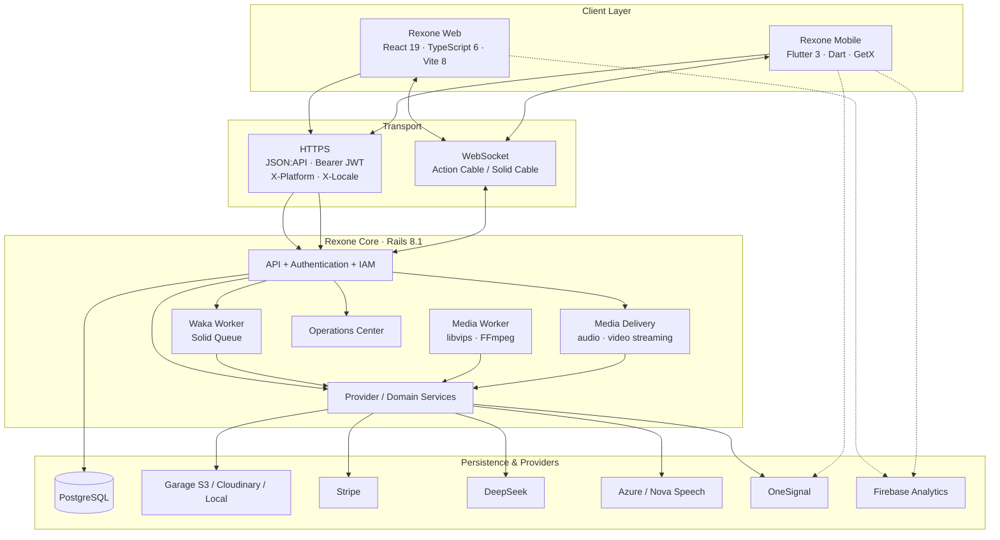
```mermaid
flowchart TB
    subgraph Clients["Client Layer"]
        Web["Rexone Web<br/>React 19 · TypeScript 6 · Vite 8"]
        Mobile["Rexone Mobile<br/>Flutter 3 · Dart · GetX"]
    end

    subgraph Transport["Transport"]
        HTTPS["HTTPS<br/>JSON:API · Bearer JWT<br/>X-Platform · X-Locale"]
        WSS["WebSocket<br/>Action Cable / Solid Cable"]
    end

    subgraph Core["Rexone Core · Rails 8.1"]
        API["API + Authentication + IAM"]
        Services["Provider / Domain Services"]
        Waka["Waka Worker<br/>Solid Queue"]
        Media["Media Worker<br/>libvips · FFmpeg"]
        Delivery["Media Delivery<br/>audio · video streaming"]
        Ops["Operations Center"]
    end

    subgraph Data["Persistence & Providers"]
        PG[("PostgreSQL")]
        Garage["Garage S3 / Cloudinary / Local"]
        Stripe["Stripe"]
        DeepSeek["DeepSeek"]
        Speech["Azure / Nova Speech"]
        OneSignal["OneSignal"]
        Firebase["Firebase Analytics"]
    end

    Web --> HTTPS --> API
    Mobile --> HTTPS --> API
    Web <--> WSS <--> API
    Mobile <--> WSS
    API --> PG
    API --> Services
    API --> Delivery
    API --> Waka
    Waka --> Services
    Media --> Services
    Delivery --> Services
    Services --> Stripe
    Services --> Garage
    Services --> DeepSeek
    Services --> Speech
    Services --> OneSignal
    Web -.-> Firebase
    Mobile -.-> Firebase
    Mobile -.-> OneSignal
    API --> Ops
```

Core deliberately keeps responsibilities conventional: controllers define HTTP contracts, models hold data rules, services isolate business/provider boundaries, jobs own deferred work, and serializers own response representation. Web follows pages/components → controllers → domain services → Axios; Mobile follows module pages → GetX controllers → feature/shared services → Core.

## 1.1 Landing Page — Modular Presentation & Rapid Rebranding

The public front door demonstrates how the visual layer is decoupled from business logic. Located in `rexone-web/src/modules/landing`, the landing page is composed of modular, plug-and-play sections: Hero, Greetings, Skills, Projects, Testimonials, and Contact.

<!-- SCREENSHOT:LND01 — Landing Page -->
<p align="center">
  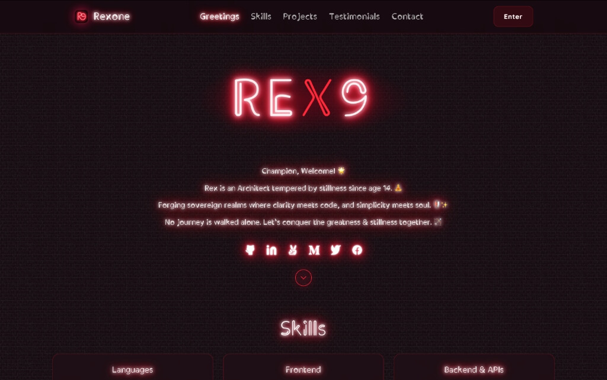
</p>

All visual elements, colors, and typography hook into the reusable design system in `rexone-web/src/design/`. Product teams can completely rebrand the application by modifying `brand.config.json` and running `./scripts/rebrand.sh`, instantly updating logos, typography, metadata, and color themes across Web, Mobile, and Core without touching domain code.

## 1.2 Home Page — Minimal Business Hub & Protected Portals

Upon authentication, the user lands on the Home dashboard hub (`rexone-web/src/design/pages/home/`).

<!-- SCREENSHOT:HOM01 — Home Page -->
<p align="center">
  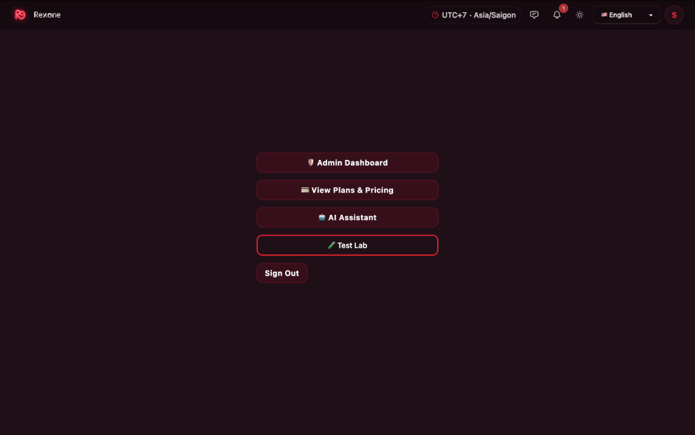
  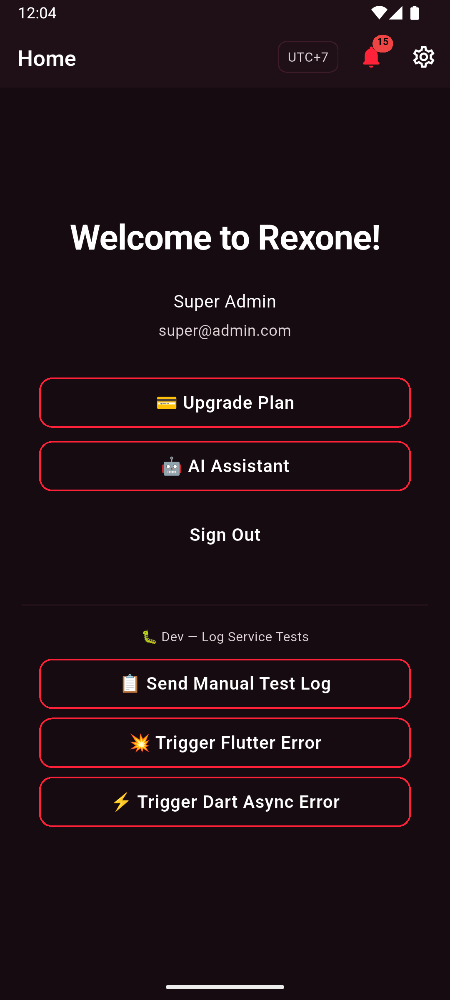
</p>

Designed as a clean, flexible launchpad ready to adapt to any business requirements:

- **Admin Dashboard**: Strictly role-guarded and accessible only to administrative roles (`admin`, `super_admin`, or scoped `*_admin`). Unauthorized users never see administrative entry points.
- **Plans & Pricing**: Direct navigation to commercial tiers, active subscriptions, and one-time purchases.
- **AI Assistant**: Persistent workspace for real-time and background AI conversations.
- **Test Lab**: System diagnostics, progressive media streaming, and client error telemetry.

---

# 2. Smart Authentication — Zero Decision Fatigue

Authentication is the first system worth showing because it demonstrates the ecosystem philosophy clearly: **the user should not have to understand the account state before the software does**.

Instead of beginning with separate “Sign in” and “Sign up” decisions, or forcing the user to remember whether they previously used Google SSO or email/passcode, the flow starts from a single unified entry point. Core inspects the account state and the clients seamlessly move to the correct next step: existing-account passcode, new-account passcode creation, email confirmation, dropped-registration recovery, Google challenge completion, or a security cooldown.

## 2.1 One entry point, state-driven next step

<!-- SCREENSHOT:A01 — Web Initial/Auth dialog + Mobile initial email/identifier screen -->
<p align="center">
  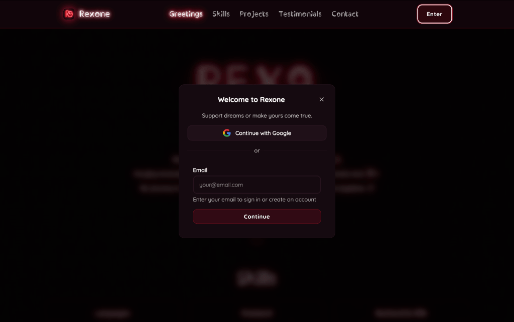
  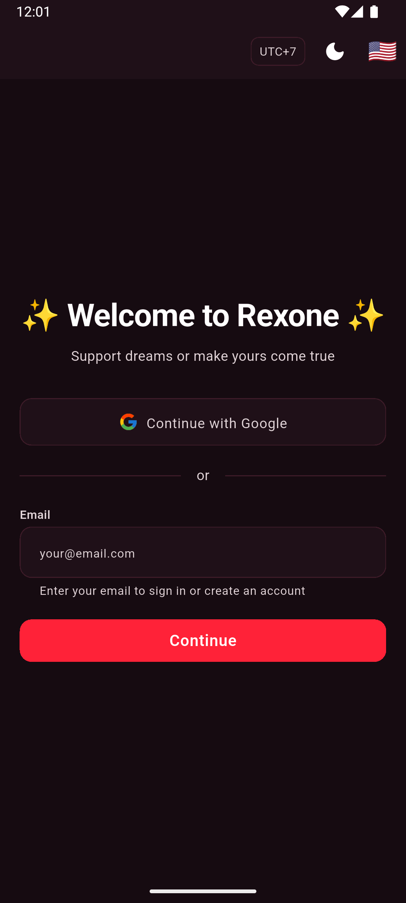
</p>

### Unified Identifier & OAuth Gateway

- **Web & Mobile**: Initial authentication dialog and screen before submitting the identifier. Users simply enter their email or select Google SSO without needing to know whether an account already exists.
- **Google OAuth & First-Time Challenge**: Web and Mobile both integrate native Google OAuth. Core remains the sole identity authority: when a first-time Google user signs in, Core can issue a challenge if additional profile details or security confirmation are required before granting the final session, avoiding duplicated client-side rules.
- **Server-Side Security**: Multi-tier server-side rate limiting protects against brute-force attacks with progressive cooldown delays.

The client asks Core for account state before deciding whether the user is signing in or registering. On Mobile this is explicitly handled through `GET /peek`; the Web flow follows the same state-driven identity contract. The result is a single front door instead of duplicate login/registration decision trees.

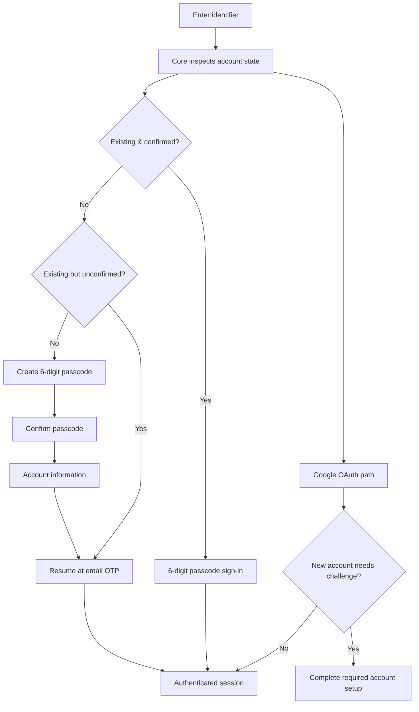
```mermaid
flowchart TD
    Start["Enter identifier"] --> Peek["Core inspects account state"]
    Peek --> Existing{"Existing & confirmed?"}
    Existing -->|Yes| SignIn["6-digit passcode sign-in"]
    Existing -->|No| Unconfirmed{"Existing but unconfirmed?"}
    Unconfirmed -->|Yes| OTP["Resume at email OTP"]
    Unconfirmed -->|No| Register["Create 6-digit passcode"]
    Register --> ConfirmPass["Confirm passcode"]
    ConfirmPass --> Info["Account information"]
    Info --> OTP
    Peek --> Google["Google OAuth path"]
    Google --> Challenge{"New account needs challenge?"}
    Challenge -->|Yes| Complete["Complete required account setup"]
    Challenge -->|No| Session["Authenticated session"]
    SignIn --> Session
    OTP --> Session
```

## 2.2 Existing account — six-digit passcode

<!-- SCREENSHOT:A02 — existing user passcode -->
<p align="center">
  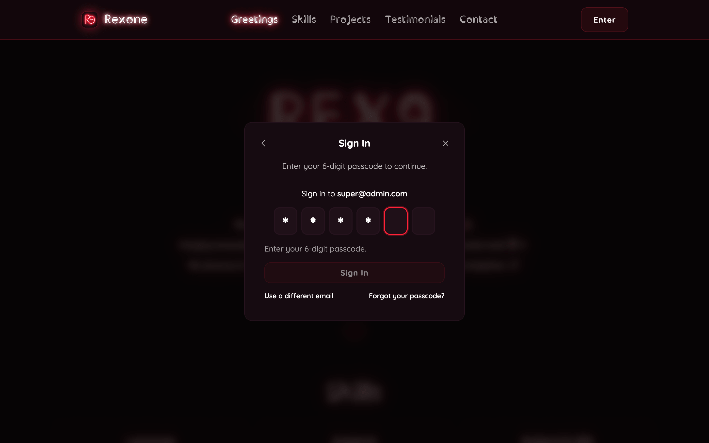
  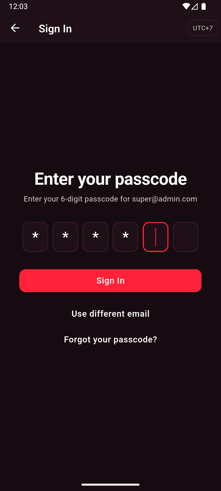
</p>

The credentials are intentionally kept out of persistent client storage and URL parameters. Web keeps sensitive passcode state in memory while still allowing the dialog step itself to be URL-addressable. Mobile likewise keeps credentials out of route arguments and persistent storage.

Core can return retry/cooldown information so the clients react to server-authoritative security state rather than inventing independent retry rules.

## 2.3 New account — passcode creation and confirmation

<!-- SCREENSHOT:A03 — signup passcode create/confirm; choose the stronger of the two states -->
<p>
  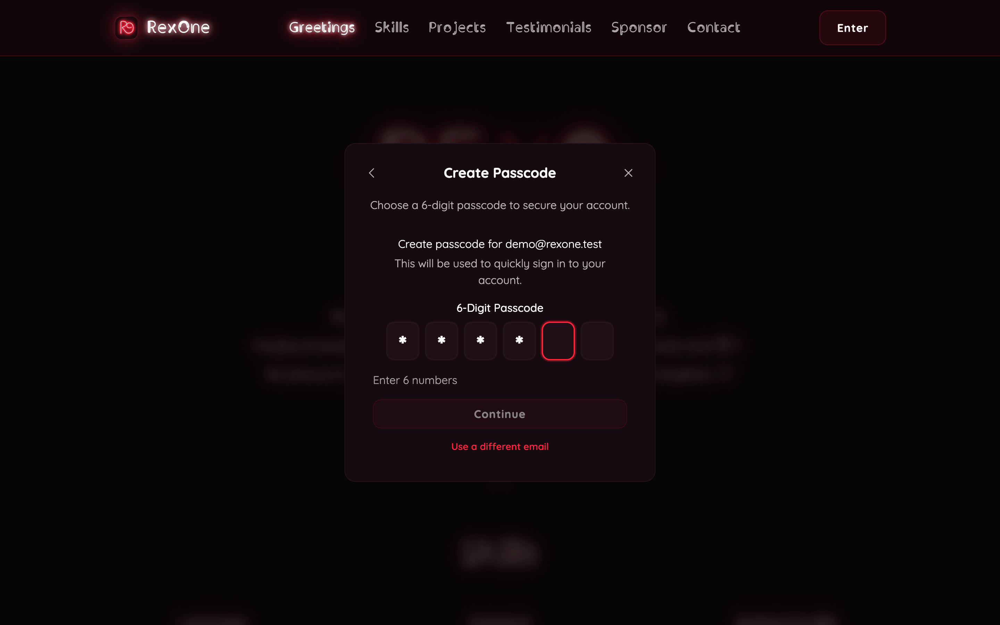
  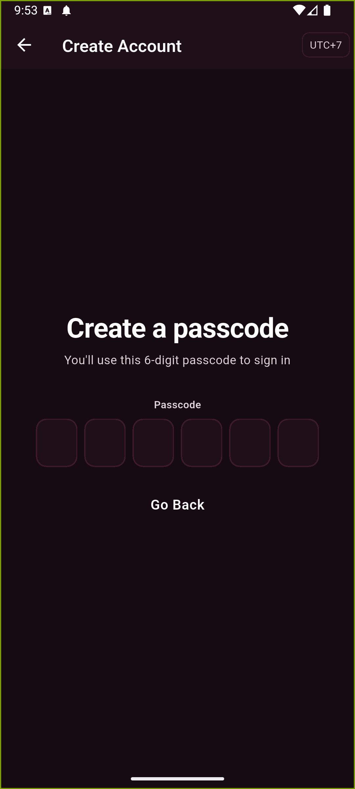
</p>

New users create a six-digit numeric passcode and confirm it before the account proceeds. The Web client provides dedicated create/confirm dialogs; Mobile follows the same contract with native controls.

## 2.4 Email confirmation and resend cooldown

<!-- SCREENSHOT:A04 — confirmation OTP -->
<p>
  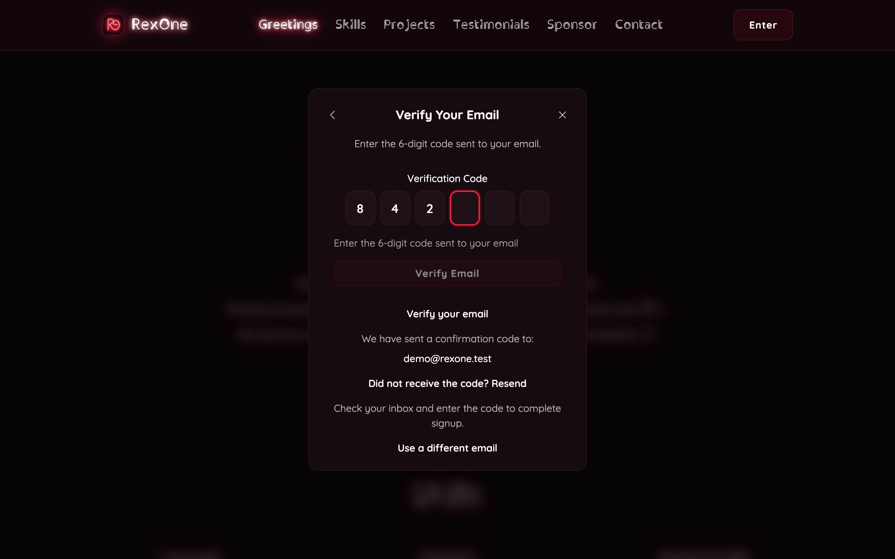
  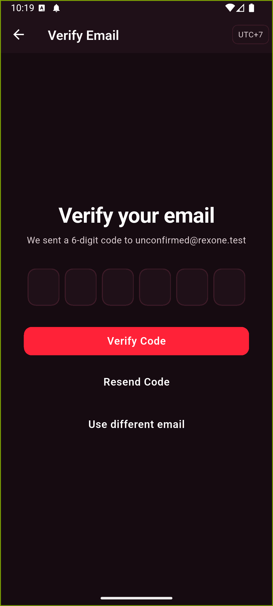
</p>

Email confirmation uses a six-digit verification code with guarded resend behavior. A user who leaves midway through signup does not have to reconstruct the old flow later: after account discovery, an unconfirmed account is routed directly back to verification.

That **drop-off recovery** is part of the authentication contract rather than an afterthought in one client.

## 2.5 Forgot passcode / reset flow

<!-- SCREENSHOT:A06 — forgot/reset passcode -->
<p>
  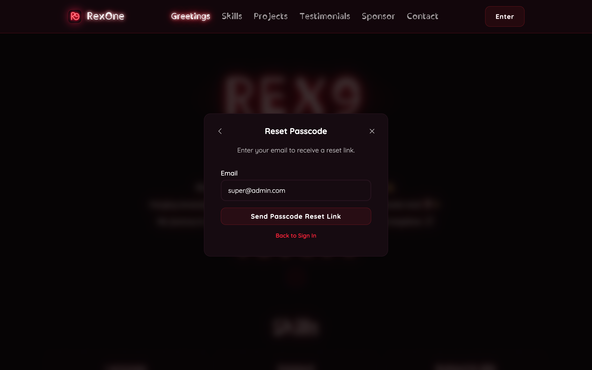
  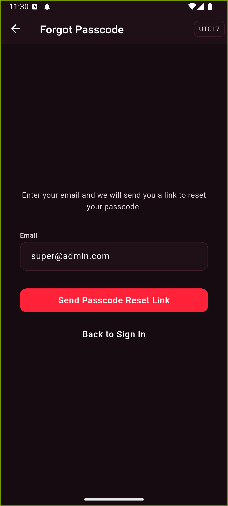
</p>

Password/passcode recovery is a first-class flow with server-issued reset verification and client-side guarded transitions. The same authentication shell also handles replaced or expired sessions consistently.

## 2.6 Platform-isolated active sessions

There is no screenshot required for this behavior because its value is architectural.

Core reads `X-Platform` and maintains an active-session key per user and platform. One user may remain signed in on **Web + Android + iOS at the same time**, while a newer login on the same platform can replace the older session for that platform.

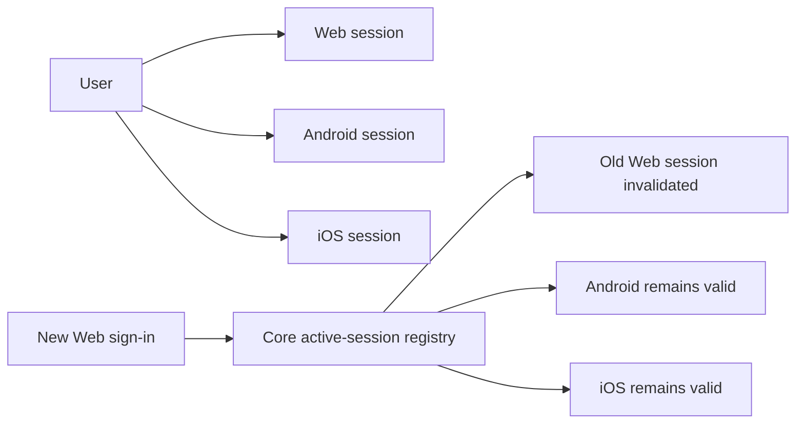
```mermaid
flowchart LR
    U["User"] --> W1["Web session"]
    U --> A1["Android session"]
    U --> I1["iOS session"]
    W2["New Web sign-in"] --> Core["Core active-session registry"]
    Core --> W1x["Old Web session invalidated"]
    Core --> A1ok["Android remains valid"]
    Core --> I1ok["iOS remains valid"]
```

This keeps native and browser use independent without allowing an unlimited collection of stale sessions of the same platform type.

## 2.7 Authentication security notes

- JWT issuance/revocation is owned by Core through Devise + Devise JWT.
- Web centralizes token use and expiry handling through its Axios client.
- Mobile sends the native platform identity with requests and responds to session replacement cleanly.
- Public and protected navigation boundaries are explicit.
- Authentication failures are normalized into client-facing responses rather than leaking provider/framework behavior.
- Rack Attack and production edge controls protect abusive request paths.
- Client analytics use opaque user IDs; email addresses and other personal data are not sent to Firebase Analytics.

---

# 3. Profile and account identity

<!-- SCREENSHOT:P01 — profile -->
<p align="center">
  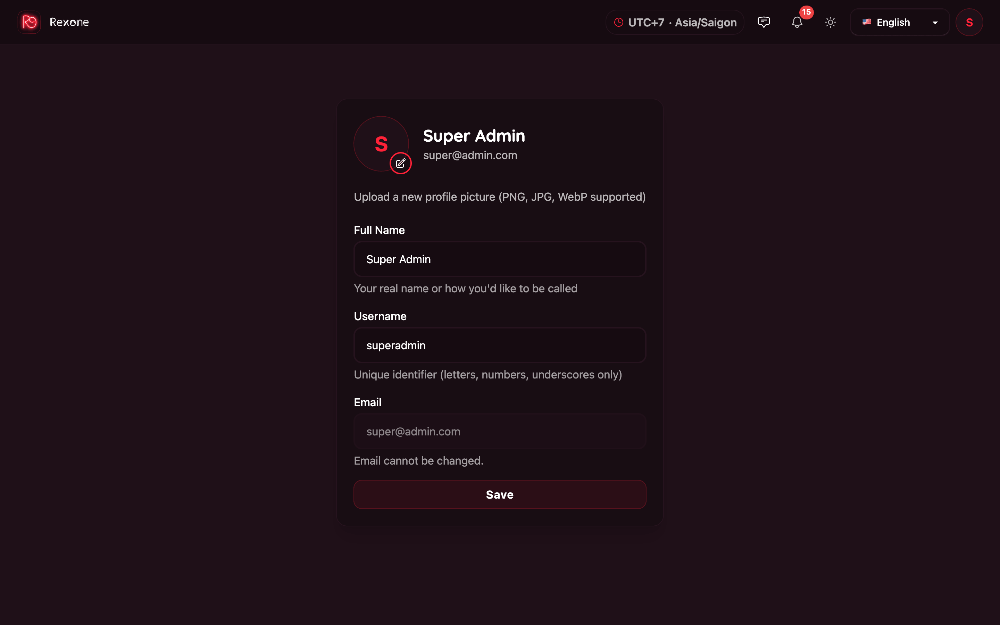
  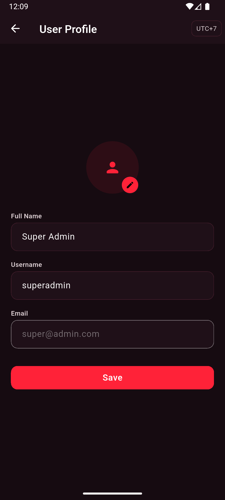
</p>

The account model stays shared while each client uses platform-appropriate interaction.

Core supports atomic identity/profile updates and assets for avatars. Mobile’s profile module loads name, username, and read-only email; the avatar editor can use camera or gallery through a shared permission service. Web uses the same user contract and shared media/profile primitives.

This is a useful paired screenshot because it shows **cross-platform parity without forcing identical UI**.

---

# 4. IAM and RBAC

Rexone treats authorization as an explicit model, not scattered controller conditionals.

Core models:

- `Iam::Role`
- `Iam::Permission`
- `Iam::UserRole`
- `Iam::RolePermission`

Permissions are resource/action based (`create`, `read`, `update`, `delete`) and the ecosystem uses a three-tier administrative hierarchy.

| Tier          | Purpose                                                                                                                |
| ------------- | ---------------------------------------------------------------------------------------------------------------------- |
| `super_admin` | Unrestricted system authority, including users, IAM, versions, and operational administration                          |
| `admin`       | Broad domain operations but restricted from sensitive governance areas such as users/IAM/version governance            |
| `*_admin`     | Scoped partial administrator, e.g. `feedback_admin` or `payment_admin`, with only explicitly granted admin permissions |

A single IAM introspection request returns role and permission groupings so clients can build navigation and action state without secondary permission calls.

## 4.1 Permission-aware admin navigation

<!-- SCREENSHOT:I01 — Web admin sidebar showing scoped navigation -->
<p align="center">
  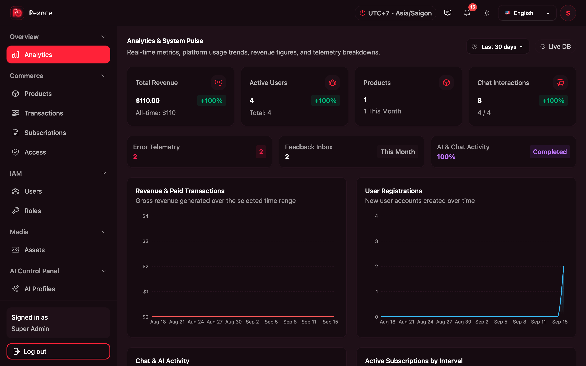
</p>

Web evaluates admin permissions through `usePermissions` and protects both routes and actions. Read permission controls page access; create/update/delete permissions control their corresponding actions. A normal `user` role cannot leak permissions into `/admin/*`.

## 4.2 Role and permission management

<!-- SCREENSHOT:I02 — role edit / permissions matrix -->
<p align="center">
  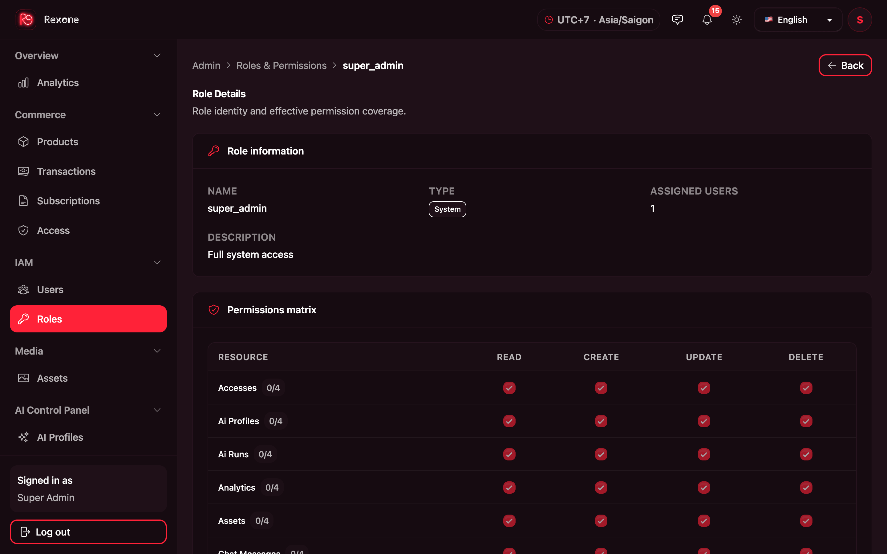
</p>

The screenshot makes the RBAC model understandable at a glance: a role is not merely a label; it is a collection of explicit resource/action permissions enforced again by Core.

---

# 5. Commerce, subscriptions and entitlements

Rexone connects product presentation, Stripe Checkout, durable webhook processing, subscriptions, transactions, and access grants into one commercial loop.

## 5.1 Product catalogue & pricing plans

<!-- SCREENSHOT:C01 — products -->
<p align="center">
  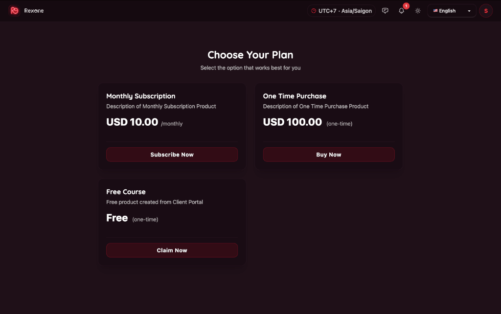
  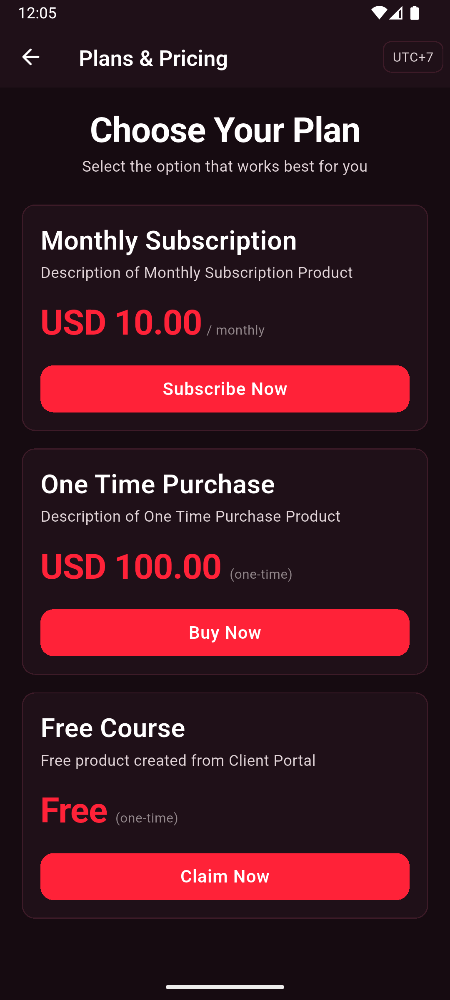
</p>

Web and Mobile retrieve the same Core product catalogue and distinguish one-time payments, monthly subscriptions, and free tiers. Products are created and managed directly in the client admin portal and synced with Stripe via automated webhooks.

### Active Entitlements & Purchased Products State

<!-- SCREENSHOT:C03 — active entitlements & purchased products -->
<p align="center">
  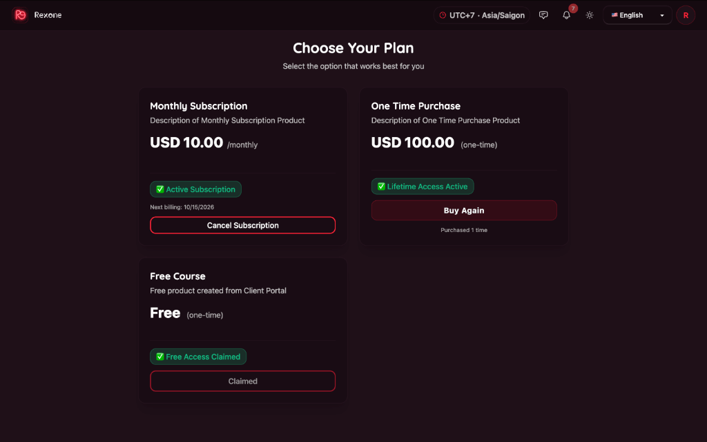
</p>

Once checkout webhooks are fulfilled, the client pricing and plan selection interface dynamically transitions to reflect the user's real-time entitlements and subscription lifecycle:

- **Active Subscriptions**: Displays the verified `Active Subscription` badge, explicit next billing date (`10/15/2026`), and a self-serve "Cancel Subscription" action.
- **One-Time Purchases**: Indicates durable `Lifetime Access Active`, records the purchase tally (`Purchased 1 time`), and provides a secondary "Buy Again" option.
- **Free Entitlements**: Reflects confirmed access (`Free Access Claimed`) with one-click claiming disabled.

## 5.2 Stripe Checkout handoff

<!-- SCREENSHOT:C02 — checkout handoff -->
<p align="center">
  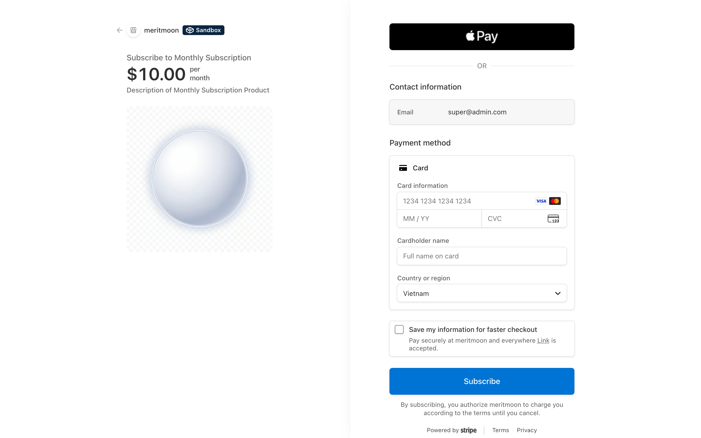
  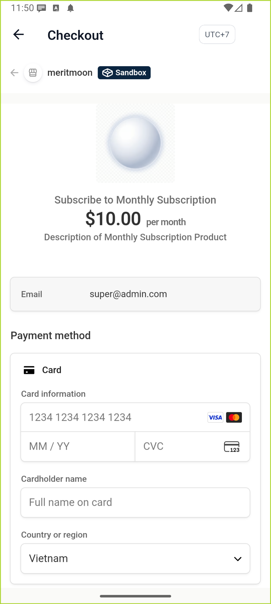
</p>

Web redirects into Stripe Checkout; Mobile opens Checkout inside a WebView. Neither client owns Stripe secrets or webhook fulfillment. Core creates/reuses Stripe customers, creates Checkout Sessions, persists payment state, and processes supported Stripe webhooks asynchronously.

## 5.3 Administrative Transactions and Subscriptions

<!-- SCREENSHOT:C04 — Admin Transactions & Subscriptions -->
<p align="center">
  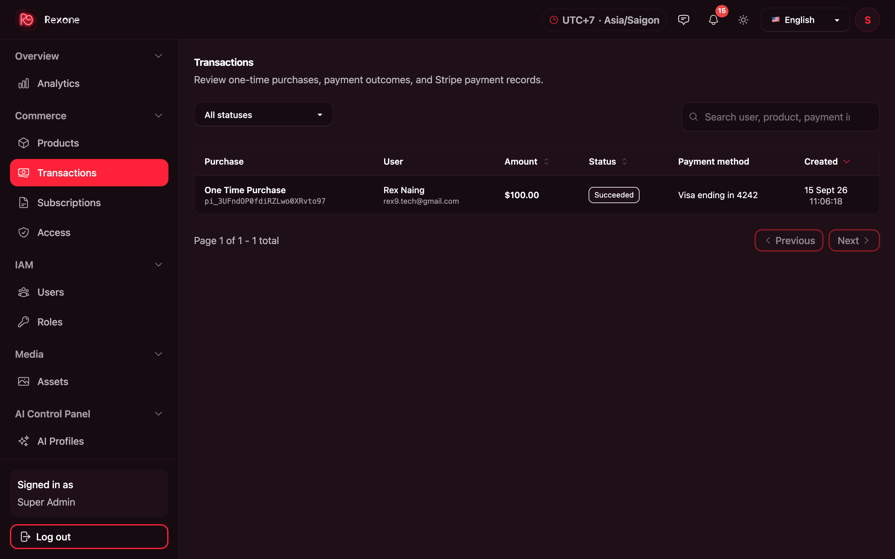
  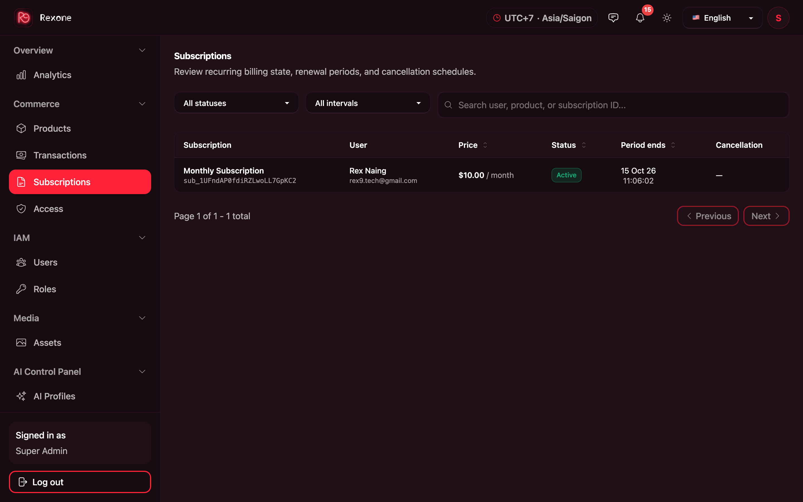
</p>

Full administrative visibility into commercial records: completed charges, pending invoices, refund workflows, active subscription lifecycles, and scheduled cancellations. Subscription cancellation is safely scheduled for the end of the paid period and can be resumed where allowed. Clients communicate intent; Core remains authoritative over subscription state and access.

## 5.4 Durable webhook fulfillment

No screenshot is necessary.

Stripe events are persisted with duplicate protection, processing state, attempt/error information, and retention behavior before business fulfillment runs through the `payments` queue. This separates a fast customer-facing checkout from durable backend completion.

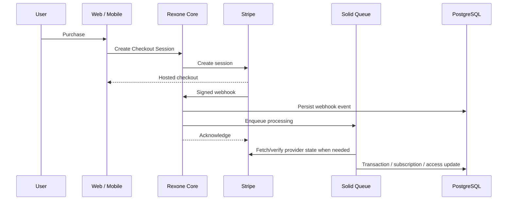
```mermaid
sequenceDiagram
    participant U as User
    participant Client as Web / Mobile
    participant Core as Rexone Core
    participant Stripe as Stripe
    participant Q as Solid Queue
    participant DB as PostgreSQL

    U->>Client: Purchase
    Client->>Core: Create Checkout Session
    Core->>Stripe: Create session
    Stripe-->>Client: Hosted checkout
    Stripe->>Core: Signed webhook
    Core->>DB: Persist webhook event
    Core->>Q: Enqueue processing
    Core-->>Stripe: Acknowledge
    Q->>Stripe: Fetch/verify provider state when needed
    Q->>DB: Transaction / subscription / access update
```

---

# 6. AI workspace and speech

AI is intentionally non-blocking. A user message can be persisted immediately, processed in a background queue, and completed later through a real-time event without requiring the user to keep one HTTP request open.

## 6.1 Persistent multi-room AI chat & Asynchronous Background Execution

<!-- SCREENSHOT:AI01 — AI chat -->
<p align="center">
  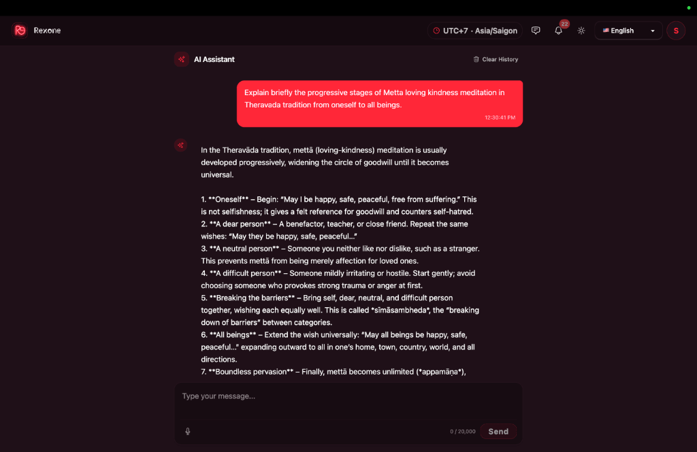
  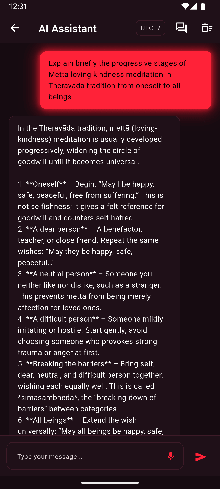
</p>

Both clients support persistent rooms/history, multi-provider model profiles (DeepSeek, Google Gemini), and a visible queued/processing state:

- **Asynchronous Queue**: When a prompt is submitted, Core enqueues a background `Chat::ProcessMessageJob` into Solid Queue (`ai` queue).
- **Zero Loss on Navigation**: Users can leave the page anytime, browse other modules, or sign out without losing state. Work is performed durably in the background.
- **Real-Time Delivery**: Action Cable (`NotificationChannel`) broadcasts completion directly to the client with `ai_response_ready` payloads, dynamically rendering the assistant response.

## 6.2 Real-time AI completion

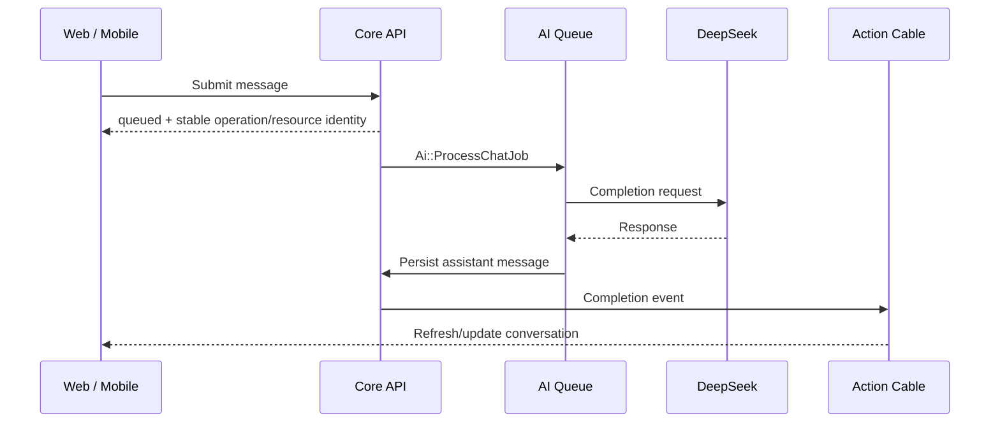
```mermaid
sequenceDiagram
    participant Client as Web / Mobile
    participant Core as Core API
    participant Queue as AI Queue
    participant AI as DeepSeek
    participant Cable as Action Cable

    Client->>Core: Submit message
    Core-->>Client: queued + stable operation/resource identity
    Core->>Queue: Ai::ProcessChatJob
    Queue->>AI: Completion request
    AI-->>Queue: Response
    Queue->>Core: Persist assistant message
    Core->>Cable: Completion event
    Cable-->>Client: Refresh/update conversation
```

The same architecture keeps provider latency and retries away from the initial request.

## 6.3 Speech — live STT and TTS

<!-- SCREENSHOT:AI02 — speech interaction; use the closest equivalent on Web and Mobile -->
<p>
  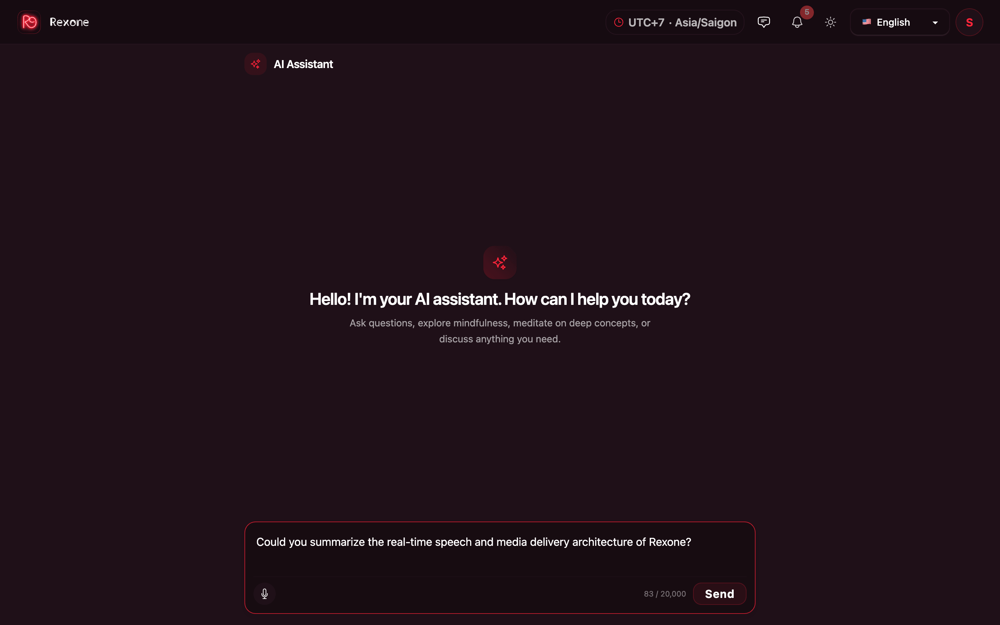
  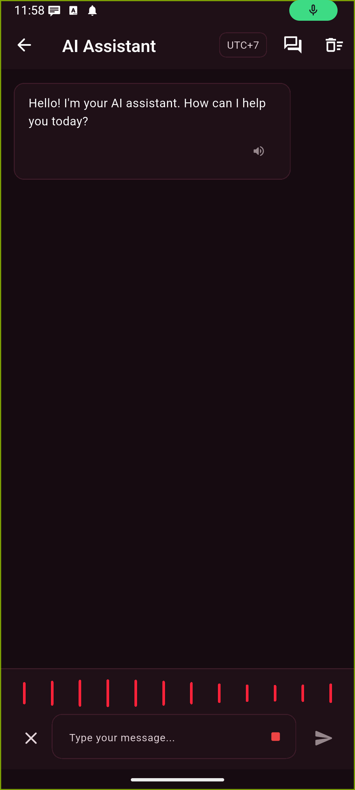
</p>

Core supports direct MP3 TTS streaming, queued TTS work, batch speech-to-text, and live audio WebSocket streaming. Mobile can stream normalized PCM chunks through `SpeechLiveChannel`, visualize live voice levels, and play generated audio without base64 wrapping. Web also consumes raw binary MP3 streams and integrates live audio recognition.

This **speech streaming** path is separate from the stored-asset audio/video streaming capability. `SpeechLiveChannel` is about live recognition / generated speech interaction; the newer media-delivery layer is about consuming persisted audio/video assets through Core.

---

# 7. Notifications and real-time delivery

Notifications are split by channel so provider failure in one channel does not replay successful work in another.

Core coordinates:

- persistent in-app notification receipts,
- Action Cable delivery,
- push delivery through OneSignal,
- transactional/broadcast email,
- unread counts,
- read/read-all actions,
- soft deletion and retention cleanup.

## 7.1 In-app notification experience

<!-- SCREENSHOT:N01 — notification inbox / center if currently exposed on both clients -->
<p align="center">
  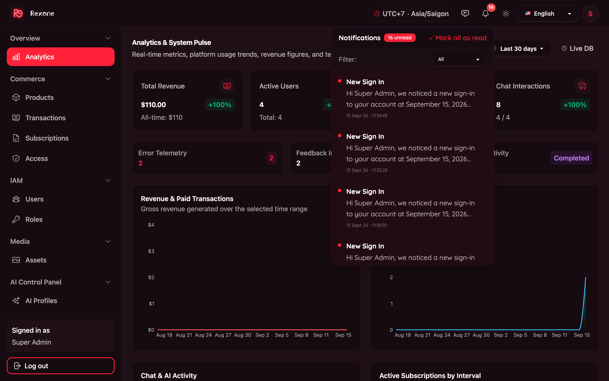
  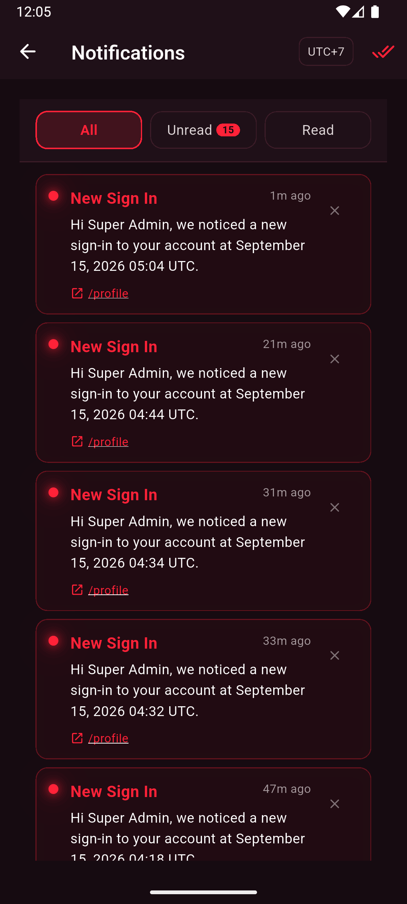
</p>

Each persisted `UserNotification` is an immutable receipt of what the user actually received, so later edits to an admin template do not rewrite history. In Web, clicking the topbar notification bell triggers the notification center popover, presenting real-time unread counts, status filters (All, Unread, Read), bulk "Mark all as read" actions, and interactive deep-link navigation directly into the target operational or chat room resource. Mobile renders a matching native notification inbox with unread badges and contextual swipe-to-dismiss actions.

## 7.2 Native push notification

<!-- SCREENSHOT:N02 — Mobile push notification -->
<p align="center">
  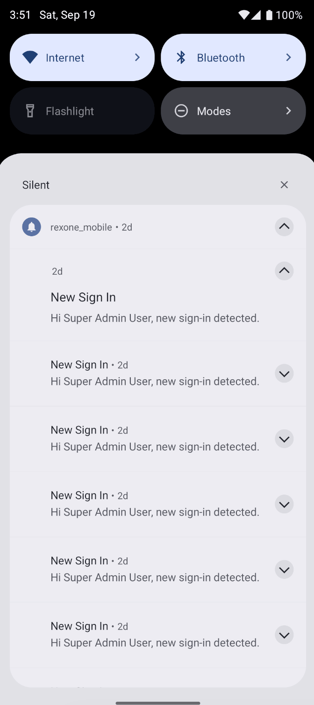
</p>

Mobile identifies the signed-in user to OneSignal, syncs tags, clears provider identity on logout, and routes notification clicks back into the app. Open events are tracked using the persisted Core notification identity.

## 7.3 Admin notification dispatch

<!-- SCREENSHOT:N03 — Web admin notification dispatch/create -->
<p align="center">
  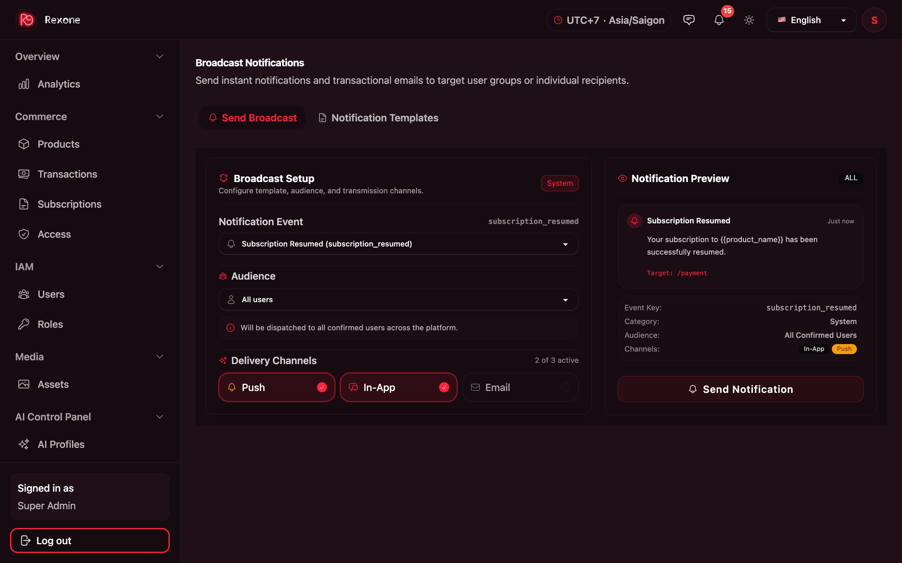
</p>

Admin notifications can target roles, specific users, or the confirmed audience and fan out across enabled in-app, push, and email channels. Each resulting delivery keeps an independent retry boundary.

---

# 8. Intelligent feedback

Rexone’s feedback system follows the same “remove unnecessary decisions from the user” principle as authentication.

## 8.1 In-place feedback

<!-- SCREENSHOT:F01 — feedback modal / bottom sheet -->
<p align="center">
  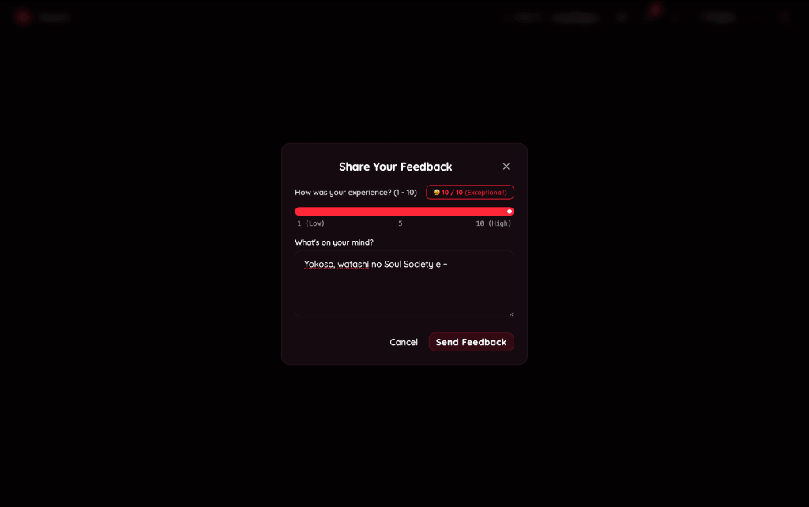
  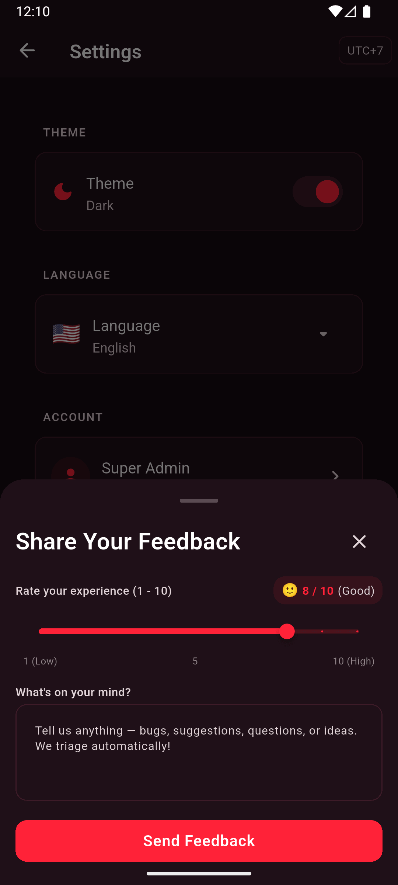
</p>

The user can give a short message and/or feeling score without navigating to a bureaucratic support form. Clients automatically attach contextual telemetry such as route/screen, platform, app version, and relevant device/browser information.

Core can classify feedback into categories such as bug, feature request, improvement, or general feedback and derive operational priority for admin triage.

## 8.2 Feedback triage

<!-- SCREENSHOT:F02 — feedback admin -->
<p align="center">
  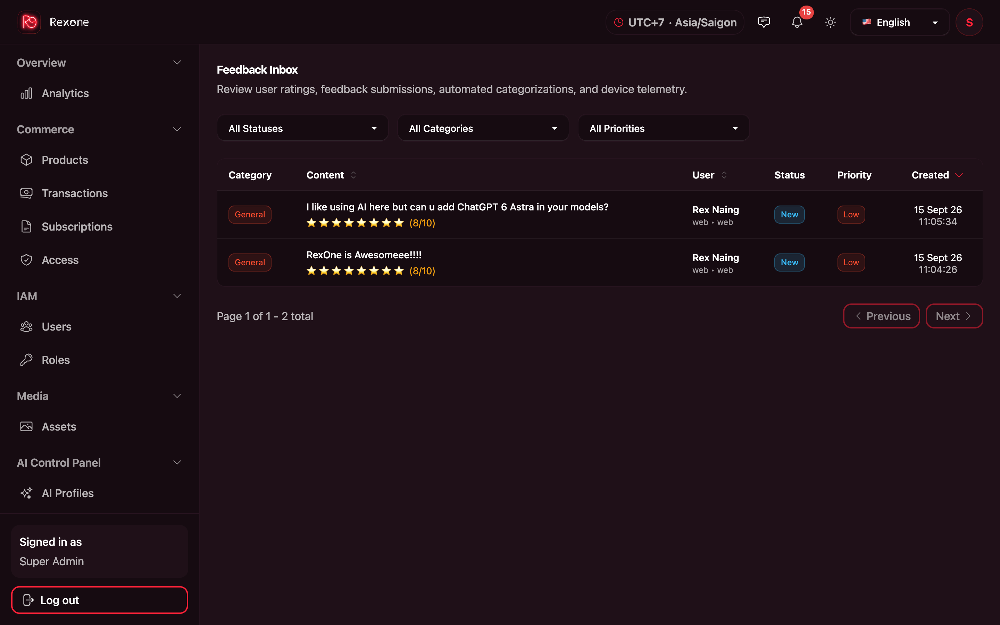
</p>

The admin view turns lightweight user input into an actionable operational stream with classification, priority, status, and captured context.

---

# 9. Assets, storage, media processing and streaming

Core provides a unified asset model over Garage S3, Cloudinary, or local storage. The default self-hosted path uses Garage and keeps provider behavior behind `StorageService::Client`.

## 9.1 Asset Control Center

<!-- SCREENSHOT:M01 — asset table -->
<p align="center">
  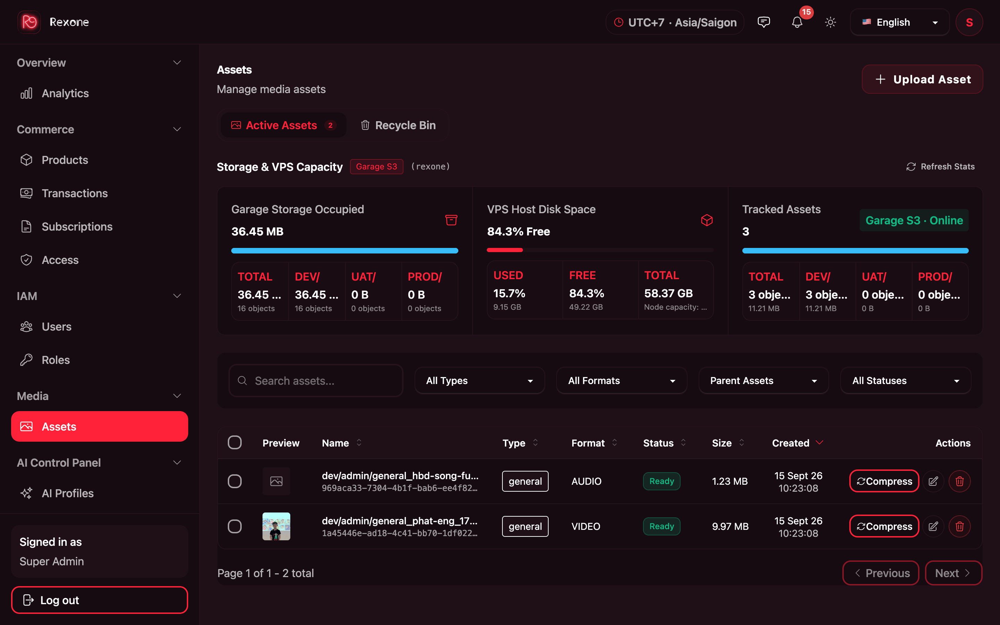
</p>

The Web admin client supports batch upload, filtering, recycle-bin workflows, edit, discard/restore, permanent purge, and real-time status updates.

## 9.2 Storage and VPS capacity

<!-- SCREENSHOT:M02 — storage stats -->
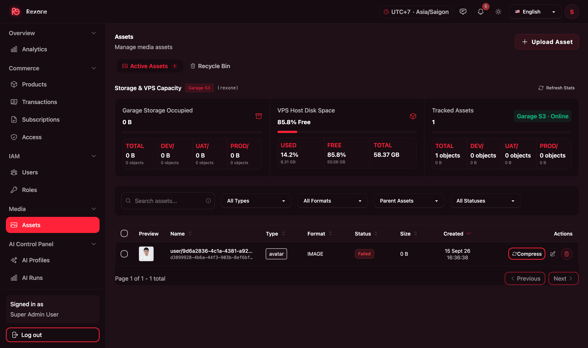

Super admins can inspect bucket/VPS capacity and per-environment Garage usage (`dev/`, `uat/`, `prod/`). Regular admins do not request or render this sensitive infrastructure telemetry.

## 9.3 Silent underground compression

No screenshot is required for the worker itself; the outcome is visible through the live asset badges.

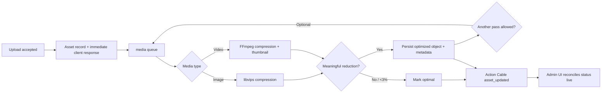
```mermaid
flowchart LR
    Upload["Upload accepted"] --> Asset["Asset record + immediate client response"]
    Asset --> MediaQ["media queue"]
    MediaQ --> Type{"Media type"}
    Type -->|Image| Vips["libvips compression"]
    Type -->|Video| FFmpeg["FFmpeg compression + thumbnail"]
    Vips --> Compare{"Meaningful reduction?"}
    FFmpeg --> Compare
    Compare -->|No / <3%| Optimal["Mark optimal"]
    Compare -->|Yes| Ready["Persist optimized object + metadata"]
    Ready --> Cap{"Another pass allowed?"}
    Cap -->|Optional| MediaQ
    Optimal --> Socket["Action Cable asset_updated"]
    Ready --> Socket
    Socket --> UI["Admin UI reconciles status live"]
```

Heavy image/video/audio processing runs in an isolated media worker so API requests and general transactional jobs are not forced to share the same compute path.

## 9.4 Audio/video streaming — Test Lab diagnostics & Core media delivery

Until this branch, the visual story of media was strongest on the **ingest and processing** side: upload an asset, persist its metadata, optimize it in the isolated media worker, generate thumbnails/subtitles where relevant, and surface live processing state to administrators.

The streaming work closes the other half of that lifecycle: **delivery**.

<!-- SCREENSHOT:M03 — Test Lab with Core-backed stored audio/video playback and telemetry -->
<p align="center">
  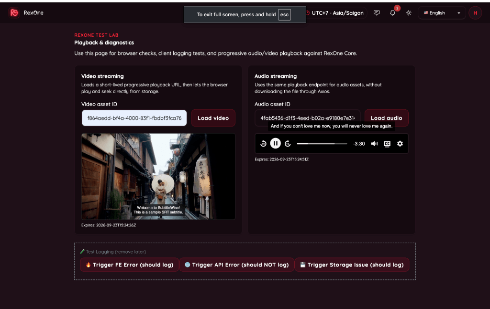
</p>

The **Test Lab** (`/test`) showcases:

- **Progressive Video & Audio Streaming**: Native HTML5 media elements streaming MP4 video and MP3 audio directly through Core's streaming routes, supporting range headers, seekability, and buffer optimization.
- **Diagnostics & Error Telemetry**: Interactive error generation buttons testing uncaught runtime errors, Promise rejections, and network failures, verifying that structured client logs are dispatched to Core and captured in the telemetry subsystem.

- **Range-Header Streaming Protocol**: Core media delivery exposes standard RFC 7233 HTTP 206 Partial Content range requests (`bytes=start-end`), enabling smooth audio/video scrubbing, pause/resume, and low-latency chunk buffering without requiring clients to download the entire media asset upfront.
- **Provider Credential Shielding**: Media playback routes stream assets directly through Core's authenticated controller layer with short-lived tokens, shielding the underlying Garage S3-compatible storage endpoints, private bucket names, and internal VPS network topography.

## 9.5 Storage lifecycle

- Environment prefixes partition new Garage objects.
- User and admin assets use distinct key namespaces.
- Updating an asset type can move the storage object in place rather than duplicating it.
- Destroying an asset cleans the backing object.
- Recycle-bin batch operations support discard, restore, permanent delete, and empty-bin behavior.
- Video thumbnails are generated by Core and linked back to their source asset.
- Persisted audio/video assets can participate in the Core media-delivery layer without making clients own storage-provider details.

---

# 10. Client administration portal

Rexone Web includes a comprehensive, permission-aware operational admin client under `/admin/*`. This is separate from the server-rendered Administrate dashboard and is the primary visual surface for product operations.

## 10.1 Admin Overview & Analytics (`/admin/analytics`)

<!-- SCREENSHOT:AD01 -->
<p align="center">
  
</p>

The admin dashboard aggregates high-level metrics, active user registrations, commercial revenue, system health, and activity trends. Route guards and navigation sidebars are dynamically built from the logged-in user's explicit IAM permissions rather than hardcoded client roles.

## 10.2 User Management (`/admin/users`)

<!-- SCREENSHOT:AD02 -->
<p align="center">
  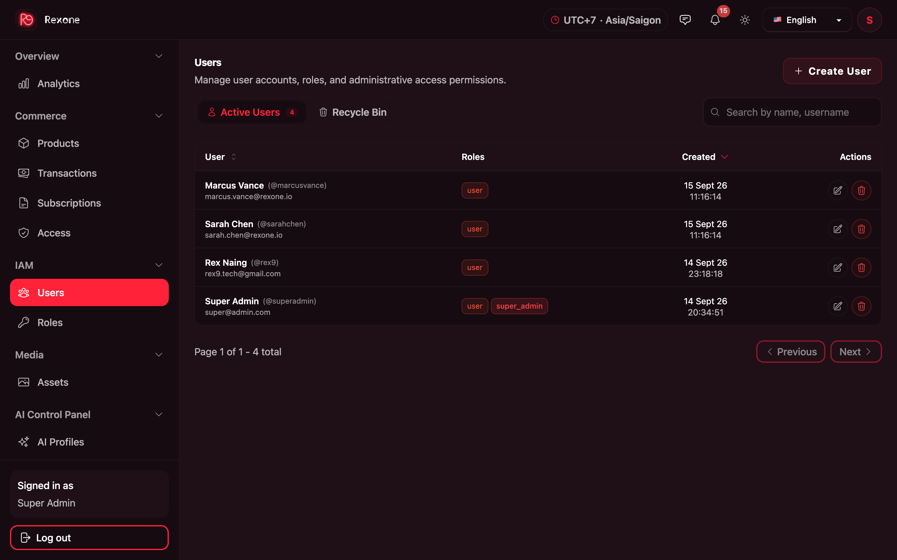
</p>

User administration provides full lifecycle management: email/identifier discovery, role assignment, account status, soft deletion (recycle bin), permanent destruction safeguards, and protection of system super-admins.

## 10.3 Roles & Permissions (`/admin/roles`)

<!-- SCREENSHOT:AD03 -->
<p align="center">
  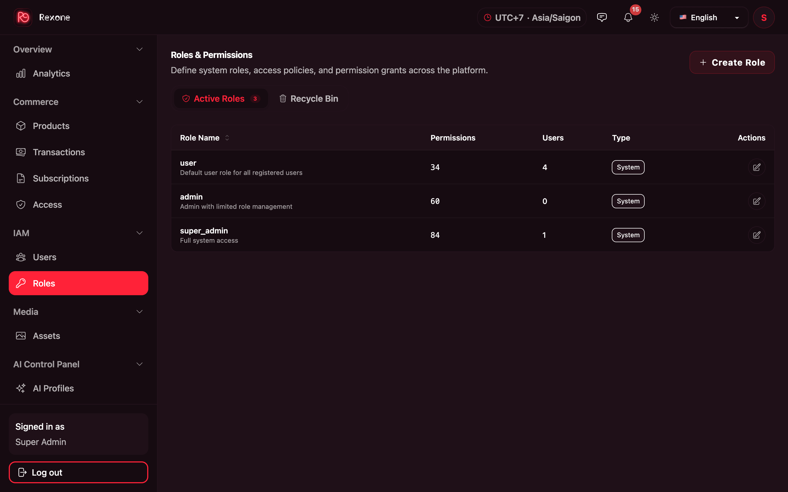
</p>

Exposes the granular RBAC model directly: system roles (`super_admin`, `admin`, `user`), scoped departmental admins, and fine-grained CRUD permission toggles across all domain resources.

### Role Detail & Granular IAM Permission Matrix (`/admin/roles/:id`)

<!-- SCREENSHOT:AD03_DETAIL -->
<p align="center">
  
</p>

Inspect effective permission coverage per role: granular matrices for each domain resource (Accesses, AI Profiles, AI Runs, Analytics, Assets, Chat Messages, Chat Rooms, Feedback, Logs, Notifications, Products, Roles, Subscriptions, Transactions, Users, Versions) with distinct Read, Create, Update, and Delete toggles.

## 10.4 Products & Commercial Catalogue (`/admin/products`)

<!-- SCREENSHOT:AD04 -->
<p align="center">
  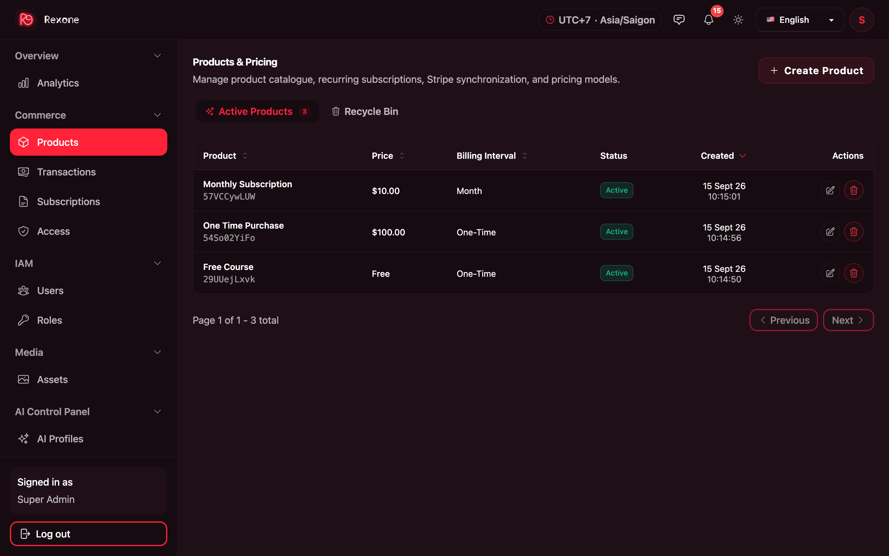
</p>

Administer recurring subscription tiers and one-time purchases with metadata, pricing, trial periods, and currency settings synchronized with Stripe.

### Product Recycle Bin & Soft-Deletion Lifecycle (`/admin/products/bin`)

<!-- SCREENSHOT:AD04_BIN -->
<p align="center">
  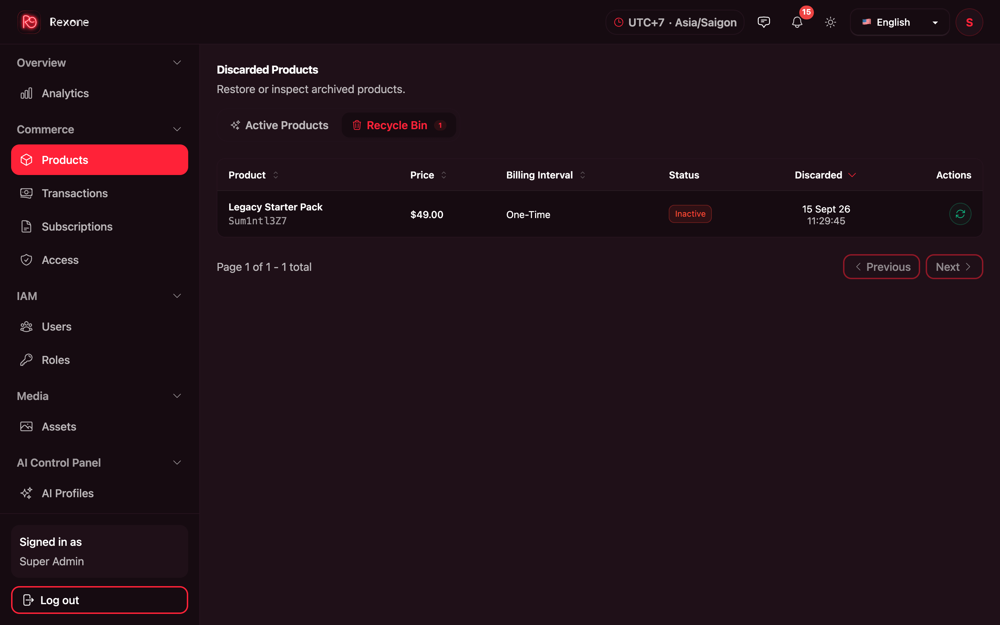
</p>

Rexone implements a universal soft-deletion paradigm across all core domain resources (`User`, `Payment::Product`, `Iam::Role`, `Asset`, `Client::Log`, `Client::Version`, `Chat::Room`, `Chat::Message`, `Feedback`) backed by the `discard` gem in Core and dedicated `/bin` tabbed routes in Web. Discarded items are safely quarantined in a dedicated Recycle Bin tab, preventing accidental data loss while allowing privileged administrators to inspect discarded records, restore (`undiscard`) them back to active service, or permanently purge them with explicit safety confirmations.

## 10.5 Transactions (`/admin/transactions`)

<!-- SCREENSHOT:AD_TX -->
<p align="center">
  
</p>

Inspect completed charges, pending invoices, payment provider references, customer identifiers, amount breakdowns, and refund audit trails.

## 10.6 Subscriptions (`/admin/subscriptions`)

<!-- SCREENSHOT:AD_SUB -->
<p align="center">
  
</p>

Operational visibility into recurring subscriptions: current period start/end, auto-renewal flags, cancellation schedules, billing intervals, and associated Stripe customer entities.

## 10.7 Accesses & Entitlements (`/admin/accesses`)

<!-- SCREENSHOT:AD05 -->
<p align="center">
  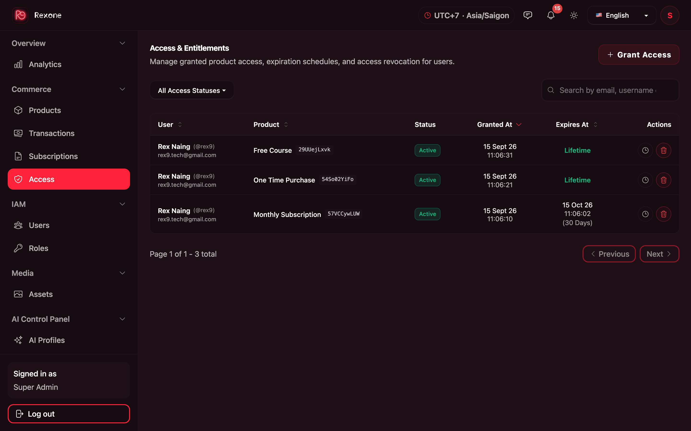
</p>

Manage durable entitlement grants across users and products. Administrators can manually grant access, revoke entitlements, or extend expiration windows independently of payment provider state.

## 10.8 Assets Control Center (`/admin/assets`)

<!-- SCREENSHOT:AD_ASSETS -->
<p align="center">
  
</p>

Unified asset governance over images, video, and audio. Features batch drag-and-drop uploads, storage key inspection, optimization badges, libvips/FFmpeg processing status, recycle-bin recovery, and permanent deletion.

## 10.9 Notifications & Broadcasts (`/admin/notifications`)

<!-- SCREENSHOT:AD06 -->
<p align="center">
  
</p>

Draft and dispatch push, in-app socket, and email broadcasts. Filter target audiences by role or individual recipient, track open/read rates, and manage system alert templates.

## 10.10 Intelligent Feedback Triage (`/admin/feedback`)

<!-- SCREENSHOT:AD09 -->
<p align="center">
  
</p>

Triage user-submitted ratings and messages with automatically attached client telemetry (platform, app version, screen route, user context) and operational priority ranking.

## 10.11 Client Logs & Error Telemetry (`/admin/logs`)

<!-- SCREENSHOT:AD_LOGS -->
<p align="center">
  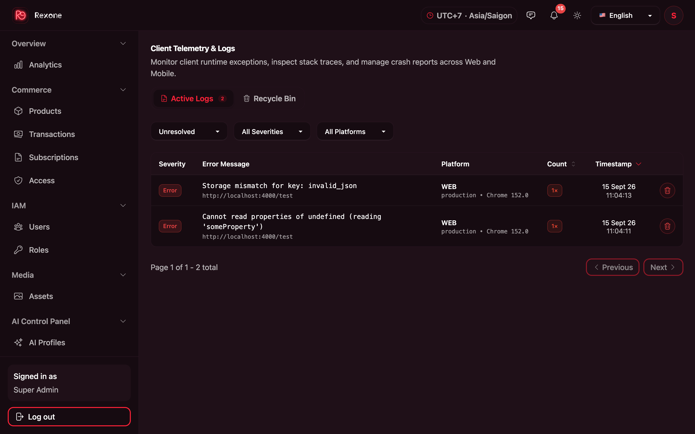
</p>

Centralized error observability capturing uncaught browser exceptions, React boundary errors, mobile Flutter stack traces, network timeouts, and device context directly in Core.

## 10.12 Chat Rooms Moderation (`/admin/chat/rooms`)

<!-- SCREENSHOT:AD08 -->
<p align="center">
  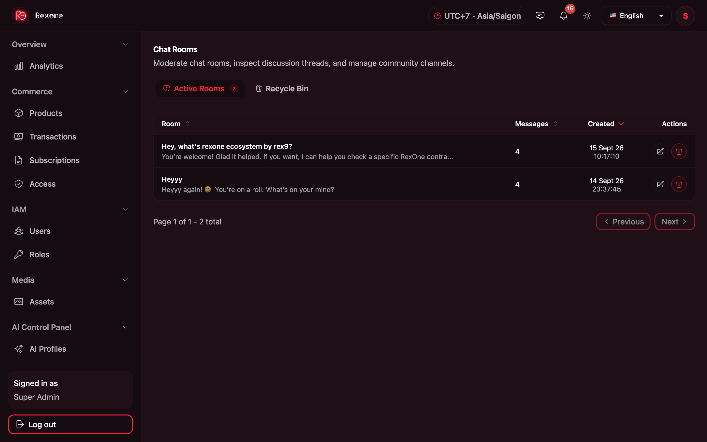
</p>

Moderate user AI and community chat rooms, inspect room ownership, review conversation titles, and manage room lifecycle state.

## 10.13 Chat Messages Moderation (`/admin/chat/messages`)

<!-- SCREENSHOT:AD_CHAT_MSG -->
<p align="center">
  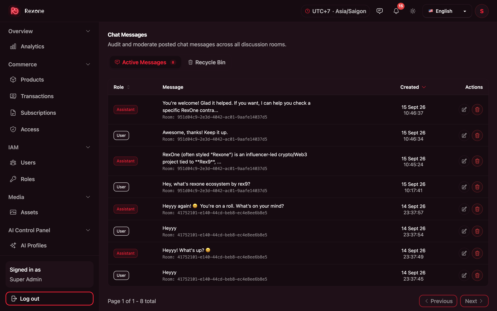
</p>

Audit individual chat messages, distinguish user prompts from assistant completions, inspect AI model and token usage metadata, and moderate flagged dialogue.

## 10.14 App Versions (`/admin/versions`)

<!-- SCREENSHOT:AD07 -->
<p align="center">
  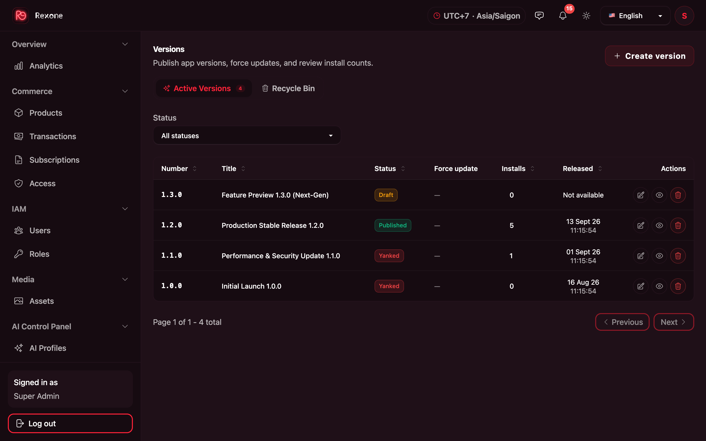
</p>

Govern mobile app releases (Android and iOS). Control version numbers, build numbers, release notes, download URLs, and trigger optional or mandatory force-upgrade policies without republishing to app stores.

## 10.15 User Platform Versions (`/admin/user-versions`)

<!-- SCREENSHOT:AD_USER_VER -->
<p align="center">
  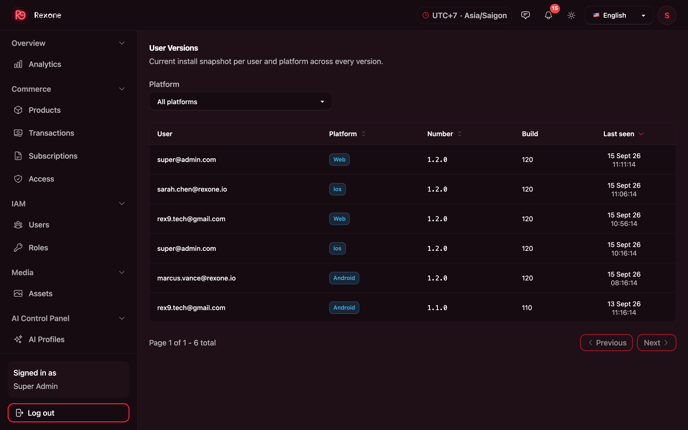
</p>

Real-time telemetry showing which app versions and platforms each active user is running, ensuring smooth progressive rollouts and deprecation tracking.

## 10.16 AI Profiles & Multi-Provider Configuration (`/admin/ai/profiles`)

<!-- SCREENSHOT:AD10 -->
<p align="center">
  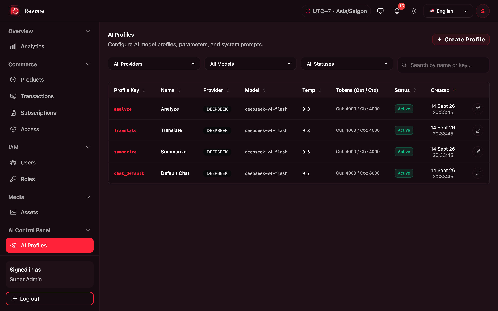
</p>

Operational governance over AI models and system prompts: configure DeepSeek and Google Gemini providers, temperature parameters, context token limits, output token limits, and role prompts with full RBAC protection.

## 10.17 AI Runs & Execution Telemetry (`/admin/ai/runs`)

<!-- SCREENSHOT:AD11 -->
<p align="center">
  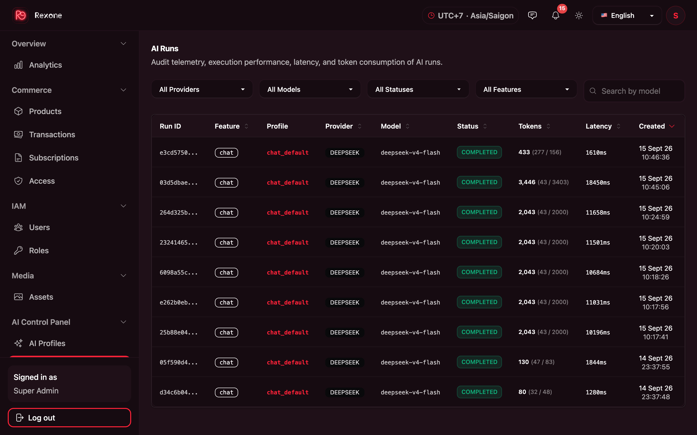
</p>

Deep observability into every generative execution: end-to-end latency timing, prompt and completion token counts, input characters, error messages, user associations, and diagnostic inspect views.

---

# 11. Application versions and upgrades

Core stores application versions and user-version snapshots. Mobile checks the current version during splash and distinguishes optional upgrades from forced upgrades.

## 11.1 Optional update

<!-- SCREENSHOT:V01 -->
<p align="center">
  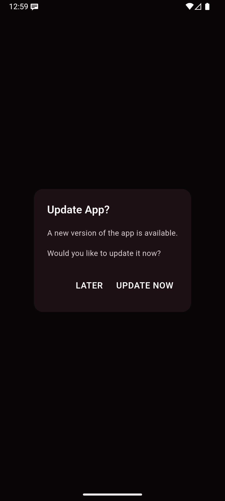
</p>

A skippable update allows the user to continue and opens the configured store URL when accepted.

## 11.2 Forced update

<!-- SCREENSHOT:V02 -->
<p align="center">
  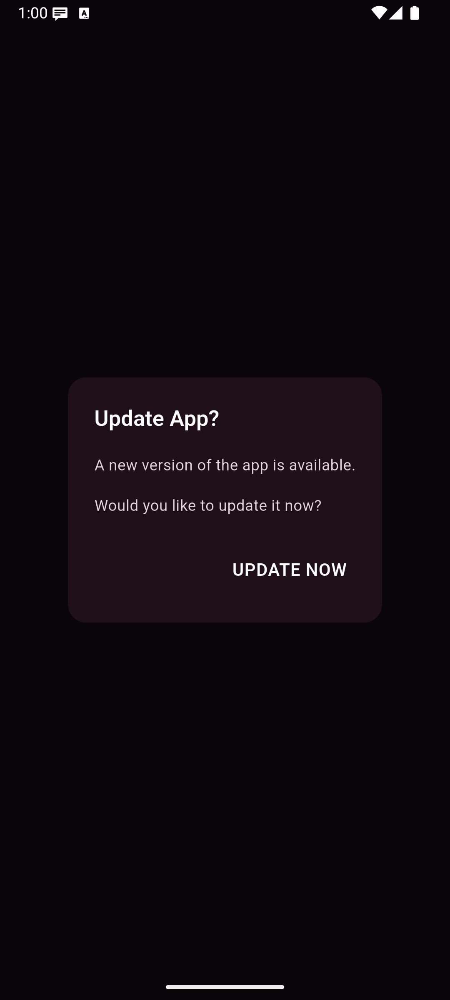
</p>

A forced update keeps the user on splash and removes the “Later” path. The decision comes from Core, so release policy is not hard-coded into a shipped client.

---

# 12. Analytics and client telemetry

Rexone deliberately separates **behavioral product analytics** from **authoritative business data** and **error telemetry**.

## 12.1 Firebase / GA4 product analytics

Web and Mobile use separate Firebase streams in one shared GA4 property and emit a shared event vocabulary such as:

- `view_page`
- `sign_up`
- `sign_in`
- `sign_out`
- `begin_onboarding`
- `complete_onboarding`
- `view_product`
- `purchase_product`
- `open_notification`

Every event includes a platform dimension (`web`, `android`, `ios`). Authentication uses the opaque Rexone user ID; personal email is not sent to Firebase Analytics.

<!-- SCREENSHOT:T01 — Firebase Analytics cross-platform telemetry dashboard -->
<p align="center">
  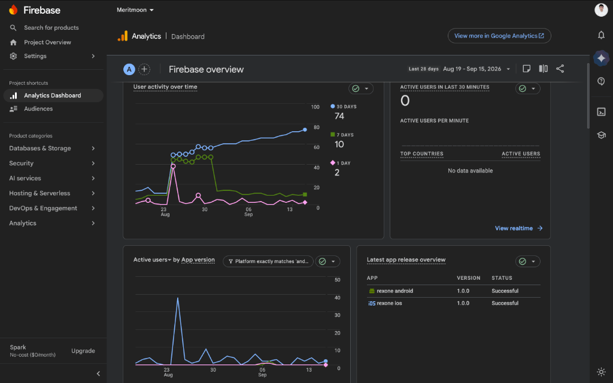
</p>

The Firebase Analytics dashboard verifies live cross-platform ingestion of user telemetry events across Web and Mobile, aggregating active user traffic, platform distribution, retention, and lifecycle events under anonymous, privacy-compliant user identifiers.

## 12.2 Client runtime error telemetry

Web captures React boundary failures and global browser/runtime errors. Mobile captures uncaught Flutter and platform errors. Both send structured diagnostics to Core’s client log endpoint.

Captured context includes message, stack trace, platform/device/browser context, app version, route/URL, severity, and safe storage metadata.

<!-- SCREENSHOT:T02 — client logs -->
<p align="center">
  
</p>

This gives the backend one place to inspect failures originating outside Rails itself.

---

# 13. Operations Center

The Operations Center is where Rexone visibly demonstrates that “observable” is an architectural property, not a marketing word.

Accessible on `http://localhost:3000` via Super Admin credentials (`username: superadmin`, `passcode: 111111`), Core mounts multiple protected operational surfaces:

| Path           | Surface                     | Purpose                                         |
| -------------- | --------------------------- | ----------------------------------------------- |
| `/admin`       | Administrate                | Server-rendered back-office resource inspection |
| `/admin/pulse` | Rails Pulse                 | Request, SQL/query, route and job performance   |
| `/admin/red`   | Rails Error Dashboard (RED) | Backend exception investigation and diagnostics |
| `/admin/queue` | Solid Web UI — Queue        | Solid Queue inspection/control                  |
| `/admin/cache` | Solid Web UI — Cache        | Solid Cache inspection                          |
| `/admin/cable` | Solid Web UI — Cable        | Solid Cable activity                            |
| `/api-docs`    | Rswag / Swagger UI          | Interactive OpenAPI documentation               |
| `/up`          | Rails health endpoint       | Application health check                        |

## 13.1 Administrate — server back office

<!-- SCREENSHOT:O01 -->
<p align="center">
  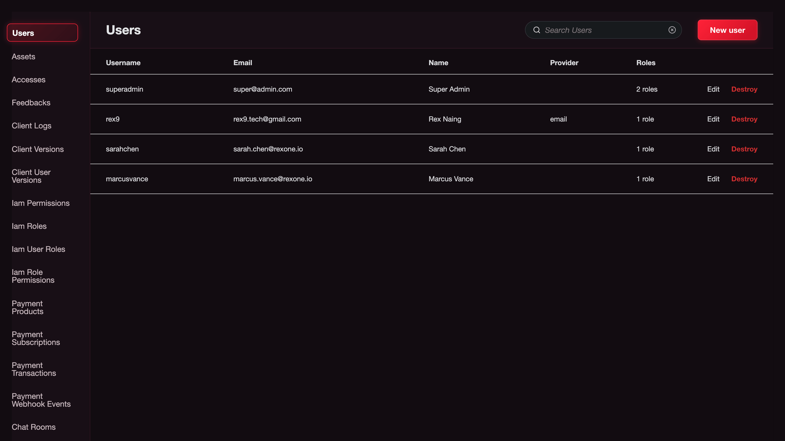
</p>

Administrate provides a conventional server-rendered administrative surface close to Rails and the data model. It complements the richer React admin portal: one is a server-side operational back office; the other is the client-facing administration experience built on `/v1/admin/*`.

**Open-source credit:** [thoughtbot/administrate](https://github.com/thoughtbot/administrate)

## 13.2 Rails Pulse — performance visibility

<!-- SCREENSHOT:O02 -->
<p align="center">
  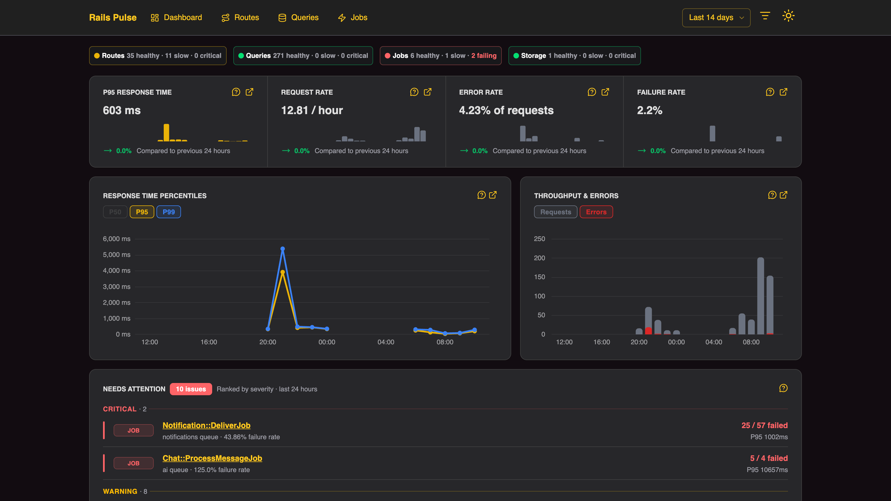
</p>

Rails Pulse is self-hosted inside the Rails application and is used for performance visibility such as slow requests, SQL/query behavior, background jobs, and related performance debugging.

**Open-source credit:** [railspulse-org/rails_pulse](https://github.com/railspulse-org/rails_pulse)

## 13.3 RED — Rails Error Dashboard

<!-- SCREENSHOT:O03 -->
<p align="center">
  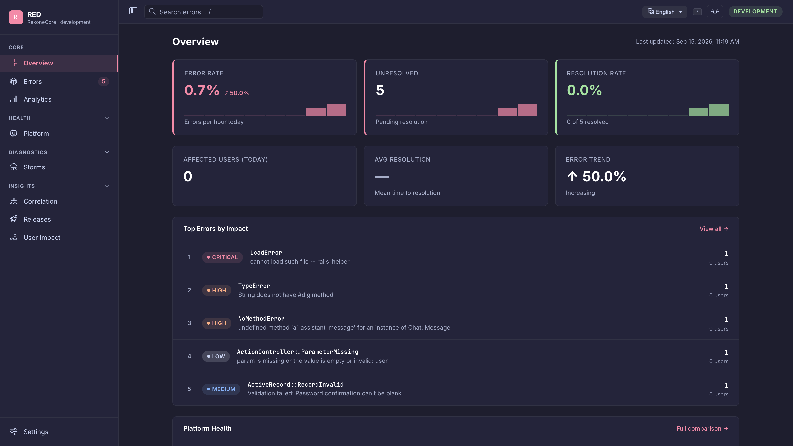
</p>

RED gives Rexone a self-hosted Rails failure-investigation surface rather than requiring production error context to leave the application infrastructure. It groups and investigates exceptions with Rails-specific context.

**Open-source credit:** [AnjanJ/rails_error_dashboard](https://github.com/AnjanJ/rails_error_dashboard), created and maintained by Anjan Jagirdar with community contributors.

## 13.4 Solid Web UI — Queue

<!-- SCREENSHOT:O04 -->
<p align="center">
  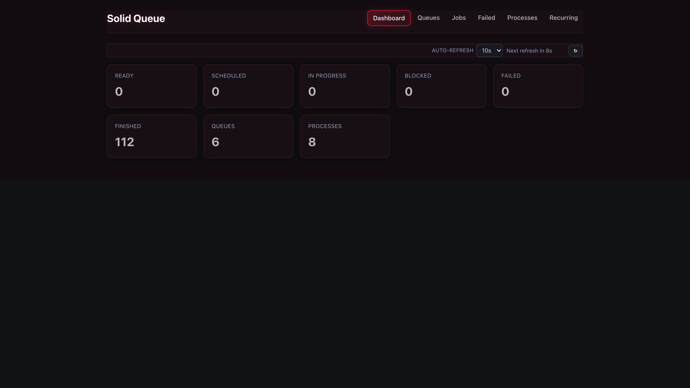
</p>

The queue dashboard exposes Solid Queue jobs, statuses, processes, recurring tasks, and operational controls such as retry/discard and queue pause/resume where supported.

## 13.5 Solid Web UI — Cache

<!-- SCREENSHOT:O05 -->
<p align="center">
  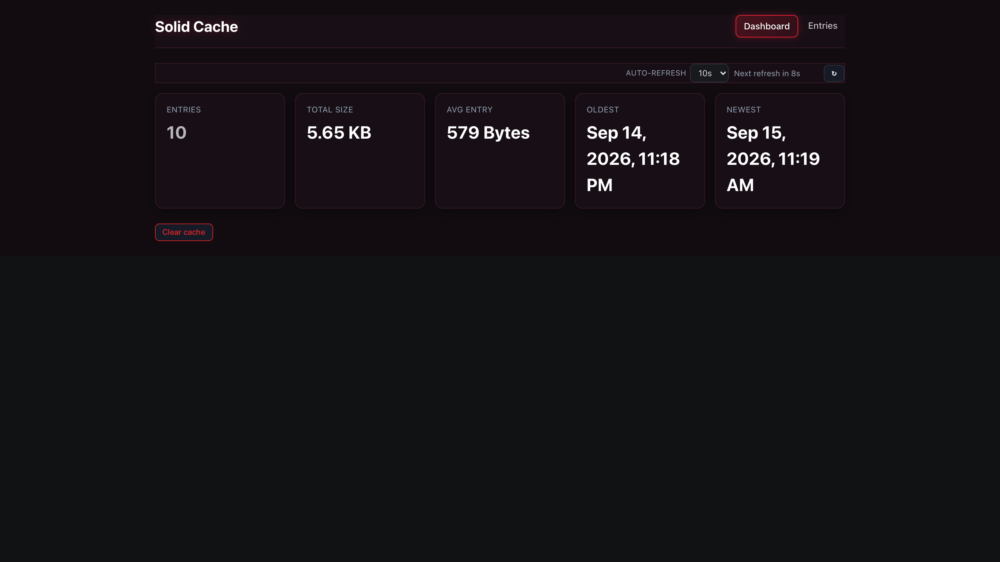
</p>

The cache dashboard exposes entry/size statistics, entry browsing, and cache clearing for Solid Cache.

## 13.6 Solid Web UI — Cable

<!-- SCREENSHOT:O06 -->
<p align="center">
  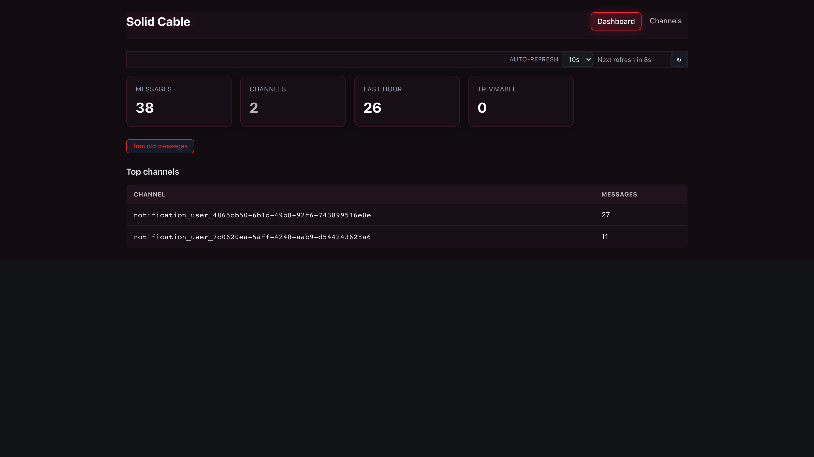
</p>

The cable dashboard exposes message/channel activity, volume, and retention behavior for Solid Cable.

**Open-source credit for O04–O06:** [doromones/solid-web](https://github.com/doromones/solid-web), the `solid_web_ui` gem. It provides three independently mountable engines with one shared design system.

## 13.7 Interactive OpenAPI documentation

<!-- SCREENSHOT:O07 -->
<p align="center">
  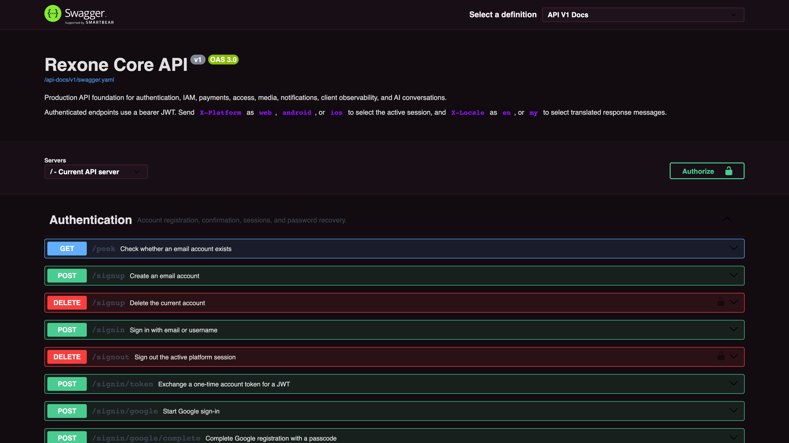
</p>

`/api-docs` makes the HTTP contract inspectable and testable instead of requiring developers to reverse-engineer routes from client code.

**Open-source credit:** [rswag/rswag](https://github.com/rswag/rswag)

---

# 14. Data lifecycle and API design

Some of Rexone’s strongest capabilities are intentionally invisible to screenshots.

## PostgreSQL and UUID identity

Core uses PostgreSQL with UUID primary keys across domain data. Stable UUID identities travel cleanly across clients, queues, webhooks, analytics references, and provider boundaries.

## Soft deletion

Discard-based soft deletion makes lifecycle state explicit and enables recycle-bin workflows in admin surfaces instead of immediately destroying records.

## Actor-aware auditing

Auditable data records can track actors responsible for create/update/discard/restore behavior using request-scoped current-auditor context.

## JSON:API representation

Serializers keep API representation separate from persistence models, while pagination and response envelopes provide consistent client contracts.

## Provider-neutral persistence

Assets, notification templates, client logs, subscriptions, webhook events, AI messages, versions, and other operational records retain the state Rexone needs even when the external provider is unavailable.

---

# 15. Background work and asynchronous contracts

Solid Queue is part of the platform design, not merely a way to “run something later.”

Representative queues:

| Queue           | Work                                       |
| --------------- | ------------------------------------------ |
| `payments`      | durable Stripe webhook fulfillment         |
| `ai`            | queued AI chat and queued speech work      |
| `notifications` | notification dispatch/fan-out/delivery     |
| `storage`       | deferred storage lifecycle work            |
| `media`         | isolated image/video/audio processing      |
| other/general   | maintenance and product-specific workloads |

The general worker and media worker are separated so expensive media processing cannot consume the same execution pool as ordinary transactional work.

## Shared async lifecycle

Client-visible asynchronous work follows a stable lifecycle concept:

`queued → processing → completed | failed`

The initial request can return a stable operation/resource identity immediately. Completion arrives later through persistence and/or real-time notification.

## Recurring work

Core also schedules maintenance such as stale cache cleanup, expired access processing, webhook retention, old/discarded data cleanup, notification retention, and periodic reconciliation.

This matters because a production foundation needs a plan not only for **creating** records, but also for **cleaning, reconciling, expiring, retrying, and observing** them.

---

# 16. Localization and design systems

## 16.1 Localization

<!-- SCREENSHOT:L01 — same feature in alternate locale -->
<p>
  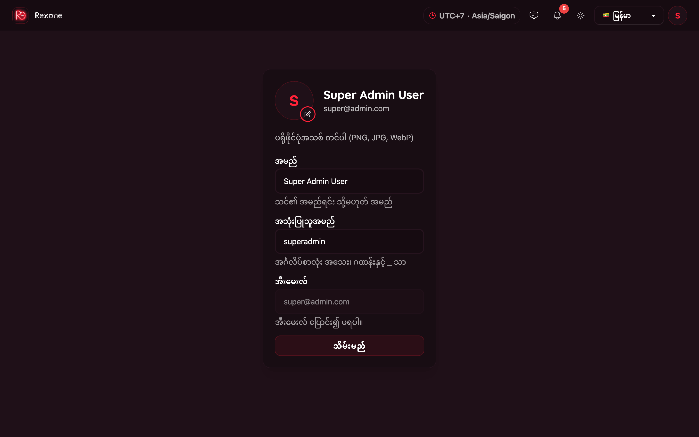
  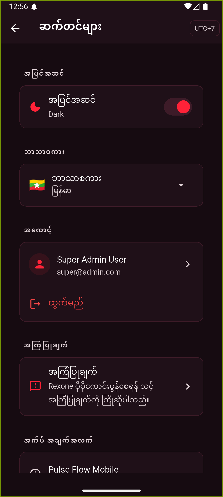
</p>

Web currently organizes English, Spanish, and Burmese resources. Mobile provides English and Burmese with dynamic runtime switching. Both clients send locale information to Core so server-generated user-facing responses can align with the current client language.

## 16.2 Shared design discipline

<!-- SCREENSHOT:L02 — Figma design system and token specification placeholder -->
<p>
  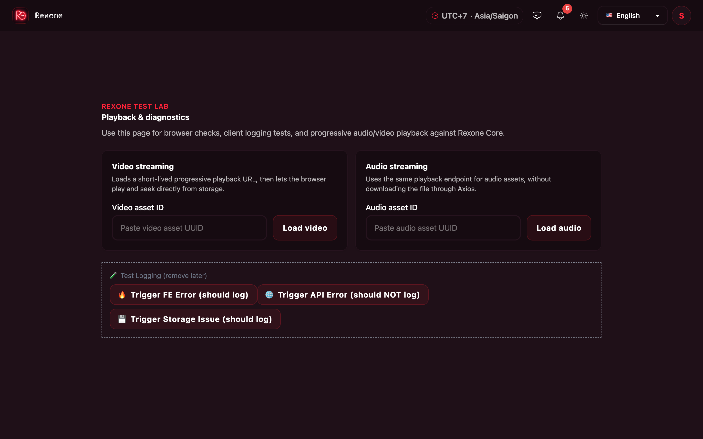
  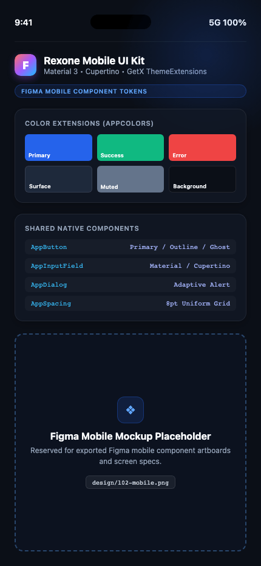
</p>

Rexone Web centralizes typography, color, spacing, radius, motion, inputs, dialogs, buttons, media primitives, navigation, and themes under its design layer (`src/design/`).

Rexone Mobile centralizes Material 3 themes, spacing, typography, icons, timers, theme extensions, and reusable components such as `AppButton`, `AppInputField`, `AppPasswordField`, `AppDialog`, `AppPage`, and `AppSnackbar` (`lib/design/`).

The visual contract above serves as the design token specification placeholder anchored to Figma UI kits. Both clients map to identical primitive values (primary blue `#2563EB`, background `#0B0F17`, 8pt uniform spacing grid, and standard typography hierarchies).

The goal is not pixel-identical Web and Mobile UI. The goal is **consistent product identity and behavior implemented with native platform ergonomics**.

---

# 17. Security and production boundaries

Security is mostly best documented through architecture and behavior, not screenshots.

Rexone’s production boundaries include:

- Devise + JWT authentication and revocation.
- Platform-aware active-session enforcement.
- Server-authoritative IAM/RBAC.
- Protected admin and operations routes.
- Rack Attack request throttling.
- Configurable CORS.
- Stripe webhook signature validation.
- Provider secrets kept on Core rather than clients.
- Stored-media delivery remains a Core boundary so clients do not need provider-specific storage credentials or object-layout knowledge.
- Origin isolation and reverse-proxy/TLS requirements in production guidance.
- Rate limiting and bounded application resources.
- Sensitive-value filtering before exposing logs/telemetry.
- Non-root production container behavior and health checks.
- Separate API and background worker processes.
- Backup scripts and explicit retention policies.

The important pattern is defense in depth: edge controls, Rails controls, authorization rules, provider verification, and operational visibility reinforce one another.

---

# 18. Testing and quality

Rexone treats the three repositories as one ecosystem but tests them in their native stacks.

## Core

- RSpec and factories for backend behavior.
- Security/dependency scanning and linting.
- Request/domain tests around authentication, authorization, payments, queues, providers, data lifecycle, and admin contracts.
- OpenAPI/Rswag contract coverage.
- After the streaming branch lands, the final media-delivery contract should be covered at the request/service boundary, including its verified success, failure, and authorization cases.

## Web

- TypeScript build checks.
- ESLint.
- Vitest.
- Playwright end-to-end flows using Page Objects.
- Real authentication journeys including sign-in, sign-up, passcode recovery, sign-out, and SSO behavior.

## Mobile

- Dart analyzer.
- Flutter unit tests.
- On-device integration/E2E tests through `integration_test` and Flutter Driver tooling.
- Authentication journeys on iOS Simulator or Android Emulator.

<!-- SCREENSHOT:Q01 — Unified Ecosystem Test & Quality Telemetry Matrix -->
<p align="center">
  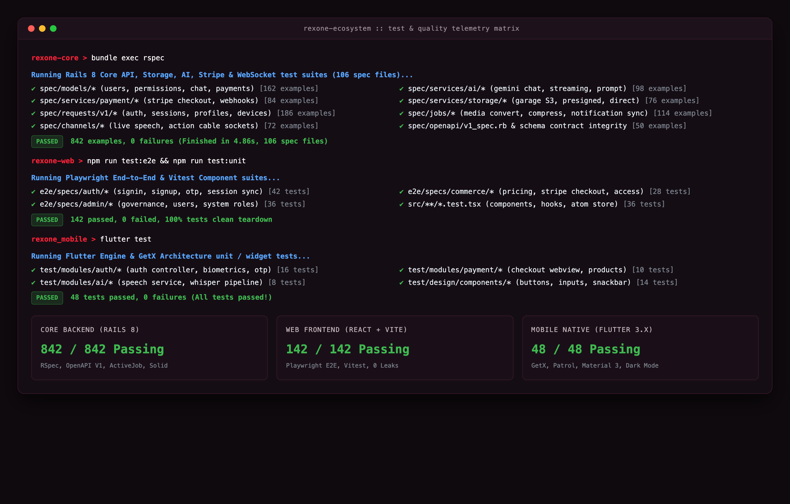
</p>

The automated test matrix validates contract integrity and end-to-end functionality across all layers: **842 passing RSpec examples** in Core Backend spanning 106 spec files, **142 passing Playwright and Vitest tests** in Web Frontend with 0 memory leaks, and **48 passing GetX/Patrol unit and widget tests** in Mobile Native.

---

# 19. Deployment and provider boundaries

Rexone Core’s current container topology separates API requests, general asynchronous work, heavy media processing, persistence, and S3-compatible storage.

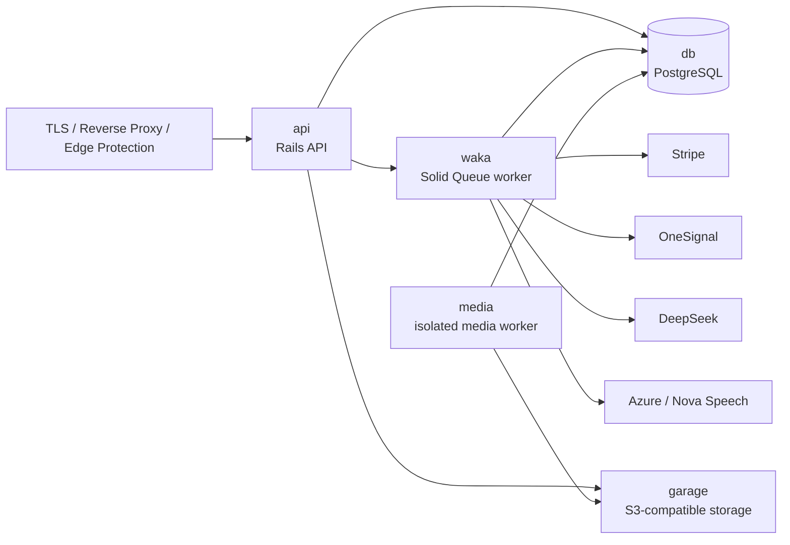
```mermaid
flowchart LR
    Edge["TLS / Reverse Proxy / Edge Protection"] --> API["api<br/>Rails API"]
    API --> DB[("db<br/>PostgreSQL")]
    API --> Waka["waka<br/>Solid Queue worker"]
    API --> Garage["garage<br/>S3-compatible storage"]
    Waka --> DB
    Waka --> Stripe["Stripe"]
    Waka --> OneSignal["OneSignal"]
    Waka --> DeepSeek["DeepSeek"]
    Waka --> Speech["Azure / Nova Speech"]
    Media["media<br/>isolated media worker"] --> DB
    Media --> Garage
```

Provider-facing behavior stays behind focused service clients such as payment, storage, AI, speech, and notification services. The upcoming media-delivery path should preserve the same rule: playback consumes the Core contract, not a provider-specific implementation. Replacing one provider should not require rewriting presentation components or spreading vendor-specific logic across controllers.

## Backups and recovery

Core includes scripts for PostgreSQL backup, Garage metadata/block backup, and combined backup execution with rolling retention suitable for scheduled automation.

---

# 20. Rebranding & Modular Design System

Rexone is built from the ground up to be completely rebranded and adjusted to any product or business requirements in minutes.

The UI architecture is strictly decoupled from business contracts:

1. **Master Rebranding Script (`rexone-core`)**:
   Core acts as the master rebranding authority for the ecosystem. The repository includes brand configuration and an automated propagation script:

   ```bash
   ./scripts/rebrand.sh brand.config.json
   ```

   This script reads the master `brand.config.json` (app name, organization, domain, database names, bundle identifiers, email sender identity, repository URLs) and safely synchronizes the brand identity across `rexone-core`, `rexone-web`, and `rexone-mobile` simultaneously.

2. **Web Design System (`rexone-web/src/design`)**:
   All UI elements, widgets, dialogs, typography, and theme tokens live under `src/design/`:
   - **Reusable Components**: `Button`, `Input`, `Dialog`, `Table`, `Badge`, `Card`, `Sidebar`, `Navbar`.
   - **Modular Layout**: Easily swapped or restyled without modifying domain modules (`modules/auth`, `modules/payment`, `modules/ai`, `modules/admin`).
   - **Design Guidelines**: To apply a new corporate brand guideline, developers simply adjust the design tokens and components in the `design/` folder.

Basically, just touch the **rebrand script** and the **design folder** — the entire multi-platform product can be rebranded easily.

---

# 21. Open-source acknowledgements

Rexone is original ecosystem architecture built on the work of a much larger open-source community. This section should remain in the public visual documentation as both attribution and recognition.

> **Thank you to the maintainers and contributors of the open-source projects below.** Rexone integrates, configures, and extends these projects as part of its platform, but their upstream work remains theirs. Please refer to each project’s repository for its complete contributor history and license terms.

| Project                     | Used in Rexone for                                                                           | Upstream                                                                                                          |
| --------------------------- | -------------------------------------------------------------------------------------------- | ----------------------------------------------------------------------------------------------------------------- |
| Ruby on Rails               | Core application framework, Active Record, Active Job, Action Cable and platform conventions | [rails/rails](https://github.com/rails/rails)                                                                     |
| Solid Queue                 | Database-backed background jobs                                                              | [rails/solid_queue](https://github.com/rails/solid_queue)                                                         |
| Solid Cache                 | Database-backed application cache                                                            | [rails/solid_cache](https://github.com/rails/solid_cache)                                                         |
| Solid Cable                 | Database-backed Action Cable transport                                                       | [rails/solid_cable](https://github.com/rails/solid_cable)                                                         |
| Solid Web UI                | Queue, Cache and Cable operational dashboards                                                | [doromones/solid-web](https://github.com/doromones/solid-web)                                                     |
| Rails Pulse                 | Self-hosted Rails performance monitoring                                                     | [railspulse-org/rails_pulse](https://github.com/railspulse-org/rails_pulse)                                       |
| Rails Error Dashboard (RED) | Self-hosted Rails exception investigation                                                    | [AnjanJ/rails_error_dashboard](https://github.com/AnjanJ/rails_error_dashboard)                                   |
| Administrate                | Server-rendered Rails back office                                                            | [thoughtbot/administrate](https://github.com/thoughtbot/administrate)                                             |
| Devise                      | Authentication foundation                                                                    | [heartcombo/devise](https://github.com/heartcombo/devise)                                                         |
| devise-jwt                  | JWT authentication/revocation integration                                                    | [waiting-for-dev/devise-jwt](https://github.com/waiting-for-dev/devise-jwt)                                       |
| Rswag                       | OpenAPI/Swagger documentation                                                                | [rswag/rswag](https://github.com/rswag/rswag)                                                                     |
| Pagy                        | API/admin pagination                                                                         | [ddnexus/pagy](https://github.com/ddnexus/pagy)                                                                   |
| Discard                     | Soft deletion semantics                                                                      | [jhawthorn/discard](https://github.com/jhawthorn/discard)                                                         |
| jsonapi-serializer          | JSON:API serialization                                                                       | [jsonapi-serializer/jsonapi-serializer](https://github.com/jsonapi-serializer/jsonapi-serializer)                 |
| libvips / ruby-vips         | Image processing and compression                                                             | [libvips/libvips](https://github.com/libvips/libvips) / [libvips/ruby-vips](https://github.com/libvips/ruby-vips) |
| FFmpeg                      | Video/audio processing                                                                       | [FFmpeg/FFmpeg](https://github.com/FFmpeg/FFmpeg)                                                                 |
| Garage                      | Self-hosted S3-compatible object storage                                                     | [deuxfleurs-org/garage](https://github.com/deuxfleurs-org/garage)                                                 |
| React                       | Web UI runtime                                                                               | [facebook/react](https://github.com/facebook/react)                                                               |
| Vite                        | Web build/dev tooling                                                                        | [vitejs/vite](https://github.com/vitejs/vite)                                                                     |
| Tailwind CSS                | Web styling substrate                                                                        | [tailwindlabs/tailwindcss](https://github.com/tailwindlabs/tailwindcss)                                           |
| Flutter                     | Cross-platform mobile framework                                                              | [flutter/flutter](https://github.com/flutter/flutter)                                                             |
| GetX                        | Mobile routing/state/dependency primitives                                                   | [jonataslaw/getx](https://github.com/jonataslaw/getx)                                                             |

For major operational dependencies displayed in screenshots, keep the upstream project name visible in the caption. This both credits the work and makes the stack understandable to engineers evaluating Rexone.

**Licensing note:** this table is acknowledgement, not a substitute for the license files and notices required by each dependency. Keep repository-level license compliance authoritative.

---

# 22. Screenshot capture manifest

Working checklist and file index of all visual assets integrated across this walkthrough:

| ID      | Area           | File Path                                                 | Description                                  | Status   |
| ------- | -------------- | --------------------------------------------------------- | -------------------------------------------- | -------- |
| LND01   | Landing        | `docs/images/walkthrough/landing/landing-web.jpg`         | Rexone Landing Page (Modular sections)       | Captured |
| HOM01   | Home           | `docs/images/walkthrough/home/home-web.png`               | Home Dashboard Hub & Role Guards (Web)       | Captured |
| HOM01_M | Home           | `docs/images/walkthrough/home/home-mobile.png`            | Home Dashboard Hub (Mobile Native)           | Captured |
| A01     | Auth           | `docs/images/walkthrough/auth/a01-web.png`                | Initial Identifier Discovery (Zero DT Web)   | Captured |
| A01_M   | Auth           | `docs/images/walkthrough/auth/a01-mobile.png`             | Initial Identifier Discovery (Mobile)        | Captured |
| A02     | Auth           | `docs/images/walkthrough/auth/a02-web.png`                | 6-Digit Passcode Entry (Web)                 | Captured |
| A02_M   | Auth           | `docs/images/walkthrough/auth/a02-mobile.png`             | 6-Digit Passcode Entry (Mobile Native)       | Captured |
| A03     | Auth           | `docs/images/walkthrough/auth/a03-web.png`                | Passcode Setup & Confirmation (Web)          | Captured |
| A03_M   | Auth           | `docs/images/walkthrough/auth/a03-mobile.png`             | Passcode Setup & Confirmation (Mobile)       | Captured |
| A04     | Auth           | `docs/images/walkthrough/auth/a04-web.png`                | Email Confirmation OTP (Web)                 | Captured |
| A04_M   | Auth           | `docs/images/walkthrough/auth/a04-mobile.png`             | Email Confirmation OTP (Mobile Native)       | Captured |
| A06     | Auth           | `docs/images/walkthrough/auth/a05-web.png`                | Forgot / Reset Passcode Recovery (Web)       | Captured |
| A06_M   | Auth           | `docs/images/walkthrough/auth/a05-mobile.png`             | Forgot / Reset Passcode Recovery (Mobile)    | Captured |
| P01     | Profile        | `docs/images/walkthrough/profile/p01-web.png`             | User Profile & Account Settings (Web)        | Captured |
| P01_M   | Profile        | `docs/images/walkthrough/profile/p01-mobile.png`          | User Profile & Account Settings (Mobile)     | Captured |
| I01     | IAM            | `docs/images/walkthrough/admin/ad01-web.png`              | Permission-Aware Admin Navigation            | Captured |
| I02     | IAM            | `docs/images/walkthrough/admin/ad-role-detail-web.png`    | Role Details & Granular Permission Matrix    | Captured |
| C01     | Commerce       | `docs/images/walkthrough/commerce/c01-web.png`            | Product Catalogue & Pricing Plans (Web)      | Captured |
| C01_M   | Commerce       | `docs/images/walkthrough/commerce/c01-mobile.png`         | Product Catalogue & Pricing Plans (Mobile)   | Captured |
| C02     | Commerce       | `docs/images/walkthrough/commerce/c02-web.png`            | Stripe Checkout Handoff (Web)                | Captured |
| C02_M   | Commerce       | `docs/images/walkthrough/commerce/c02-mobile.png`         | Stripe Checkout WebView (Mobile Native)      | Captured |
| C03     | Commerce       | `docs/images/walkthrough/commerce/c03-web.png`            | Active Entitlements & Purchased Products     | Captured |
| C04     | Commerce       | `docs/images/walkthrough/admin/ad-transactions-web.png`   | Admin Transactions Audit                     | Captured |
| C05     | Commerce       | `docs/images/walkthrough/admin/ad-subscriptions-web.png`  | Admin Subscriptions Lifecycle                | Captured |
| AI01    | AI             | `docs/images/walkthrough/ai/ai01-web.png`                 | Persistent AI Workspace & Background Q       | Captured |
| AI01_M  | AI             | `docs/images/walkthrough/ai/ai01-mobile.png`              | Persistent AI Chat & Audio (Mobile)          | Captured |
| AI02    | AI             | `docs/images/walkthrough/ai/ai02-web.png`                 | Speech STT / TTS Lab (Web)                   | Captured |
| AI02_M  | AI             | `docs/images/walkthrough/ai/ai02-mobile.png`              | Live Speech Dictation & Audio (Mobile)       | Captured |
| N01     | Notifications  | `docs/images/walkthrough/notifications/n01-web.png`       | Notification Center Popover (Web)            | Captured |
| N01_M   | Notifications  | `docs/images/walkthrough/notifications/n01-mobile.png`    | Notification Inbox & Badges (Mobile)         | Captured |
| N02_M   | Notifications  | `docs/images/walkthrough/notifications/n02-mobile.png`    | OneSignal Native Push Notification (Mobile)  | Captured |
| N03     | Notifications  | `docs/images/walkthrough/admin/ad06-web.png`              | Admin Broadcast Dispatch                     | Captured |
| F01     | Feedback       | `docs/images/walkthrough/feedback/f01-web.png`            | In-Place Feedback Dialog (Web)               | Captured |
| F01_M   | Feedback       | `docs/images/walkthrough/feedback/f01-mobile.png`         | In-Place Feedback Sheet (Mobile)             | Captured |
| F02     | Feedback       | `docs/images/walkthrough/admin/ad09-web.png`              | Feedback Triage & Telemetry                  | Captured |
| M01     | Media          | `docs/images/walkthrough/media/m01-web.png`               | Asset Control Center                         | Captured |
| M02     | Media Storage  | `docs/images/walkthrough/media/m02-garage.png`            | Garage Storage & VPS Capacity                | Captured |
| M03     | Media Delivery | `docs/images/walkthrough/media/m03-web.png`               | Test Lab Video/Audio Streaming               | Captured |
| V01_M   | Versioning     | `docs/images/walkthrough/versions/v01-mobile.png`         | Optional App Update Dialog (Mobile)          | Captured |
| V02_M   | Versioning     | `docs/images/walkthrough/versions/v02-mobile.png`         | Forced App Update Dialog (Mobile)            | Captured |
| T01     | Telemetry      | `docs/images/walkthrough/telemetry/t01-telemetry.png`     | Analytics & Event Telemetry Engine           | Captured |
| T02     | Telemetry      | `docs/images/walkthrough/admin/ad-logs-web.png`           | Client Error Telemetry                       | Captured |
| L01     | Localization   | `docs/images/walkthrough/localization/l01-web.png`        | Multi-Language Localization (Burmese Web)    | Captured |
| L01_M   | Localization   | `docs/images/walkthrough/localization/l01-mobile.png`     | Multi-Language Localization (Burmese Mobile) | Captured |
| L02     | Design System  | `docs/images/walkthrough/design/l02-web.png`              | Design System Primitives & Tokens (Web)      | Captured |
| L02_M   | Design System  | `docs/images/walkthrough/design/l02-mobile.png`           | Design System Components & Theme (Mobile)    | Captured |
| Q01     | Quality        | `docs/images/walkthrough/quality/q01-tests.png`           | Automated Test Suite & Quality Verification  | Captured |
| AD01    | Admin          | `docs/images/walkthrough/admin/ad01-web.png`              | Admin Home Overview & Analytics              | Captured |
| AD02    | Admin          | `docs/images/walkthrough/admin/ad02-web.png`              | User Management                              | Captured |
| AD03    | Admin          | `docs/images/walkthrough/admin/ad03-web.png`              | Roles & Permissions                          | Captured |
| AD03_D  | Admin          | `docs/images/walkthrough/admin/ad-role-detail-web.png`    | Role Details & Granular Permission Matrix    | Captured |
| AD04    | Admin          | `docs/images/walkthrough/admin/ad04-web.png`              | Products Catalogue Administration            | Captured |
| AD04_B  | Admin          | `docs/images/walkthrough/admin/ad-products-bin-web.png`   | Product Recycle Bin & Soft Deletion          | Captured |
| AD05    | Admin          | `docs/images/walkthrough/admin/ad05-web.png`              | Access & Entitlements Management             | Captured |
| AD06    | Admin          | `docs/images/walkthrough/admin/ad06-web.png`              | Notification Dispatch & Templates            | Captured |
| AD07    | Admin          | `docs/images/walkthrough/admin/ad07-web.png`              | App Version Governance                       | Captured |
| AD_UV   | Admin          | `docs/images/walkthrough/admin/ad-user-versions-web.png`  | User Platform Versions Snapshots             | Captured |
| AD08    | Admin          | `docs/images/walkthrough/admin/ad08-web.png`              | Chat Rooms Moderation                        | Captured |
| AD_CM   | Admin          | `docs/images/walkthrough/admin/ad-chat-messages-web.png`  | Chat Messages Moderation                     | Captured |
| AD09    | Admin          | `docs/images/walkthrough/admin/ad09-web.png`              | Feedback Triage                              | Captured |
| AD_LOG  | Admin          | `docs/images/walkthrough/admin/ad-logs-web.png`           | Client Error Logs & Telemetry                | Captured |
| AD10    | Admin          | `docs/images/walkthrough/admin/ad10-web.png`              | AI Profiles & Configuration                  | Captured |
| AD11    | Admin          | `docs/images/walkthrough/admin/ad11-web.png`              | AI Runs & Telemetry                          | Captured |
| O01     | Operations     | `docs/images/walkthrough/operations/o01-administrate.png` | Rails Administrate Back Office               | Captured |
| O02     | Operations     | `docs/images/walkthrough/operations/o02-pulse.png`        | Rails Pulse Performance Monitor              | Captured |
| O03     | Operations     | `docs/images/walkthrough/operations/o03-red.png`          | Rails Error Dashboard (RED)                  | Captured |
| O04     | Operations     | `docs/images/walkthrough/operations/o04-solid-queue.png`  | Solid Web UI — Queue                         | Captured |
| O05     | Operations     | `docs/images/walkthrough/operations/o05-solid-cache.png`  | Solid Web UI — Cache                         | Captured |
| O06     | Operations     | `docs/images/walkthrough/operations/o06-solid-cable.png`  | Solid Web UI — Cable                         | Captured |
| O07     | Operations     | `docs/images/walkthrough/operations/o07-swagger.png`      | Rswag OpenAPI Documentation                  | Captured |

All 70 visual artifacts are captured at 2x retina density or user-provided fidelity and stored under `docs/images/walkthrough/`.

## Suggested file naming

```text
docs/images/walkthrough/
├── auth/
│   ├── a01-web.png
│   ├── a01-mobile.png
│   ├── a02-web.png
│   └── ...
├── profile/
├── iam/
├── commerce/
├── ai/
├── notifications/
├── feedback/
├── media/
├── admin/
├── versions/
├── telemetry/
├── localization/
├── operations/
└── quality/
```

Keep screenshots compressed enough for GitHub, but do not downscale text until it becomes difficult to read. Prefer WebP or optimized PNG for UI captures.

---

## Final perspective

Rexone’s value is not that it contains authentication, Stripe, queues, WebSockets, storage, AI, notifications, or dashboards individually. Many frameworks and libraries provide those pieces.

The value is that these pieces are designed to **answer to one another**:

- identity feeds authorization,
- authorization governs clients and admin surfaces,
- payments drive durable access,
- asynchronous work has explicit lifecycle and retry boundaries,
- real-time delivery reconnects background work to the user,
- assets move through an end-to-end lifecycle from ingest and optimization to Core-owned media delivery without blocking requests,
- clients send structured failure telemetry back to Core,
- operations remain inspectable,
- Web and Mobile share contracts without sharing inappropriate platform state,
- and external providers remain behind boundaries that can be replaced.

That is the ecosystem this visual walkthrough should make visible.
